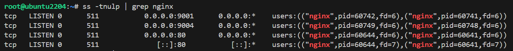

# Systemd. Инициализация системы

## Задача:
1. Написать service, который будет раз в 30 секунд мониторить лог на предмет наличия ключевого слова (файл лога и ключевое слово должны задаваться в /etc/default);
2. Установить spawn-fcgi и создать unit-файл (spawn-fcgi.sevice) с помощью переделки init-скрипта (https://gist.github.com/cea2k/1318020);
3. Доработать unit-файл Nginx (nginx.service) для запуска нескольких инстансов сервера с разными конфигурационными файлами одновременно;


### Ход выполнения работы:
1.1 Cоздаём файл с конфигурацией для сервиса в директории /etc/default - из неё сервис будет брать необходимые переменные
```bash
sudo bash -c 'cat > /etc/default/watchlog << "EOF"
# Configuration file for my watchlog service
# Place it to /etc/default

# File and word in that file that we will be monit
WORD="ALERT"
LOG=/var/log/watchlog.log
EOF'
```

1.2 Затем создаем `/var/log/watchlog.log` :
```bash
sudo bash -c 'cat > /var/log/watchlog.log <<EOF
2025-02-16 10:15:23, ALERT: an important event occurred
2025-02-16 10:16:23, INFO: a normal event message
2025-02-16 10:17:23, ALERT: an important event occurred
2025-02-16 10:15:23, INFO: a normal event message
2025-02-16 11:15:23, INFO: a normal event message
2025-02-16 13:15:23, ALERT: an important event occurred
2025-02-16 14:15:23, INFO: a normal event message
2025-02-16 15:15:23, ALERT: an important event occurred
2025-02-16 16:15:23, ALERT: an important event occurred
2025-02-16 17:15:23, INFO: a normal event message
EOF'
```
1.3  Создадим скрипт: `/opt/watchlog.sh` (Команда logger отправляет лог в системный журнал.)
``` bash
sudo bash -c 'cat > /opt/watchlog.sh << "EOF"
#!/bin/bash

WORD=\$1
LOG=\$2
DATE=\`date\`

if grep \$WORD \$LOG &> /dev/null
then
  logger "\$DATE: I found word, Master!"
else
  exit 0
fi
EOF'
```
1.4 Добавим права на запуск файла:
```
chmod +x /opt/watchlog.sh
```
1.5 Создадим юнит для сервиса:
```bash
sudo bash -c 'cat > /etc/systemd/system/watchlog.service << EOF
[Unit]
Description=My watchlog service

[Service]
Type=oneshot
EnvironmentFile=/etc/default/watchlog
ExecStart=/opt/watchlog.sh \$WORD \$LOG
EOF'
```
1.6 Создадим юнит для таймера:
```bash
sudo bash -c 'cat > /etc/systemd/system/watchlog.timer << EOF
[Unit]
Description=Run watchlog script every 30 second

[Timer]
# Run every 30 second
OnUnitActiveSec=30
Unit=watchlog.service

[Install]
WantedBy=multi-user.target
EOF'
```
1.7 Запускаем timer:
```
systemctl start watchlog.timer
```
1.8 Проверяем лог:
```bash
tail -n 50 /var/log/syslog  | grep word
```


2. Установить spawn-fcgi и создать unit-файл (spawn-fcgi.sevice) с помощью переделки init-скрипта  

2.1 Устанавливаем spawn-fcgi и необходимые для него пакеты:
```bash
apt install spawn-fcgi php php-cgi php-cli \
 apache2 libapache2-mod-fcgid -y
```
2.2  Создадим файл с настройками для будущего сервиса в файле /etc/spawn-fcgi/fcgi.conf
```
mkdir /etc/spawn-fcgi/
```
```bash
sudo bash -c 'cat > /etc/spawn-fcgi/fcgi.conf << EOF
# You must set some working options before the "spawn-fcgi" service will work.
# If SOCKET points to a file, then this file is cleaned up by the init script.
#
# See spawn-fcgi(1) for all possible options.
#
# Example :
SOCKET=/var/run/php-fcgi.sock
OPTIONS="-u www-data -g www-data -s \$SOCKET -S -M 0600 -C 32 -F 1 -- /usr/bin/php-cgi"
EOF'
```

2.3 Юнит-файл:

```bash
sudo bash -c 'cat > /etc/systemd/system/spawn-fcgi.service << EOF
[Unit]
Description=Spawn-fcgi startup service by Otus
After=network.target

[Service]
Type=simple
PIDFile=/var/run/spawn-fcgi.pid
EnvironmentFile=/etc/spawn-fcgi/fcgi.conf
ExecStart=/usr/bin/spawn-fcgi -n \$OPTIONS
KillMode=process

[Install]
WantedBy=multi-user.target
EOF'
```
2.4 Убеждаемся, что все успешно работает:
```bash
systemctl start spawn-fcgi
systemctl status spawn-fcgi
```


3. Доработать unit-файл Nginx (nginx.service) для запуска нескольких инстансов сервера с разными конфигурационными файлами одновременно  

3.1 Установим Nginx из стандартного репозитория:
```bash
apt install nginx -y
```
3.2 Для запуска нескольких экземпляров сервиса модифицируем исходный service для использования различной конфигурации, а также PID-файлов. Для этого создадим новый Unit для работы с шаблонами `(/etc/systemd/system/nginx@.service)`:

```bash
cat > /etc/systemd/system/nginx@.service
# Stop dance for nginx
# =======================
#
# ExecStop sends SIGSTOP (graceful stop) to the nginx process.
# If, after 5s (--retry QUIT/5) nginx is still running, systemd takes control
# and sends SIGTERM (fast shutdown) to the main process.
# After another 5s (TimeoutStopSec=5), and if nginx is alive, systemd sends
# SIGKILL to all the remaining processes in the process group (KillMode=mixed).
#
# nginx signals reference doc:
# http://nginx.org/en/docs/control.html
#
[Unit]
Description=A high performance web server and a reverse proxy server
Documentation=man:nginx(8)
After=network.target nss-lookup.target

[Service]
Type=forking
PIDFile=/run/nginx-%I.pid
ExecStartPre=/usr/sbin/nginx -t -c /etc/nginx/nginx-%I.conf -q -g 'daemon on; master_process on;'
ExecStart=/usr/sbin/nginx -c /etc/nginx/nginx-%I.conf -g 'daemon on; master_process on;'
ExecReload=/usr/sbin/nginx -c /etc/nginx/nginx-%I.conf -g 'daemon on; master_process on;' -s reload
ExecStop=-/sbin/start-stop-daemon --quiet --stop --retry QUIT/5 --pidfile /run/nginx-%I.pid
TimeoutStopSec=5
KillMode=mixed

[Install]
WantedBy=multi-user.target
```

3.3 Создадим два файла конфигурации /etc/nginx/nginx-first.conf, /etc/nginx/nginx-second.conf с модификацией путей до PID-файлов и разделением по портам:
 <details>
 <summary>nginx-first.conf</summary>

```bash
user  www-data;
worker_processes  auto;

error_log  /var/log/nginx/error.log notice;
pid        /var/run/nginx-first.pid;


events {
    worker_connections  1024;
}


http {

	server {
		listen 9001;
        server_name  localhost;

        location / {
            root   /usr/share/nginx/html;
            index  index.html index.htm;
        }

        error_page   500 502 503 504  /50x.html;
        location = /50x.html {
            root   /usr/share/nginx/html;
    	}
    }

    include       /etc/nginx/mime.types;
    default_type  application/octet-stream;

    log_format  main  '$remote_addr - $remote_user [$time_local] "$request" '
                      '$status $body_bytes_sent "$http_referer" '
                      '"$http_user_agent" "$http_x_forwarded_for"';

    access_log  /var/log/nginx/access.log  main;

    sendfile        on;
    #tcp_nopush     on;

    keepalive_timeout  65;

    #gzip  on;

#    include /etc/nginx/conf.d/*.conf;
}
```
 </details>

 <details>
 <summary>nginx-second.conf</summary>

```bash
user  www-data;
worker_processes  auto;

error_log  /var/log/nginx/error.log notice;
pid        /var/run/nginx-second.pid;


events {
    worker_connections  1024;
}


http {

	server {
		listen 9004;
        server_name  localhost;

        location / {
            root   /usr/share/nginx/html;
            index  index.html index.htm;
        }

        error_page   500 502 503 504  /50x.html;
        location = /50x.html {
            root   /usr/share/nginx/html;
    	}
    }

    include       /etc/nginx/mime.types;
    default_type  application/octet-stream;

    log_format  main  '$remote_addr - $remote_user [$time_local] "$request" '
                      '$status $body_bytes_sent "$http_referer" '
                      '"$http_user_agent" "$http_x_forwarded_for"';

    access_log  /var/log/nginx/access.log  main;

    sendfile        on;
    #tcp_nopush     on;

    keepalive_timeout  65;

    #gzip  on;

#    include /etc/nginx/conf.d/*.conf;
}
```
 </details>  

 3.4 Проверим работу:
```bash
systemctl start nginx@first
systemctl start nginx@second
systemctl status nginx@second
```
 <details>
 <summary>Результат</summary>

```
root@ubuntu2204:~# systemctl start nginx@first
root@ubuntu2204:~# systemctl start nginx@second
root@ubuntu2204:~# systemctl status nginx@second
● nginx@second.service - A high performance web server and a reverse proxy server
     Loaded: loaded (/etc/systemd/system/nginx@.service; disabled; vendor preset: enabled)
     Active: active (running) since Mon 2025-02-24 15:26:42 UTC; 12s ago
       Docs: man:nginx(8)
    Process: 60746 ExecStartPre=/usr/sbin/nginx -t -c /etc/nginx/nginx-second.conf -q -g daemon on; master_process on; (code=exited, status=0/SUCCESS)
    Process: 60747 ExecStart=/usr/sbin/nginx -c /etc/nginx/nginx-second.conf -g daemon on; master_process on; (code=exited, status=0/SUCCESS)
   Main PID: 60748 (nginx)
      Tasks: 2 (limit: 1013)
     Memory: 1.7M
        CPU: 14ms
     CGroup: /system.slice/system-nginx.slice/nginx@second.service
             ├─60748 "nginx: master process /usr/sbin/nginx -c /etc/nginx/nginx-second.conf -g daemon on; master_process on;"
             └─60749 "nginx: worker process" "" "" "" "" "" "" "" "" "" "" "" "" "" "" "" "" "" "" "" "" "" "" "" "" "" "" "" "" "" "" "" "" "" "" "" "" "" "" "" "" "" "" "" "" "" "" "" "" "" "" "">
```
 </details>

 3.5  Cмотрим какие порты слушаются:
 ```
ss -tnulp | grep nginx
 ```
 
 3.6 Cмотрим список процессов:
```
ps afx | grep nginx
```
 
