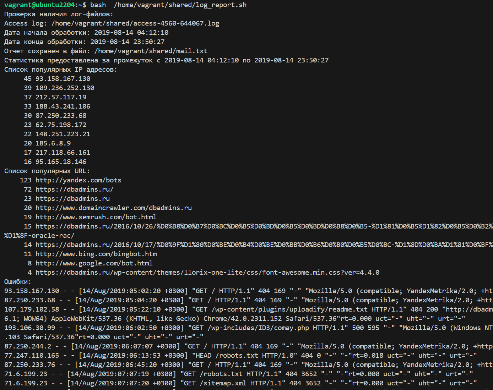

# Bash

## Задача:
Написать скрипт для CRON, который раз в час будет формировать письмо с необходимой информацией:
1. Список IP адресов (с наибольшим кол-вом запросов) с указанием кол-ва запросов с
момента последнего запуска скрипта
2. Список запрашиваемых URL (с наибольшим кол-вом запросов) с указанием кол-ва
запросов с момента последнего запуска скрипта
3. Ошибки веб-сервера/приложения c момента последнего запуска
4. Список всех кодов HTTP ответа с указанием их кол-ва с момента последнего запуска
скрипта
5. Скрипт должен предотвращать одновременный запуск нескольких копий, до его
завершения.
6. Обрабатываемый временной диапазон

### Ход выполнения работы:
1.  Переменные:
```bash
REPORT_FILE=/tmp/report  # Путь к временному файлу, позволяет отслеживать запуск второго экземпляра скрипта
LOG_ACCESS_FILE=/home/vagrant/shared/access-4560-644067.log  # Путь к логу
MAIL_FILE=/home/vagrant/shared/mail.txt  # Путь к файлу, в который будет записан отчет
LAST_DATE_FILE=/home/vagrant/shared/last_date.txt  # Путь к файлу, в который будет записан LAST_DATE
FILTERED_LOG=""  # Переменная для отфильтрованного лога по временному диапазону
```
2. Формирования даты начала и конца обрабатываемого временного диапазона:
```bash
    # Формирования даты начала обрабатываемого временного диапазона
    # Проверка наличия файла LAST_DATE_FILE
    if [[ -f "$LAST_DATE_FILE" ]]; then
        FIRST_DATE=$(cat "$LAST_DATE_FILE")
    else
        FIRST_DATE=$(awk '{print $4}' "$LOG_ACCESS_FILE" | sed 's/\[//;s/:/ /;s/\//-/g' | sort | head -n 1)  # Извлечение первой даты из лог-файла
    fi

    # Формирования даты конца обрабатываемого временного диапазона (Извлечение последней даты из лог-файла)
    LAST_DATE=$(awk '{print $4}' "$LOG_ACCESS_FILE" | sed 's/\[//;s/:/ /;s/\//-/g' | sort | tail -n 1)

    # Приведение FIRST_DATE и LAST_DATE к формату для сравнения
    FORMATTED_FIRST_DATE=$(date -d "$FIRST_DATE" +"%Y-%m-%d %H:%M:%S")
    FORMATTED_LAST_DATE=$(date -d "$LAST_DATE" +"%Y-%m-%d %H:%M:%S")

    # Запись FORMATTED_LAST_DATE в файл
    echo "$FORMATTED_LAST_DATE" > "$LAST_DATE_FILE"
```

3. Формирование FILTERED_LOG:
```bash
# Формирование FILTERED_LOG
    while IFS= read -r line; do
        # Извлечение даты из четвертого поля
        LOG_DATE=$(echo "$line" | awk '{print $4}' | sed 's/\[//;s/:/ /;s/\//-/g')

        # Приведение LOG_DATE к формату для сравнения
        FORMATTED_LOG_DATE=$(date -d "$LOG_DATE" +"%Y-%m-%d %H:%M:%S" 2>/dev/null)

        # Проверка, находится ли LOG_DATE в диапазоне FIRST_DATE и LAST_DATE
        if [[ "$FORMATTED_LOG_DATE" > "$FORMATTED_FIRST_DATE" && "$FORMATTED_LOG_DATE" < "$FORMATTED_LAST_DATE" ]]; then
            FILTERED_LOG+="$line"$'\n'  # Добавление строки в переменную FILTERED_LOG
        fi
    done < "$LOG_ACCESS_FILE"
```

4. Формирования статистики:
```bash
echo "Статистика предоставлена за промежуток с $FORMATTED_FIRST_DATE по $FORMATTED_LAST_DATE" >> "$REPORT_FILE"
    # Используем отфильтрованные данные для получения статистики
    echo "Список популярных IP адресов:" >> "$REPORT_FILE"
    echo "$FILTERED_LOG" | awk '{print $1}' | sort | uniq -c | sort -nr | head -n 10 >> "$REPORT_FILE"
    echo "Список популярных URL:" >> "$REPORT_FILE"
    echo "$FILTERED_LOG" | grep -E 'http[s]?://[^ ]+' | sed -E 's/.*(http[s]?:\/\/[^ ";\)]+).*/\1/' | sort | uniq -c | sort -nr | head -n 10 >> "$REPORT_FILE"
    echo "Ошибки:" >> "$REPORT_FILE"
    echo "$FILTERED_LOG" | grep -E '" [4-5][0-9]{2} ' >> "$REPORT_FILE"
    echo "Список кодов HTTP ответа:" >> "$REPORT_FILE"
    echo "$FILTERED_LOG" | awk '{print $9}' | sort | uniq -c | sort -nr >> "$REPORT_FILE"
```

5.  <details>
 <summary>Полная версия [скрипта](/shared/log_report.sh)</summary>

```bash
 #!/bin/bash

REPORT_FILE=/tmp/report  # Путь к временному файлу, позволяет отслеживать запуск второго экземпляра скрипта
LOG_ACCESS_FILE=/home/vagrant/shared/access-4560-644067.log  # Путь к логу
MAIL_FILE=/home/vagrant/shared/mail.txt  # Путь к файлу, в который будет записан отчет
LAST_DATE_FILE=/home/vagrant/shared/last_date.txt  # Путь к файлу, в который будет записан LAST_DATE
FILTERED_LOG=""  # Переменная для отфильтрованного лога

function parse_log() {
    # Формирования даты начала обрабатываемого временного диапазона
    # Проверка наличия файла LAST_DATE_FILE
    if [[ -f "$LAST_DATE_FILE" ]]; then
        FIRST_DATE=$(cat "$LAST_DATE_FILE")
    else
        FIRST_DATE=$(awk '{print $4}' "$LOG_ACCESS_FILE" | sed 's/\[//;s/:/ /;s/\//-/g' | sort | head -n 1)  # Извлечение первой даты из лог-файла
    fi

    # Формирования даты конца обрабатываемого временного диапазона (Извлечение последней даты из лог-файла)
    LAST_DATE=$(awk '{print $4}' "$LOG_ACCESS_FILE" | sed 's/\[//;s/:/ /;s/\//-/g' | sort | tail -n 1)

    # Приведение FIRST_DATE и LAST_DATE к формату для сравнения
    FORMATTED_FIRST_DATE=$(date -d "$FIRST_DATE" +"%Y-%m-%d %H:%M:%S")
    FORMATTED_LAST_DATE=$(date -d "$LAST_DATE" +"%Y-%m-%d %H:%M:%S")

    # Запись FORMATTED_LAST_DATE в файл
    echo "$FORMATTED_LAST_DATE" > "$LAST_DATE_FILE"

    echo "Дата начала обработки: $FORMATTED_FIRST_DATE"
    echo "Дата конца обработки: $FORMATTED_LAST_DATE"

    # Формирование FILTERED_LOG
    while IFS= read -r line; do
        # Извлечение даты из четвертого поля
        LOG_DATE=$(echo "$line" | awk '{print $4}' | sed 's/\[//;s/:/ /;s/\//-/g')

        # Приведение LOG_DATE к формату для сравнения
        FORMATTED_LOG_DATE=$(date -d "$LOG_DATE" +"%Y-%m-%d %H:%M:%S" 2>/dev/null)

        # Проверка, находится ли LOG_DATE в диапазоне FIRST_DATE и LAST_DATE
        if [[ "$FORMATTED_LOG_DATE" > "$FORMATTED_FIRST_DATE" && "$FORMATTED_LOG_DATE" < "$FORMATTED_LAST_DATE" ]]; then
            FILTERED_LOG+="$line"$'\n'  # Добавление строки в переменную FILTERED_LOG
        fi
    done < "$LOG_ACCESS_FILE"

    # Вывод отфильтрованного лога (для отладки)
    # echo -e "Отфильтрованный лог:\n$FILTERED_LOG"

    echo "Статистика предоставлена за промежуток с $FORMATTED_FIRST_DATE по $FORMATTED_LAST_DATE" >> "$REPORT_FILE"
    # Используем отфильтрованные данные для получения статистики
    echo "Список популярных IP адресов:" >> "$REPORT_FILE"
    echo "$FILTERED_LOG" | awk '{print $1}' | sort | uniq -c | sort -nr | head -n 10 >> "$REPORT_FILE"
    echo "Список популярных URL:" >> "$REPORT_FILE"
    echo "$FILTERED_LOG" | grep -E 'http[s]?://[^ ]+' | sed -E 's/.*(http[s]?:\/\/[^ ";\)]+).*/\1/' | sort | uniq -c | sort -nr | head -n 10 >> "$REPORT_FILE"
    echo "Ошибки:" >> "$REPORT_FILE"
    echo "$FILTERED_LOG" | grep -E '" [4-5][0-9]{2} ' >> "$REPORT_FILE"
    echo "Список кодов HTTP ответа:" >> "$REPORT_FILE"
    echo "$FILTERED_LOG" | awk '{print $9}' | sort | uniq -c | sort -nr >> "$REPORT_FILE"
}

echo "Проверка наличия лог-файлов:"
echo "Access log: $LOG_ACCESS_FILE"

if [ -e "$REPORT_FILE" ]; then
    echo 'Скрипт уже запущен'
    exit 1
else
    > "$REPORT_FILE"
    if [[ -f "$LOG_ACCESS_FILE" ]]; then
        parse_log
        # Записываем отчет в файл mail
        cp "$REPORT_FILE" "$MAIL_FILE"
        echo "Отчет сохранен в файл: $MAIL_FILE"
        rm "$REPORT_FILE"
    else
        echo "Лог-файл не найден."
        exit 1
    fi
fi

# Вывод отчета:
cat $MAIL_FILE
```
 </details>

6. Проверки:  

6.1 Некорректный путь к лог файлу:  
  

6.2 Запуск второго экземпляра скрипта:  
  

6.3 Проверка корректной обработки временного диапазона:  
Ограничим события в лог файле 14 августа 2019г (с 14/Aug/2019:04:12:10 по 14/Aug/2019:23:50:27)  
  

Повторно запустим скрипт с полным лог-файлом (с 14/Aug/2019:04:12:10 по 15/Aug/2019:00:25:46):  
  

В результате работы скрипта получаем отчет:
[mail.txt](/shared/mail.txt) 