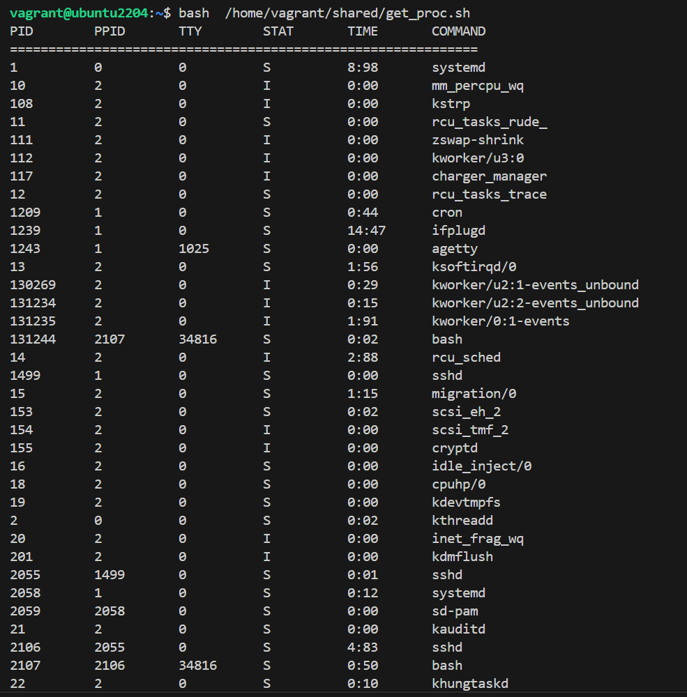

# Processes

## Задача:
написать свою реализацию ps ax используя анализ /proc
Результат - рабочий скрипт который можно запустить

## Выполнение:

[get_proc.sh](get_proc.sh):

```bash
#!/bin/bash

# Заголовок таблицы
printf "%-10s %-10s %-10s %-10s %-10s %-25s\n" "PID" "PPID" "TTY" "STAT" "TIME" "COMMAND"
echo "============================================================="

# Перебираем все директории в /proc
for pid in /proc/[0-9]*; do
    # Проверяем, что это директория
    if [ -d "$pid" ]; then
        # Читаем файл stat
        if [ -f "$pid/stat" ]; then
            # Извлекаем PID
            pid_num=$(awk '{print $1}' "$pid/stat")
            # Извлекаем PPID
            ppid=$(awk '{print $4}' "$pid/stat")
            # Извлекаем TTY
            tty=$(awk '{print $7}' "$pid/stat")
            # Извлекаем имя команды
            comm=$(awk '{print $2}' "$pid/stat" | tr -d '()')
            # Извлекаем состояние
            state=$(awk '{print $3}' "$pid/stat")

            # Извлекаем время работы процесса
            utime=$(awk '{print $14}' "$pid/stat")  # Время пользовательского режима
            stime=$(awk '{print $15}' "$pid/stat")  # Время системного режима
            total_time=$((utime + stime))  # Общее время
            time_formatted=$(printf "%d:%02d" $((total_time / 100)) $((total_time % 100)))  # Форматируем время

            # Выводим информацию
            printf "%-10s %-10s %-10s %-10s %-10s %-25s\n" "$pid_num" "$ppid" "$tty" "$state" "$time_formatted" "$comm"
        fi
    fi
done

```

<details>
<summary>Результат выполнения скрипта</summary>



</details>