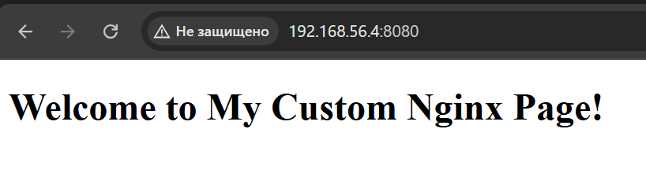

# Docker

## Задача:
- Установите Docker на хост машину
https://docs.docker.com/engine/install/ubuntu/
- Установите Docker Compose - как плагин, или как отдельное приложение
- Создайте свой кастомный образ nginx на базе alpine. После запуска nginx должен отдавать кастомную страницу (достаточно изменить дефолтную страницу nginx)
- Определите разницу между контейнером и образом
- Ответьте на вопрос: Можно ли в контейнере собрать ядро?
- Собранный образ необходимо запушить в docker hub и дать ссылку на ваш репозиторий.


## Выполнение:  

1. Устанновим Docker по инструкции `https://docs.docker.com/engine/install/ubuntu/`:  

1.1 Set up Docker's apt repository.
```
# Add Docker's official GPG key:
sudo apt-get update
sudo apt-get install ca-certificates curl
sudo install -m 0755 -d /etc/apt/keyrings
sudo curl -fsSL https://download.docker.com/linux/ubuntu/gpg -o /etc/apt/keyrings/docker.asc
sudo chmod a+r /etc/apt/keyrings/docker.asc

# Add the repository to Apt sources:
echo \
  "deb [arch=$(dpkg --print-architecture) signed-by=/etc/apt/keyrings/docker.asc] https://download.docker.com/linux/ubuntu \
  $(. /etc/os-release && echo "${UBUNTU_CODENAME:-$VERSION_CODENAME}") stable" | \
  sudo tee /etc/apt/sources.list.d/docker.list > /dev/null
sudo apt-get update
```

1.2. Install the Docker packages
```
sudo apt-get install docker-ce docker-ce-cli containerd.io docker-buildx-plugin docker-compose-plugin
```
3. Создание кастомного образа Nginx на базе Alpine:  

3.1 Создадим директорию для нашего проекта:
```bash
mkdir my-nginx
cd my-nginx
```
3.2 Создадим файл Dockerfile со следующим содержимым:
```
# Берем официальный образ nginx на базе alpine
FROM nginx:alpine

# Удаляем дефолтный индексный файл и копируем наш кастомный index.html
COPY index.html /usr/share/nginx/html/index.html

# Открываем порт 80
EXPOSE 80

# Запускаем nginx в foreground
CMD ["nginx", "-g", "daemon off;"]
```

3.3 Создадим файл index.html с кастомным содержимым:
```html
<!DOCTYPE html>
<html lang="en">
<head>
    <meta charset="UTF-8">
    <meta name="viewport" content="width=device-width, initial-scale=1.0">
    <title>My Custom Nginx Page</title>
</head>
<body>
    <h1>Welcome to My Custom Nginx Page!</h1>
</body>
</html>
```
3.4 Построим образ:
```bash
docker build -t my-custom-nginx .
```
```
root@ubuntu-jammy:~/my-nginx# docker build -t my-custom-nginx .
[+] Building 4.8s (7/7) FINISHED                                                                                                                                  docker:default
 => [internal] load build definition from Dockerfile                                                                                                                        0.0s
 => => transferring dockerfile: 424B                                                                                                                                        0.0s 
 => [internal] load metadata for docker.io/library/nginx:alpine                                                                                                             2.1s 
 => [internal] load .dockerignore                                                                                                                                           0.0s
 => => transferring context: 2B                                                                                                                                             0.0s 
 => [internal] load build context                                                                                                                                           0.0s 
 => => transferring context: 298B                                                                                                                                           0.0s 
 => [1/2] FROM docker.io/library/nginx:alpine@sha256:4ff102c5d78d254a6f0da062b3cf39eaf07f01eec0927fd21e219d0af8bc0591                                                       2.4s 
 => => resolve docker.io/library/nginx:alpine@sha256:4ff102c5d78d254a6f0da062b3cf39eaf07f01eec0927fd21e219d0af8bc0591                                                       0.0s 
 => => sha256:ccc35e35d420d6dd115290f1074afc6ad1c474b6f94897434e6befd33be781d2 1.79MB / 1.79MB                                                                              0.4s 
 => => sha256:43f2ec460bdf5babee56d7e13b060b308f42cbf2103f6665c349f0b98dac8962 627B / 627B                                                                                  0.5s 
 => => sha256:984583bcf083fa6900b5e7834795a9a57a9b4dfe7448d5350474f5d309625ece 955B / 955B                                                                                  0.6s 
 => => sha256:a71e0884a7f1192ecf5decf062b67d46b54ad63f0cc1b8aa7e705f739a97c2fc 2.50kB / 2.50kB                                                                              0.0s 
 => => sha256:4ff102c5d78d254a6f0da062b3cf39eaf07f01eec0927fd21e219d0af8bc0591 10.36kB / 10.36kB                                                                            0.0s 
 => => sha256:1ff4bb4faebcfb1f7e01144fa9904a570ab9bab88694457855feb6c6bba3fa07 11.23kB / 11.23kB                                                                            0.0s 
 => => extracting sha256:ccc35e35d420d6dd115290f1074afc6ad1c474b6f94897434e6befd33be781d2                                                                                   0.1s 
 => => resolve docker.io/library/nginx:alpine@sha256:4ff102c5d78d254a6f0da062b3cf39eaf07f01eec0927fd21e219d0af8bc0591                                                       0.0s 
 => => sha256:ccc35e35d420d6dd115290f1074afc6ad1c474b6f94897434e6befd33be781d2 1.79MB / 1.79MB                                                                              0.4s 
 => => sha256:43f2ec460bdf5babee56d7e13b060b308f42cbf2103f6665c349f0b98dac8962 627B / 627B                                                                                  0.5s 
 => => sha256:984583bcf083fa6900b5e7834795a9a57a9b4dfe7448d5350474f5d309625ece 955B / 955B                                                                                  0.6s 
 => => sha256:a71e0884a7f1192ecf5decf062b67d46b54ad63f0cc1b8aa7e705f739a97c2fc 2.50kB / 2.50kB                                                                              0.0s 
 => => sha256:4ff102c5d78d254a6f0da062b3cf39eaf07f01eec0927fd21e219d0af8bc0591 10.36kB / 10.36kB                                                                            0.0s 
 => => sha256:1ff4bb4faebcfb1f7e01144fa9904a570ab9bab88694457855feb6c6bba3fa07 11.23kB / 11.23kB                                                                            0.0s 
 => => extracting sha256:ccc35e35d420d6dd115290f1074afc6ad1c474b6f94897434e6befd33be781d2                                                                                   0.1s 
 => => sha256:ccc35e35d420d6dd115290f1074afc6ad1c474b6f94897434e6befd33be781d2 1.79MB / 1.79MB                                                                              0.4s 
 => => sha256:43f2ec460bdf5babee56d7e13b060b308f42cbf2103f6665c349f0b98dac8962 627B / 627B                                                                                  0.5s 
 => => sha256:984583bcf083fa6900b5e7834795a9a57a9b4dfe7448d5350474f5d309625ece 955B / 955B                                                                                  0.6s 
 => => sha256:a71e0884a7f1192ecf5decf062b67d46b54ad63f0cc1b8aa7e705f739a97c2fc 2.50kB / 2.50kB                                                                              0.0s 
 => => sha256:4ff102c5d78d254a6f0da062b3cf39eaf07f01eec0927fd21e219d0af8bc0591 10.36kB / 10.36kB                                                                            0.0s 
 => => sha256:1ff4bb4faebcfb1f7e01144fa9904a570ab9bab88694457855feb6c6bba3fa07 11.23kB / 11.23kB                                                                            0.0s 
 => => extracting sha256:ccc35e35d420d6dd115290f1074afc6ad1c474b6f94897434e6befd33be781d2                                                                                   0.1s 
 => => sha256:43f2ec460bdf5babee56d7e13b060b308f42cbf2103f6665c349f0b98dac8962 627B / 627B                                                                                  0.5s 
 => => sha256:984583bcf083fa6900b5e7834795a9a57a9b4dfe7448d5350474f5d309625ece 955B / 955B                                                                                  0.6s 
 => => sha256:a71e0884a7f1192ecf5decf062b67d46b54ad63f0cc1b8aa7e705f739a97c2fc 2.50kB / 2.50kB                                                                              0.0s 
 => => sha256:4ff102c5d78d254a6f0da062b3cf39eaf07f01eec0927fd21e219d0af8bc0591 10.36kB / 10.36kB                                                                            0.0s 
 => => sha256:1ff4bb4faebcfb1f7e01144fa9904a570ab9bab88694457855feb6c6bba3fa07 11.23kB / 11.23kB                                                                            0.0s 
 => => extracting sha256:ccc35e35d420d6dd115290f1074afc6ad1c474b6f94897434e6befd33be781d2                                                                                   0.1s 
 => => sha256:984583bcf083fa6900b5e7834795a9a57a9b4dfe7448d5350474f5d309625ece 955B / 955B                                                                                  0.6s 
 => => sha256:a71e0884a7f1192ecf5decf062b67d46b54ad63f0cc1b8aa7e705f739a97c2fc 2.50kB / 2.50kB                                                                              0.0s 
 => => sha256:4ff102c5d78d254a6f0da062b3cf39eaf07f01eec0927fd21e219d0af8bc0591 10.36kB / 10.36kB                                                                            0.0s 
 => => sha256:1ff4bb4faebcfb1f7e01144fa9904a570ab9bab88694457855feb6c6bba3fa07 11.23kB / 11.23kB                                                                            0.0s 
 => => extracting sha256:ccc35e35d420d6dd115290f1074afc6ad1c474b6f94897434e6befd33be781d2                                                                                   0.1s 
 => => sha256:4ff102c5d78d254a6f0da062b3cf39eaf07f01eec0927fd21e219d0af8bc0591 10.36kB / 10.36kB                                                                            0.0s 
 => => sha256:1ff4bb4faebcfb1f7e01144fa9904a570ab9bab88694457855feb6c6bba3fa07 11.23kB / 11.23kB                                                                            0.0s 
 => => extracting sha256:ccc35e35d420d6dd115290f1074afc6ad1c474b6f94897434e6befd33be781d2                                                                                   0.1s 
 => => extracting sha256:ccc35e35d420d6dd115290f1074afc6ad1c474b6f94897434e6befd33be781d2                                                                                   0.1s 
 => => sha256:8d27c072a58f81ecf2425172ac0e5b25010ff2d014f89de35b90104e462568eb 402B / 402B                                                                                  0.6s 
 => => sha256:ab3286a7346303a31b69a5189f63f1414cc1de44e397088dcd07edb322df1fe9 1.21kB / 1.21kB                                                                              0.7s 
 => => sha256:8d27c072a58f81ecf2425172ac0e5b25010ff2d014f89de35b90104e462568eb 402B / 402B                                                                                  0.6s 
 => => sha256:ab3286a7346303a31b69a5189f63f1414cc1de44e397088dcd07edb322df1fe9 1.21kB / 1.21kB                                                                              0.7s 
 => => sha256:6d79cc6084d434876ce0f038c675d20532f28e476283a29e7e63bc0bf13a4ed6 1.40kB / 1.40kB                                                                              0.8s 
 => => sha256:ab3286a7346303a31b69a5189f63f1414cc1de44e397088dcd07edb322df1fe9 1.21kB / 1.21kB                                                                              0.7s 
 => => sha256:6d79cc6084d434876ce0f038c675d20532f28e476283a29e7e63bc0bf13a4ed6 1.40kB / 1.40kB                                                                              0.8s 
 => => sha256:6d79cc6084d434876ce0f038c675d20532f28e476283a29e7e63bc0bf13a4ed6 1.40kB / 1.40kB                                                                              0.8s 
 => => extracting sha256:43f2ec460bdf5babee56d7e13b060b308f42cbf2103f6665c349f0b98dac8962                                                                                   0.0s 
 => => extracting sha256:43f2ec460bdf5babee56d7e13b060b308f42cbf2103f6665c349f0b98dac8962                                                                                   0.0s 
 => => extracting sha256:984583bcf083fa6900b5e7834795a9a57a9b4dfe7448d5350474f5d309625ece                                                                                   0.0s 
 => => sha256:0c7e4c092ab716c95e1a8840943549b4ac5e6c5d1a1cc74496528e1b03e1e67a 15.38MB / 15.38MB                                                                            1.7s 
 => => extracting sha256:8d27c072a58f81ecf2425172ac0e5b25010ff2d014f89de35b90104e462568eb                                                                                   0.0s 
 => => extracting sha256:ab3286a7346303a31b69a5189f63f1414cc1de44e397088dcd07edb322df1fe9                                                                                   0.0s 
 => => extracting sha256:6d79cc6084d434876ce0f038c675d20532f28e476283a29e7e63bc0bf13a4ed6                                                                                   0.0s 
 => => extracting sha256:0c7e4c092ab716c95e1a8840943549b4ac5e6c5d1a1cc74496528e1b03e1e67a                                                                                   0.6s 
 => [2/2] COPY index.html /usr/share/nginx/html/index.html                                                                                                                  0.2s 
 => exporting to image                                                                                                                                                      0.0s 
 => => exporting layers                                                                                                                                                     0.0s 
 => => writing image sha256:19fda7837d8a820100b1911bcfea8bfb165621f951771ad7e12611e45745a9ec                                                                                0.0s 
 => => naming to docker.io/library/my-custom-nginx                                                                                                                           0.0s 
```
3.5 Проверяем образы Docker:
```bash
root@ubuntu-jammy:~/my-nginx# docker images
REPOSITORY        TAG       IMAGE ID       CREATED          SIZE
my-custom-nginx   latest    19fda7837d8a   28 minutes ago   47.9MB
hello-world       latest    74cc54e27dc4   8 weeks ago      10.1kB
```
3.6 Запускаем контейнер:
```bash
root@ubuntu-jammy:~/my-nginx# docker run -d -p 8080:80 my-custom-nginx
f11b93fb224227cbe6e2f0d788eb51ac3c17edc86626b139cd94aa5b977d6ace
```
3.7 Проверяем доступность страницы `curl http://localhost:8080`:
```bash
root@ubuntu-jammy:~/my-nginx# curl http://localhost:8080
<!DOCTYPE html>
<html lang="en">
<head>
    <meta charset="UTF-8">
    <meta name="viewport" content="width=device-width, initial-scale=1.0">
    <title>My Custom Nginx Page</title>
</head>
<body>
    <h1>Welcome to My Custom Nginx Page!</h1>
</body>
</html>
```


4. Разница между контейнером и образом
Образ (Image) – это статический шаблон, содержащий файловую систему (паттерн слоев), библиотеки, зависимости и инструкции для запуска приложения. Образ является неизменяемым, и на его основе можно создавать контейнеры.
Контейнер – это запущенный экземпляр образа. Он запускается в изолированной среде с собственным файловым пространством, процессами и сетевыми интерфейсами. Контейнеры могут быть запущены, остановлены, удалены и перезапущены, а изменения внутри них (например, записанные файлы) не сохраняются обратно в образ (если не использовать механизмы сохранения, как commit).
Таким образом, образ – это «база», а контейнер – «запущенный процесс» с этой базой.

5. Можно ли в контейнере собрать ядро?
В общем случае, сборка ядра вычислительной системы (например, Linux kernel) требует доступа к особенностям хост-системы, таким как специфичные драйверы, модули и низкоуровневый доступ к оборудованию. Контейнеры по своей природе изолированы на уровне пространств имён ОС и используют ядро хост-системы.

Таким образом, собрать полноценное ядро в контейнере проблематично (и, как правило, нет смысла) по следующим причинам:

Контейнеры используют ядро хоста, поэтому изменения и сборка ядра внутри контейнера не повлияют на само ядро хоста.
Для сборки ядра требуются привилегии и специфичная конфигурация, которая обычно не предоставляется изолированным контейнерам.
Можно запустить сборку ядра в контейнере (при наличии нужных инструментов и прав, возможно с запуском контейнера в режиме «privileged»), но конечный результат будет ограничен контекстом контейнера и не применим для реального обновления ядра хоста.

Вывод: хотя технически можно инициировать процесс сборки ядра внутри контейнера, это не является практичным способом и не изменяет используемое хост-ядро.

6. Разместим созданный образ на docker hub  

6.1 Войдите в Docker из командной строки:
```bash
docker login -u <username>
```

6.2 Привяжите ваш образ к репозиторию. Допустим, ваш Docker Hub username – username, а репозиторий будет называться my-custom-nginx. Необходимо отметить, что имя образа должно иметь формат username/repository. Если вы ещё не переименовывали образ, то можно использовать команду tag:

```bash
docker tag my-custom-nginx username/my-custom-nginx:latest
```
В данной команде:
my-custom-nginx – локальное имя образа, которое вы создали с помощью docker build.
username/my-custom-nginx – имя образа в Docker Hub, username – ваш логин.
:latest – тег, можно настроить при необходимости.

6.3 Запушьте образ в Docker Hub:
```bash
docker push username/my-custom-nginx:latest
```
6.4 После успешной загрузки образа, наш репозиторий будет доступен по адресу:

[https://hub.docker.com/repository/docker/schukinsky/my-custom-nginx](https://hub.docker.com/repository/docker/schukinsky/my-custom-nginx)


