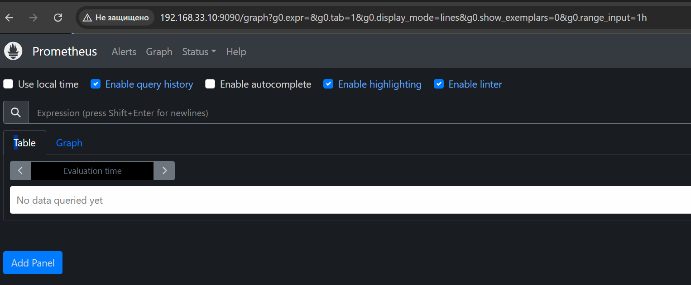
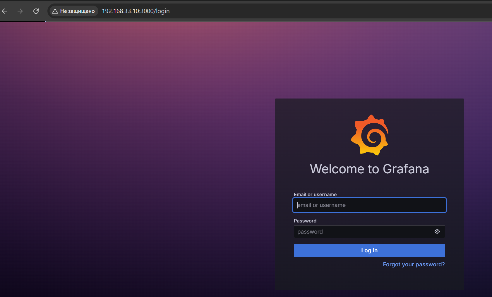
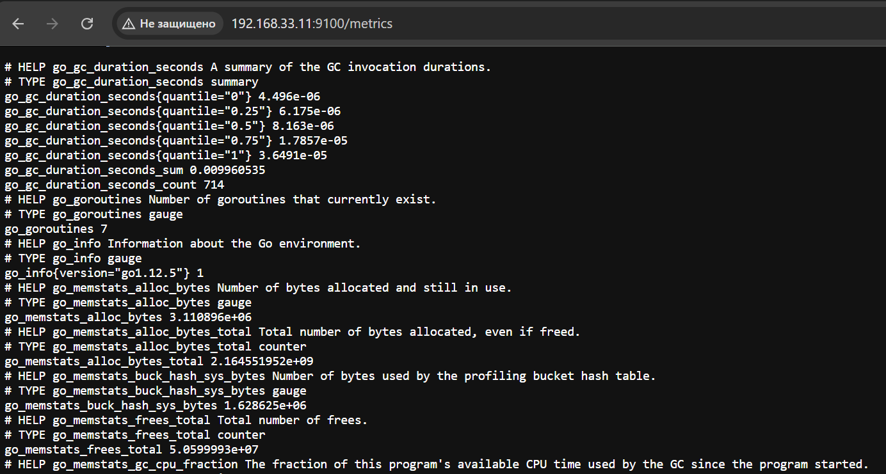
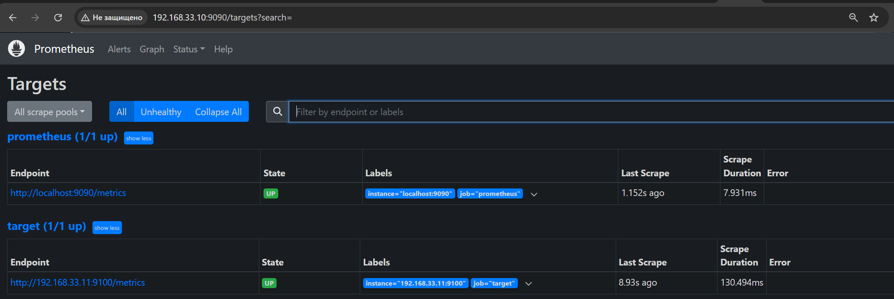
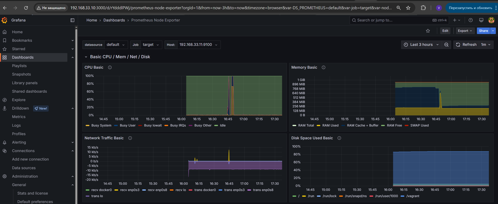

# Prometheus-Grafana

## Задача:
- Настроить систему мониторинга prometheus - grafana
- Настроить дашборд с 4-мя графиками:
    - память;
    - процессор;
    - диск;
    - сеть.

## Выполнение:
1. С помощью [Vagrantfile](Vagrantfile) развернем стенд из двух виртуальных машин:
 - ubuntu-prometheus-grafana
 - target

2. Настройка сервера мониторинга `ubuntu-prometheus-grafana`
 
2.1 Установим Docker:
```bash
sudo -i
apt update
apt install docker.io
```

2.2 Cоздадим каталог и prometheus.yml:
```bash
mkdir /home/vagrant/prometheus/
touch prometheus.yml
```
```bash
nano prometheus.yml
```
[prometheus.yml](prometheus.yml):
```
global:
  scrape_interval: 15s  # Интервал опроса всех таргетов (каждые 15 секунд)
  evaluation_interval: 15s  # Интервал выполнения правил

scrape_configs:
  - job_name: 'prometheus'
    static_configs:
      - targets: ['localhost:9090']

  - job_name: 'target'
    static_configs:
      - targets: ['192.168.33.11:9100']
```

2.3 Создалим катало для хранения данных prometheus `prometheus-data`
```bash
cd /
sudo mkdir prometheus-data
```

2.4 Запустим prometheus в docker:
```ssh
docker run -dt \
    -p 9090:9090 \
    -v /home/vagrant/prometheus/prometheus.yml:/etc/prometheus/prometheus.yml \
    -v prometheus-data:/prometheus \
    prom/prometheus
```


2.5 Установим Grafana:

Install the prerequisite packages:
```bash
sudo apt-get install -y apt-transport-https software-properties-common wget
```

Import the GPG key:
```bash
sudo mkdir -p /etc/apt/keyrings/
wget -q -O - https://apt.grafana.com/gpg.key | gpg --dearmor | sudo tee /etc/apt/keyrings/grafana.gpg > /dev/null
```

To add a repository for stable releases, run the following command:
```bash
echo "deb [signed-by=/etc/apt/keyrings/grafana.gpg] https://apt.grafana.com stable main" | sudo tee -a /etc/apt/sources.list.d/grafana.list
```

To add a repository for beta releases, run the following command:
```bash
echo "deb [signed-by=/etc/apt/keyrings/grafana.gpg] https://apt.grafana.com beta main" | sudo tee -a /etc/apt/sources.list.d/grafana.list
```

Run the following command to update the list of available packages:
```bash
# Updates the list of available packages
sudo apt-get update
```

To install Grafana OSS, run the following command:
```bash
# Installs the latest OSS release:
sudo apt-get install grafana
```

```bash
sudo /bin/systemctl daemon-reload
sudo /bin/systemctl enable grafana-server
sudo /bin/systemctl start grafana-server
```
Проверим:
http://localhost:3000


3. Установим Node Exporter на виртуальную машину target:

Add user for node_exporter:
```bash
sudo useradd --no-create-home --shell /bin/false node_exporter
```

Download node_exporter:
```bash
cd
wget https://github.com/prometheus/node_exporter/releases/download/v0.18.1/node_exporter-0.18.1.linux-amd64.tar.gz
```

Extract node_exporter:
```bash
tar xvf node_exporter-0.18.1.linux-amd64.tar.gz
```

Copy node_exporter to /opt:
```bash
sudo mv node_exporter-0.18.1.linux-amd64 /opt/node_exporter
sudo chown -R node_exporter:node_exporter /opt/node_exporter
```

Create service file for systemd:
```bash
sudo nano /etc/systemd/system/node_exporter.service
```

Fillin as follows:
```
[Unit]
Description=Node Exporter
Wants=network-online.target
After=network-online.target

[Service]
User=node_exporter
Group=node_exporter
Type=simple
ExecStart=/opt/node_exporter/node_exporter --collector.systemd

[Install]
WantedBy=multi-user.target
```

Start the service with systemd and verify it runs:
```bash
sudo systemctl daemon-reload
sudo systemctl enable node_exporter
sudo systemctl start node_exporter && sudo journalctl -f --unit node_exporter
```
Проверим доступность даныых от Node Exporter: 
```
http://192.168.33.11:9100/metrics
```

  

  

4. В добавим в Grafana Data sources prometheus `http://localhost:9090`  
5. Добавим и настроим Dashboard:

