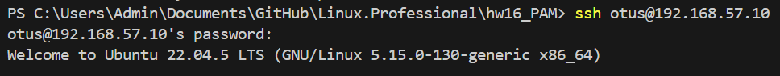

# PAM (Pluggable Authentication Modules)

### Задача:
- Запретить всем пользователям, кроме группы admin логин в выходные (суббота и воскресенье), без учета праздников
- *Дать конкретному пользователю права работать с докером и возможность рестартить докер сервис*
### Выполнение:
1. Развернем ВМ используя [Vagrantfile](Vagrantfile)
```bash
vagrant up
```
2. Подключаемся к нашей созданной ВМ:
 ```bash
 vagrant ssh
```
3. Переходим в root-пользователя: 
```bash
sudo -i
```
4. Создаём пользователя otusadm и otus: 
```bash
sudo useradd otusadm && sudo useradd otus
```
5. Создаём пользователям пароли: 
```bash
echo "otusadm:Otus2025!" | sudo chpasswd && echo "otus:Otus2025!" | sudo chpasswd
```
*Для примера мы указываем одинаковые пароли для пользователя otus и otusadm.*  
6. Создаём группу admin:
```bash
sudo groupadd -f admin
```
7. Добавляем пользователей vagrant,root и otusadm в группу admin:
```bash
usermod otusadm -a -G admin && usermod root -a -G admin && usermod vagrant -a -G admin
```
**Обращаем внимание, что мы просто добавили пользователя otusadm в группу admin. Это не делает пользователя otusadm администратором.**

После создания пользователей проверим, что они могут подключаться по SSH к ВМ. Для этого пытаемся подключиться с хостовой машины:
```bash
ssh otus@192.168.57.10
ssh otusadm@192.168.57.10
``` 
```
root@pam:~# ssh otus@192.168.57.10
The authenticity of host '192.168.57.10 (192.168.57.10)' can't be established.
ED25519 key fingerprint is SHA256:CTn1B3te9XMIW28wa0AfZxR8NAjBYxOkCpSUuQhfOsM.
This key is not known by any other names
Are you sure you want to continue connecting (yes/no/[fingerprint])? yes
Warning: Permanently added '192.168.57.10' (ED25519) to the list of known hosts.
otus@192.168.57.10's password: 
$ whoami
otus
```
```
root@pam:~# ssh otusadm@192.168.57.10
otusadm@192.168.57.10's password: 
$ whoami
otusadm
```

Далее настроим правило, по которому все пользователи кроме тех, что указаны в группе admin не смогут подключаться в выходные дни:


8. Проверим, что пользователи root, vagrant и otusadm есть в группе admin:
```bash
cat /etc/group | grep admin
```
```
root@pam:~# cat /etc/group | grep admin
admin:x:118:otusadm,root,vagrant
```

Информация о группах и пользователях в них хранится в файле /etc/group, пользователи указываются через запятую.

Выберем метод PAM-аутентификации, так как у нас используется только ограничение по времени, то было бы логично использовать метод pam_time, однако, данный метод не работает с локальными группами пользователей, и, получается, что использование данного метода добавит нам большое количество однообразных строк с разными пользователями. В текущей ситуации лучше написать небольшой скрипт контроля и использовать модуль pam_exec


9. Создадим файл-скрипт [login.sh](login.sh)
```bash
nano /usr/local/bin/login.sh
```
10. Добавим права на исполнение файла: 
```bash
chmod +x /usr/local/bin/login.sh
```
11. Укажем в файле /etc/pam.d/sshd модуль pam_exec и наш скрипт:
```
auth required pam_exec.so debug /usr/local/bin/login.sh
```
```bash
nano /etc/pam.d/sshd
```
```
# PAM configuration for the Secure Shell service

# Standard Un*x authentication.
@include common-auth
auth required pam_exec.so debug /usr/local/bin/login.sh
# Disallow non-root logins when /etc/nologin exists.
account    required     pam_nologin.so

# Uncomment and edit /etc/security/access.conf if you need to set complex
# access limits that are hard to express in sshd_config.
# account  required     pam_access.so

# Standard Un*x authorization.
@include common-account

# SELinux needs to be the first session rule.  This ensures that any
# lingering context has been cleared.  Without this it is possible that a
# module could execute code in the wrong domain.
session [success=ok ignore=ignore module_unknown=ignore default=bad]        pam_selinux.so close

# Set the loginuid process attribute.
session    required     pam_loginuid.so

# Create a new session keyring.
session    optional     pam_keyinit.so force revoke

# Standard Un*x session setup and teardown.
@include common-session

# Print the message of the day upon successful login.
# This includes a dynamically generated part from /run/motd.dynamic
# and a static (admin-editable) part from /etc/motd.
session    optional     pam_motd.so  motd=/run/motd.dynamic
session    optional     pam_motd.so noupdate

# Print the status of the user's mailbox upon successful login.
session    optional     pam_mail.so standard noenv # [1]

# Set up user limits from /etc/security/limits.conf.
session    required     pam_limits.so

# Read environment variables from /etc/environment and
# /etc/security/pam_env.conf.
session    required     pam_env.so # [1]
# In Debian 4.0 (etch), locale-related environment variables were moved to
# /etc/default/locale, so read that as well.
session    required     pam_env.so user_readenv=1 envfile=/etc/default/locale

# SELinux needs to intervene at login time to ensure that the process starts
# in the proper default security context.  Only sessions which are intended
# to run in the user's context should be run after this.
session [success=ok ignore=ignore module_unknown=ignore default=bad]        pam_selinux.so open

# Standard Un*x password updating.
@include common-password
```
На этом настройка завершена, нужно только проверить, что скрипт отрабатывает корректно.


Изменим дату на 04.04.2025 - это пятница и повторим проверку под пользователем `otus`:
```
sudo systemctl stop systemd-timesyncd
sudo date 040412302025.00
Fri Apr  4 12:30:00 UTC 2025
```
