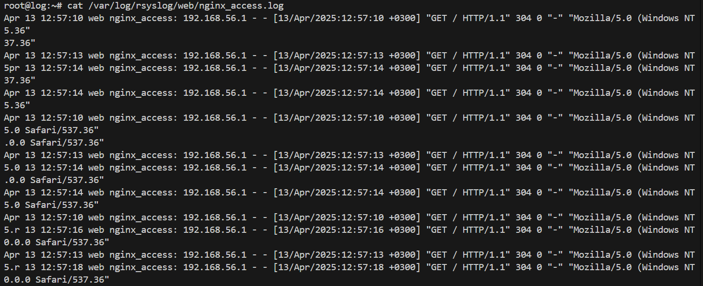
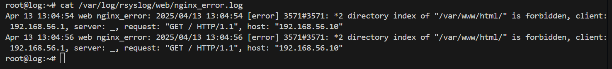
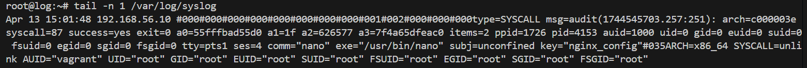

# Rsyslog (Rocket-fast System for log processing)

### Задача:
- в вагранте поднимаем 2 машины web и log
- на web поднимаем nginx
- на log настраиваем центральный лог сервер на любой системе на выбор:
    - journald;
    - rsyslog;
    - elk.
- настраиваем аудит, следящий за изменением конфигов нжинкса.
Все критичные логи с web должны собираться и локально и удаленно.  
Все логи с nginx должны уходить на удаленный сервер (локально только критичные).  
Логи аудита должны также уходить на удаленную систему.  

### Выполнение:
1. Развернем две виртуальные машины web и log используя [Vagrantfile](Vagrantfile)
```bash
vagrant up
```
2. Заходим на web-сервер:
 ```bash
 vagrant ssh web
```
3. Переходим в root пользователя: 
 ```bash
sudo -i
```
4. Устанавливаем настройки даты и времени:
```bash
timedatectl set-ntp true
timedatectl set-timezone Europe/Moscow
timedatectl status
```

```
root@web:~# timedatectl status
               Local time: Sun 2025-04-13 12:19:28 MSK
           Universal time: Sun 2025-04-13 09:19:28 UTC
                 RTC time: Sun 2025-04-13 09:19:28
                Time zone: Europe/Moscow (MSK, +0300)
System clock synchronized: yes
              NTP service: active
          RTC in local TZ: no
```
5. Установим nginx на виртуальной машине web:
```bash
apt update && apt install -y nginx
systemctl status nginx
```
```
root@web:~# systemctl status nginx
● nginx.service - A high performance web server and a reverse proxy server
     Loaded: loaded (/lib/systemd/system/nginx.service; enabled; vendor preset: enabled)
     Active: active (running) since Sun 2025-04-13 12:23:23 MSK; 1min 29s ago
       Docs: man:nginx(8)
    Process: 3343 ExecStartPre=/usr/sbin/nginx -t -q -g daemon on; master_process on; (code=exited, status=0/SUCCESS)
    Process: 3344 ExecStart=/usr/sbin/nginx -g daemon on; master_process on; (code=exited, status=0/SUCCESS)
   Main PID: 3436 (nginx)
      Tasks: 3 (limit: 1590)
     Memory: 4.7M
        CPU: 39ms
     CGroup: /system.slice/nginx.service
             ├─3436 "nginx: master process /usr/sbin/nginx -g daemon on; master_process on;"
             ├─3438 "nginx: worker process" "" "" "" "" "" "" "" "" "" "" "" "" "" "" "" "" "" "" "" "" "" "" "" "" "" "" ""
             └─3439 "nginx: worker process" "" "" "" "" "" "" "" "" "" "" "" "" "" "" "" "" "" "" "" "" "" "" "" "" "" "" ""

Apr 13 12:23:23 web systemd[1]: Starting A high performance web server and a reverse proxy server...
Apr 13 12:23:23 web systemd[1]: Started A high performance web server and a reverse proxy server.
lines 1-17/17 (END)
^C
root@web:~# ss -tln | grep 80
LISTEN 0      511          0.0.0.0:80        0.0.0.0:*
LISTEN 0      511             [::]:80           [::]:*
```
6. Заходим на log-сервер:
 ```bash
 vagrant ssh log
```
7. Переходим в root пользователя: 
 ```bash
sudo -i
```
8. Устанавливаем настройки даты и времени:
```bash
timedatectl set-ntp true && timedatectl set-timezone Europe/Moscow && timedatectl status
```
```
root@log:~# set-ntp true && set-timezone Europe/Moscow && timedatectl status
-bash: set-ntp: command not found
root@log:~# timedatectl set-ntp true && timedatectl set-timezone Europe/Moscow && timedatectl status
               Local time: Sun 2025-04-13 12:29:55 MSK
           Universal time: Sun 2025-04-13 09:29:55 UTC
                 RTC time: Sun 2025-04-13 09:29:55
                Time zone: Europe/Moscow (MSK, +0300)
System clock synchronized: no
              NTP service: active
          RTC in local TZ: no
```
9. Удебимся что rsyslog установлен в системе:
```bash
apt list rsyslog
```
```
root@log:~# apt list rsyslog
Listing... Done
rsyslog/jammy-updates,jammy-security,now 8.2112.0-2ubuntu2.2 amd64 [installed,automatic]
N: There is 1 additional version. Please use the '-a' switch to see it
```
10. Производим настройку  Rsyslog `/etc/rsyslog.conf`:
```bash
nano /etc/rsyslog.conf
```
```
# /etc/rsyslog.conf configuration file for rsyslog
#
# For more information install rsyslog-doc and see
# /usr/share/doc/rsyslog-doc/html/configuration/index.html
#
# Default logging rules can be found in /etc/rsyslog.d/50-default.conf


#################
#### MODULES ####
#################

module(load="imuxsock") # provides support for local system logging
#module(load="immark")  # provides --MARK-- message capability

# provides UDP syslog reception
module(load="imudp")
input(type="imudp" port="514")

# provides TCP syslog reception
module(load="imtcp")
input(type="imtcp" port="514")

# provides kernel logging support and enable non-kernel klog messages
module(load="imklog" permitnonkernelfacility="on")

###########################
#### GLOBAL DIRECTIVES ####
###########################

#
# Use traditional timestamp format.
# To enable high precision timestamps, comment out the following line.
#
$ActionFileDefaultTemplate RSYSLOG_TraditionalFileFormat

# Filter duplicated messages
$RepeatedMsgReduction on

#
# Set the default permissions for all log files.
#
$FileOwner syslog
$FileGroup adm
$FileCreateMode 0640
$DirCreateMode 0755
$Umask 0022
$PrivDropToUser syslog
$PrivDropToGroup syslog

#
# Where to place spool and state files
#
$WorkDirectory /var/spool/rsyslog

#
# Include all config files in /etc/rsyslog.d/
#
$IncludeConfig /etc/rsyslog.d/*.conf

#Add remote logs
$template RemoteLogs,"/var/log/rsyslog/%HOSTNAME%/%PROGRAMNAME%.log"
*.* ?RemoteLogs
& ~
```
11. Сохраняем файл и перезапускаем службу rsyslog: 
```bash
systemctl restart rsyslog
```
Проверяем видны ли открытые порты:
```bash
ss -tulpn | grep :514
```
```
root@log:~# ss -tulpn | grep :514
udp   UNCONN 0      0             0.0.0.0:514       0.0.0.0:*    users:(("rsyslogd",pid=2249,fd=5))
udp   UNCONN 0      0                [::]:514          [::]:*    users:(("rsyslogd",pid=2249,fd=6))
tcp   LISTEN 0      25            0.0.0.0:514       0.0.0.0:*    users:(("rsyslogd",pid=2249,fd=7))
tcp   LISTEN 0      25               [::]:514          [::]:*    users:(("rsyslogd",pid=2249,fd=8))
```
12. На сервере web проверяем внрсию nginx:
```
root@web:~# nginx -v
nginx version: nginx/1.18.0 (Ubuntu)
```
13. Настроим логирование nginx в файле `/etc/nginx/nginx.conf`:
```bash
nano /etc/nginx/nginx.conf
```
```
error_log  /var/log/nginx/error.log;
error_log  syslog:server=192.168.56.15:514,tag=nginx_error;
access_log syslog:server=192.168.56.15:514,tag=nginx_access,severity=info combined;
```
14. Проверяем, что конфигурация nginx указана правильно: 
```
root@web:~# root@web:~# nginx -t
nginx: the configuration file /etc/nginx/nginx.conf syntax is ok
nginx: configuration file /etc/nginx/nginx.conf test is successful
```
15. Перезапускаем nginx: 
```bash
systemctl restart nginx
```
16. Попробуем несколько раз зайти по адресу http://192.168.56.10
Далее заходим на log-сервер и смотрим информацию об nginx:
```bash
cat /var/log/rsyslog/web/nginx_access.log 
cat /var/log/rsyslog/web/nginx_error.log 
```
```
root@log:~# cat /var/log/rsyslog/web/nginx_access.log 
Apr 13 12:57:10 web nginx_access: 192.168.56.1 - - [13/Apr/2025:12:57:10 +0300] "GET / HTTP/1.1" 304 0 "-" "Mozilla/5.0 (Windows NT 10.0; Win64; x64) AppleWebKit/537.36 (KHTML, like Gecko) Chrome/135.0.0.0 Safari/537.36"
Apr 13 12:57:13 web nginx_access: 192.168.56.1 - - [13/Apr/2025:12:57:13 +0300] "GET / HTTP/1.1" 304 0 "-" "Mozilla/5.0 (Windows NT 10.0; Win64; x64) AppleWebKit/537.36 (KHTML, like Gecko) Chrome/135.0.0.0 Safari/537.36"
Apr 13 12:57:14 web nginx_access: 192.168.56.1 - - [13/Apr/2025:12:57:14 +0300] "GET / HTTP/1.1" 304 0 "-" "Mozilla/5.0 (Windows NT 10.0; Win64; x64) AppleWebKit/537.36 (KHTML, like Gecko) Chrome/135.0.0.0 Safari/537.36"
Apr 13 12:57:16 web nginx_access: 192.168.56.1 - - [13/Apr/2025:12:57:16 +0300] "GET / HTTP/1.1" 304 0 "-" "Mozilla/5.0 (Windows NT 10.0; Win64; x64) AppleWebKit/537.36 (KHTML, like Gecko) Chrome/135.0.0.0 Safari/537.36"
Apr 13 12:57:18 web nginx_access: 192.168.56.1 - - [13/Apr/2025:12:57:18 +0300] "GET / HTTP/1.1" 304 0 "-" "Mozilla/5.0 (Windows NT 10.0; Win64; x64) AppleWebKit/537.36 (KHTML, like Gecko) Chrome/135.0.0.0 Safari/537.36"
Apr 13 12:57:19 web nginx_access: 192.168.56.1 - - [13/Apr/2025:12:57:19 +0300] "GET / HTTP/1.1" 304 0 "-" "Mozilla/5.0 (Windows NT 10.0; Win64; x64) AppleWebKit/537.36 (KHTML, like Gecko) Chrome/135.0.0.0 Safari/537.36"
```  



Поскольку наше приложение работает без ошибок, файл nginx_error.log не будет создан:
```
root@log:~# cat /var/log/rsyslog/web/nginx_error.log 
cat: /var/log/rsyslog/web/nginx_error.log: No such file or directory
```
17. Чтобы сгенерировать ошибку, можно переместить файл веб-страницы, который открывает nginx:
```bash
mv /var/www/html/index.nginx-debian.html /var/www/
```
18. После этого мы получим 403 ошибку. Видим, что логи отправляются корректно:
```
root@log:~# cat /var/log/rsyslog/web/nginx_error.log 
cat: /var/log/rsyslog/web/nginx_error.log: No such file or directory
root@log:~# cat /var/log/rsyslog/web/nginx_error.log 
cat: /var/log/rsyslog/web/nginx_error.log: No such file or directory
root@log:~# cat /var/log/rsyslog/web/nginx_error.log 
Apr 13 13:04:54 web nginx_error: 2025/04/13 13:04:54 [error] 3571#3571: *2 directory index of "/var/www/html/" is forbidden, client: 192.168.56.1, server: _, request: "GET / HTTP/1.1", host: "192.168.56.10"
Apr 13 13:04:56 web nginx_error: 2025/04/13 13:04:56 [error] 3571#3571: *2 directory index of "/var/www/html/" is forbidden, client: 192.168.56.1, server: _, request: "GET / HTTP/1.1", host: "192.168.56.10"
```

19. Установка и запуск auditd:
```bash
sudo apt update
sudo apt install auditd audispd-plugins
sudo systemctl enable auditd
sudo systemctl start auditd
```
20.  Для сохранения правила после перезагрузки создадим файл правил:
```bash
nano /etc/audit/rules.d/nginx_audit.rules
```
21. Добавим в него следующее правило:  

  `-w /etc/nginx/ -p wa -k nginx_config`

Пояснения:  
-w – указание пути для отслеживания  
-p wa – режим аудита: w (изменение содержимого – запись) и a (изменение атрибутов)  
-k nginx_config – ключ для удобства поиска событий  
22. Перезагрузим правила аудита:
```bash
augenrules --load
```
(или можно перезапустить auditd: sudo systemctl restart auditd)
23. Настроим отправку событий Audit на удаленный RSYSLOG ЧЕРЕЗ audisp-remote:
```bash
sudo nano /etc/audit/audisp-remote.conf
```  
remote_server = 192.168.56.15
port = 60
transport = tcp
24. Настройте плагин audisp-remote для активации отправки событий. Для этого откройте файл /etc/audit/plugins.d/au-remote.conf:
```bash
nano /etc/audit/plugins.d/au-remote.conf
```  
Убедитесь, что строка active установлена в yes:
```
active = yes
direction = out
path = /sbin/audisp-remote
type = always
args =
format = string
```
25. Перезапустите сервис auditd, чтобы вступили в силу все изменения:
```bash
  sudo systemctl restart auditd
```
26. На сервере log cоздайте отдельный файл в /etc/rsyslog.d/:
```bash
nano /etc/rsyslog.d/remote.conf
```
```
# Модуль TCP приёма ключевых сообщений
module(load="imtcp")
input(type="imtcp" port="60")
```
27. Сохраните файл и перезапустите службу rsyslog:
```bash
  sudo systemctl restart rsyslog
```
28. Изменяем /etc/nginx/nginx.conf и проверяем логи на web и log
```
root@web:~# ausearch -k nginx_config
----
time->Sun Apr 13 15:01:47 2025
type=PROCTITLE msg=audit(1744545707.005:254): proctitle=6E616E6F002F6574632F6E67696E782F6E67696E782E636F6E66
type=PATH msg=audit(1744545707.005:254): item=1 name="/etc/nginx/.nginx.conf.swp" inode=263824 dev=fd:00 mode=0100644 ouid=0 ogid=0 rdev=00:00 nametype=DELETE cap_fp=0 cap_fi=0 cap_fe=0 cap_fver=0 cap_frootid=0
type=PATH msg=audit(1744545707.005:254): item=0 name="/etc/nginx/" inode=263875 dev=fd:00 mode=040755 ouid=0 ogid=0 rdev=00:00 nametype=PARENT cap_fp=0 cap_fi=0 cap_fe=0 cap_fver=0 cap_frootid=0
type=CWD msg=audit(1744545707.005:254): cwd="/root"
type=SYSCALL msg=audit(1744545707.005:254): arch=c000003e syscall=87 success=yes exit=0 a0=55fffbad55d0 a1=55ffe50817b0 a2=55fffbaf3ed0 a3=7fffd635d580 items=2 ppid=1726 pid=4153 auid=1000 uid=0 gid=0 euid=0 suid=0 fsuid=0 egid=0 sgid=0 fsgid=0 tty=pts1 ses=4 comm="nano" exe="/usr/bin/nano" subj=unconfined key="nginx_config"
```

```
root@log:~# tail -n 1 /var/log/syslog                                                                                                       syscall=87 success=yes
Apr 13 15:01:48 192.168.56.10 #000#000#000#000#000#000#000#000#001#002#000#000#000type=SYSCALL msg=audit(1744545703.257:251): arch=c000003e  fsgid=0 tty=pts1 ses=
syscall=87 success=yes exit=0 a0=55fffbad55d0 a1=1f a2=626577 a3=7f4a65dfeac0 items=2 ppid=1726 pid=4153 auid=1000 uid=0 gid=0 euid=0 suid=0="root" SUID="root" FS fsuid=0 egid=0 sgid=0 fsgid=0 tty=pts1 ses=4 comm="nano" exe="/usr/bin/nano" subj=unconfined key="nginx_config"#035ARCH=x86_64 SYSCALL=unlink AUID="vagrant" UID="root" GID="root" EUID="root" SUID="root" FSUID="root" EGID="root" SGID="root" FSGID="root"
```
