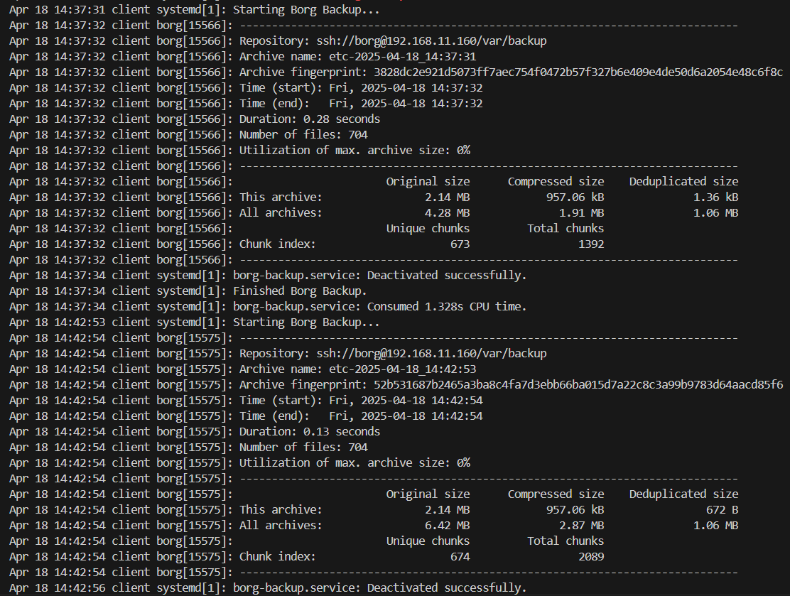

# Borgbackup

## Задача:
- Настроить стенд Vagrant с двумя виртуальными машинами: backup_server и client. (Студент самостоятельно настраивает Vagrant)
- Настроить удаленный бэкап каталога /etc c сервера client при помощи borgbackup. Резервные копии должны соответствовать следующим критериям:
    - директория для резервных копий /var/backup. Это должна быть отдельная точка монтирования. В данном случае для демонстрации размер не принципиален, достаточно будет и 2GB; (Студент самостоятельно настраивает)
    - репозиторий для резервных копий должен быть зашифрован ключом или паролем - на усмотрение студента;
    - имя бэкапа должно содержать информацию о времени снятия бекапа;
    - глубина бекапа должна быть год, хранить можно по последней копии на конец месяца, кроме последних трех. Последние три месяца должны содержать копии на каждый день. Т.е. должна быть правильно настроена политика удаления старых бэкапов;
    - резервная копия снимается каждые 5 минут. Такой частый запуск в целях демонстрации;
    - написан скрипт для снятия резервных копий. Скрипт запускается из соответствующей Cron джобы, либо systemd timer-а - на усмотрение студента;
    - настроено логирование процесса бекапа. Для упрощения можно весь вывод перенаправлять в logger с соответствующим тегом. Если настроите не в syslog, то обязательна ротация логов.

## Выполнение:
1. Развернем две виртуальные машины backup и client, используя [Vagrantfile](Vagrantfile)
```bash
vagrant up
```
2. Установим на backup и client borgbackup:
```bash
apt install borgbackup
```
3. На backup: 

3.1 Проверим доступные блочные устройства:
```bash
lsblk
```
```
root@backup:~# lsblk
NAME   MAJ:MIN RM  SIZE RO TYPE MOUNTPOINTS
loop0    7:0    0 63.7M  1 loop /snap/core20/2434
loop1    7:1    0 89.4M  1 loop /snap/lxd/31333
loop2    7:2    0 44.4M  1 loop /snap/snapd/23545
sda      8:0    0   40G  0 disk
└─sda1   8:1    0   40G  0 part /
sdb      8:16   0   10M  0 disk
sdc      8:32   0    2G  0 disk
```

3.2 Диск sdc (2G) отформатируем в файловой системе ext4:
```bash
mkfs.ext4 /dev/sdc
```
3.3 Создадим точку монтирования:
```bash
  mkdir -p /var/backup
```
3.4 Примонтируем устройство в каталог, добавляем запись с в файл /etc/fstab:
```bash
  sudo mount /dev/sdc /var/backup
```
3.5 Создадим пользователя borg:
```bash
useradd -m borg
```
3.6 Назначаем права: 
```bash
chown borg:borg /var/backup/
```
3.7 Ппереключаемся на пользователя borg:
```bash
su borg
```
3.8 Создаем файл authorize_keys в каталоге ssh и назначаем права:
```bash
mkdir .ssh
touch .ssh/authorize_keys
chmod 700 .ssh
chmod 600 .ssh/authorize_keys
```
3.9 Добавляем публичный ssh ключ:
```bash
nano ~/.ssh/authorized_keys
```

4. На client: 

4.1 Генерируем ssh ключи:
```bash
ssh-keygen
```
4.2 Иницилизируем репозиторий borg на backup сервере  c client сервера:
```bash
borg init --encryption=repokey borg@192.168.11.160:/var/backup/
```
```
root@client:/# borg init --encryption=repokey borg@192.168.11.160:/var/backup/
There is already something at /var/backup.
```
4.3 Запускаем для проверки создания бэкапа:
```bash
borg create --stats --list borg@192.168.11.160:/var/backup/::"etc-{now:%Y-%m-%d_%H:%M:%S}" /etc
```


4.4 Смотрим что получилось:
```bash
borg list borg@192.168.11.160:/var/backup/
```

4.5 Сморим список файлов:
```bash
borg list borg@192.168.11.160:/var/backup/::etc-2025-04-16_13:37:33
```
4.6 Достаем файлы из бэкапа
```bash
borg extract borg@192.168.11.160:/var/backup/::etc-2025-04-16_13:37:33 etc/hostname
```
  

5. Автоматизируем создание бэкапов с помощью systemd  
5.1 Создаем сервис в каталоге /etc/systemd/system/
```bash
nano /etc/systemd/system/borg-backup.service
```
```
[Unit]
Description=Borg Backup

[Service]
Type=oneshot
Environment="BORG_PASSPHRASE=Otus1234"
Environment="REPO=borg@192.168.11.160:/var/backup/"
Environment="BACKUP_TARGET=/etc"

ExecStart=/bin/borg create \
    --stats \
    ${REPO}::etc-{now:%Y-%m-%d_%H:%M:%S} ${BACKUP_TARGET}

ExecStart=/bin/borg check ${REPO}

ExecStart=/bin/borg prune \
    --keep-daily 90 \
    --keep-monthly 12 \
    --keep-yearly 1 \
    ${REPO}
```

5.2 Создаем таймер в каталоге /etc/systemd/system/
```bash
nano /etc/systemd/system/borg-backup.timer
```
```
[Unit]
Description=Borg Backup Timer

[Timer]
OnActiveSec=5min
OnUnitActiveSec=5min

[Install]
WantedBy=timers.target
```
5.3 Включение и запуск таймера
```bash
sudo systemctl enable borg-backup.timer
sudo systemctl start borg-backup.timer
```
5.4 Логи выполнения сервиса:
```bash
journalctl -u borg-backup.service
```

