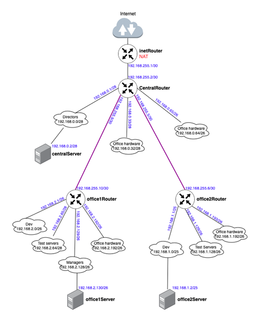
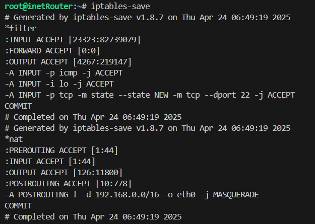
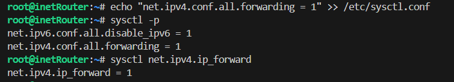
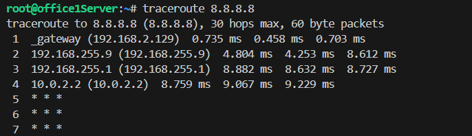
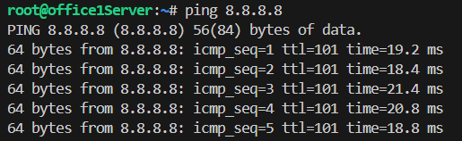
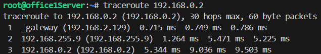
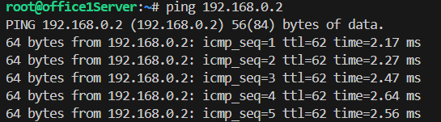

# Network

## Задача:
Построить следующую архитектуру:

Сеть office1:  
- 192.168.2.0/26 - dev
- 192.168.2.64/26 - test servers
- 192.168.2.128/26 - managers
- 192.168.2.192/26 - office hardware

Сеть office2:  
- 192.168.1.0/25 - dev
- 192.168.1.128/26 - test servers
- 192.168.1.192/26 - office hardware

Сеть central: 
- 192.168.0.0/28 - directors
- 192.168.0.32/28 - office hardware
- 192.168.0.64/26 - wifi  

Office1 ---\  
                   -----> Central --IRouter --> internet  
Office2----/  

Итого должны получится следующие сервера:
- inetRouter
- centralRouter
- office1Router
- office2Router
- centralServer
- office1Server
- office2Server

Теоретическая часть:
- Найти свободные подсети
- Посчитать сколько узлов в каждой подсети, включая свободные
- Указать broadcast адрес для каждой подсети
- проверить нет ли ошибок при разбиении

Практическая часть:
- Соединить офисы в сеть согласно схеме и настроить роутинг
- Все сервера и роутеры должны ходить в инет черз inetRouter
- Все сервера должны видеть друг друга
- у всех новых серверов отключить дефолт на нат (eth0), который вагрант поднимает для связи
- при нехватке сетевых интервейсов добавить по несколько адресов на интерфейс


## Выполнение:  
После расчета всех сетей, мы должны получить следующую таблицу топологии:
Central Network:
| Name|Network|Netmask|N|Hostmin|Hostmax|Broadcast|
| ---| ---| ---| ---| ---| ---| ---|
| Directors | 192.168.0.0/28  |255.255.255.240 | 14 | 192.168.0.1 | 192.168.0.14 | 192.168.0.15|
|Office hardware|192.168.0.32/28|255.255.255.240| 14|192.168.0.33|192.168.0.46|192.168.0.47|
|Wifi(mgt network)|192.168.0.64/26| 255.255.255.192| 62| 192.168.0.65| 192.168.0.126|192.168.0.127|
Office 1 network:
| Name|Network|Netmask|N|Hostmin|Hostmax|Broadcast|
| --- | ---| ---| ---| ---| ---| ---|
|Dev|192.168.2.0/26|255.255.255.192|62|192.168.2.1|192.168.2.62|192.168.2.63|
Test|192.168.2.64/26|255.255.255.192|62|192.168.2.65|192.168.2.126|192.168.2.127|
Managers|192.168.2.128/26|255.255.255.192|62|192.168.2.129|192.168.2.190|192.168.2.191|
Office hardware|192.168.2.192/26|255.255.255.192|62|192.168.2.193|192.168.2.254|192.168.2.255|
Office 2 network
| Name|Network|Netmask|N|Hostmin|Hostmax|Broadcast|
| --- | ---| ---| ---| ---| ---| ---|
|Dev|192.168.1.0/25|255.255.255.128|126|192.168.1.1|192.168.1.126|192.168.1.127|
Test|192.168.1.128/26|255.255.255.192|62|192.168.1.129|192.168.1.190|192.168.1.191|
Office|192.168.1.192/26|255.255.255.192|62|192.168.1.193|192.168.1.254|192.168.1.255|
InetRouter — CentralRouter network
| Name|Network|Netmask|N|Hostmin|Hostmax|Broadcast|
| --- | ---| ---| ---| ---| ---| ---|
Inet — central|192.168.255.0/30|255.255.255.252|2|192.168.255.1|192.168.255.2|192.168.255.3|

После создания таблицы топологии, мы видим, что ошибок в задании нет, также мы сразу видим следующие свободные сети:
- 192.168.0.16/28
- 192.168.0.48/28
- 192.168.0.128/25
- 192.168.255.64/26
- 192.168.255.32/27
- 192.168.255.16/28
- 192.168.255.8/29  
- 192.168.255.4/30

На основании схемы получаем готовый список серверов:
<table>
  <thead>
    <tr>
      <th>Server</th>
      <th>IP and Bitmask</th>
    </tr>
  </thead>
  <tbody>
    <tr>
      <td rowspan="2" align="center">inetRouter</td>
      <td align="center">Default-NAT address VirtualBox</td>
    </tr>
    <tr>
      <td align="center">192.168.255.1/30</td>
    </tr>
    <tr>
      <td rowspan="6" align="center">centralRouter</td>
      <td align="center">192.168.255.2/30</td>
    </tr>
    <tr>
      <td align="center">192.168.0.1/28</td>
    </tr>
    <tr>
      <td align="center">192.168.0.33/28</td>
    </tr>
    <tr>
      <td align="center">192.168.0.65/26</td>
    </tr>
    <tr>
      <td align="center">192.168.255.9/30</td>
    </tr>
    <tr>
      <td align="center">192.168.255.5/30</td>
    </tr>
    <tr>
      <td align="center">centralServer</td>
      <td align="center">192.168.0.2/28</td>
    </tr>
    <tr>
      <td rowspan="5" align="center">office1Router</td>
      <td align="center">192.168.255.10/30</td>
    </tr>
    <tr>
      <td align="center">192.168.2.1/26</td>
    </tr>
    <tr>
      <td align="center">192.168.2.65/26</td>
    </tr>
    <tr>
      <td align="center">192.168.2.129/26</td>
    </tr>
    <tr>
      <td align="center">192.168.2.193/26</td>
    </tr>
    <tr>
      <td align="center">office1Server</td>
      <td align="center">192.168.2.130/26</td>
    </tr>
    <tr>
      <td rowspan="4" align="center">office2Router</td>
      <td align="center">192.168.255.6/30</td>
    </tr>
    <tr>
      <td align="center">192.168.1.1/26</td>
    </tr>
    <tr>
      <td align="center">192.168.1.129/26</td>
    </tr>
    <tr>
      <td align="center">192.168.1.193/26</td>
    </tr>
    <tr>
      <td align="center">office2Server</td>
      <td align="center">192.168.1.2/26</td>
    </tr>
  </tbody>
</table>

1. Развернем две виртуальные машины, используя [Vagrantfile](Vagrantfile)
```bash
vagrant up
```
2. Подключаемся к по SSH к хосту inetRouter: 
```bash
vagrant ssh inetRouter
```
3. Проверяем, что отключен файервол: 
```bash
systemctl status ufw
```
```
vagrant@inetRouter:~$ systemctl status ufw
● ufw.service - Uncomplicated firewall
     Loaded: loaded (/lib/systemd/system/ufw.service; enabled; vendor preset: enabled)
     Active: active (exited) since Wed 2025-04-23 11:15:43 UTC; 1h 22min ago
       Docs: man:ufw(8)
   Main PID: 512 (code=exited, status=0/SUCCESS)
        CPU: 3ms

Warning: some journal files were not opened due to insufficient permissions.
```
4. Отключаем и удаляем из автозагрузки:
```bash
systemctl stop ufw
systemctl disable ufw
```
5. Настройка NAT:  

5.1 Создаём файл /etc/iptables_rules.ipv4:
```bash
nano /etc/iptables_rules.ipv4
```
```
# Generated by iptables-save v1.8.7 on Sat Oct 14 16:14:36 2023
*filter
:INPUT ACCEPT [90:8713]
:FORWARD ACCEPT [0:0]
:OUTPUT ACCEPT [54:7429]
-A INPUT -p icmp -j ACCEPT
-A INPUT -i lo -j ACCEPT
-A INPUT -p tcp -m state --state NEW -m tcp --dport 22 -j ACCEPT
COMMIT
# Completed on Sat Oct 14 16:14:36 2023
# Generated by iptables-save v1.8.7 on Sat Oct 14 16:14:36 2023
*nat
:PREROUTING ACCEPT [1:44]
:INPUT ACCEPT [1:44]
:OUTPUT ACCEPT [0:0]
:POSTROUTING ACCEPT [0:0]
-A POSTROUTING ! -d 192.168.0.0/16 -o eth0 -j MASQUERADE
COMMIT
# Completed on Sat Oct 14 16:14:36 2023
```

<details>
<summary>Описание iptables_rules.ipv4</summary>

Таблица Filter
Эта таблица отвечает за правила фильтрации трафика.
• Заголовок таблицы:
"*filter" – обозначение таблицы фильтрации.
• Цепочки и их политики по умолчанию:
:INPUT ACCEPT [15546:47353613]
Цепочка INPUT отвечает за входящие пакеты. Политика по умолчанию — ACCEPT (принимать). Числовые значения в квадратных скобках — счетчик пакетов и байтов, прошедших через эту цепочку (на момент сохранения конфигурации).
:FORWARD ACCEPT [0:0]
Цепочка FORWARD обрабатывает пересылаемые (проброшенные) пакеты. Политика — ACCEPT. Здесь пока нет переданных пакетов.
:OUTPUT ACCEPT [2597:126197]
Цепочка OUTPUT обрабатывает исходящие пакеты. Политика — ACCEPT.
• Правила в цепочке INPUT:
"-A INPUT -p icmp -j ACCEPT"
Это правило добавляет (Append, -A) для цепочки INPUT, разрешая любые ICMP-пакеты (протокол для сообщений об ошибках, проверки доступности и т.п.).
"-A INPUT -i lo -j ACCEPT"
Разрешает (jump ACCEPT) входящий трафик, приходящий через loopback-интерфейс (lo).
"-A INPUT -p tcp -m state --state NEW -m tcp --dport 22 -j ACCEPT"
Разрешает новые входящие TCP-соединения (посредством модуля state, отслеживающего состояние соединений) на порт 22. Это правило нужно для доступа по SSH.
• Команда COMMIT завершает определение таблицы фильтра.
──────────────────────────────
Таблица NAT
Эта таблица используется для преобразования адресов. Обычно она применяется для организации доступа в Интернет для внутренних сетей.
• Заголовок таблицы:
"*nat" – обозначение таблицы NAT.
• Цепочки и их политики по умолчанию:
:PREROUTING ACCEPT [1:44]
Цепочка PREROUTING применяется к входящим пакетам до маршрутизации. Здесь политика — ACCEPT.
:INPUT ACCEPT [1:44]
Обрабатывает пакеты, предназначенные для локального хоста, после PREROUTING.
:OUTPUT ACCEPT [54:4974]
Обрабатывает пакеты, созданные на локальном хосте, для преобразования адреса перед выходом.
:POSTROUTING ACCEPT [5:389]
Обрабатывает пакеты после маршрутизации, перед тем как они будут отправлены по внешнему интерфейсу.
• Правило в цепочке POSTROUTING:
"-A POSTROUTING ! -d 192.168.0.0/16 -o eth0 -j MASQUERADE"
Это правило преобразует (маскарадинг) исходящие пакеты, когда:
• Пакет не предназначен для сети 192.168.0.0/16 (символ "!" — отрицание условия "-d 192.168.0.0/16").
• Пакет отправляется через интерфейс eth0.
MASQUERADE позволяет скрыть внутренние IP-адреса за IP-адресом интерфейса eth0, что обычно используется для организации доступа в Интернет с внутренней сети.
• Команда COMMIT завершает определение таблицы NAT.
</details>

5.2 Создаём файл, в который добавим скрипт автоматического восстановления правил при перезапуске системы:
```bash
nano /etc/network/if-pre-up.d/iptables
```
```
#!/bin/sh
/sbin/iptables-restore < /etc/iptables_rules.ipv4
```
5.3 Добавляем права на выполнение файла /etc/network/if-pre-up.d/iptables:
```bash
sudo chmod +x /etc/network/if-pre-up.d/iptables
```
5.4 Перезагружаем сервер: 
```bash
reboot
```
5.5 После перезагрузки сервера проверяем правила iptables: 
```bash
iptables-save
```


6. Маршрутизация транзитных пакетов (IP forward)
Важным этапом настройки сетевой лаборатории, является маршрутизация транзитных пакетов. Если объяснить простыми словами — это возможность сервера Linux пропускать трафик через себя к другому серверу. По умолчанию эта функция отключена в Linux. Включить её можно командой:
```bash
echo "net.ipv4.conf.all.forwarding = 1" >> /etc/sysctl.conf
sysctl -p
```
`sysctl -p` команда сохраняет и применяет настройки

Посмотреть статус форвардинга можно командой: 
```bash
sysctl net.ipv4.ip_forward
```


Если параметр равен 1, то маршрутизация транзитных пакетов включена, если 0 — отключена.
В нашей схеме необходимо включить данную маршрутизацию на всех роутерах (inetRouter, centralRouter, office1Router, office2Router).


7. Отключение маршрута по умолчанию на интерфейсе eth0  
Отключение дефолтного маршрута требуется настроить на всех хостах кроме inetRouter (centralRouter, centralServer, office1Router, office1Server, office2Router, office2Server)  
Для отключения маршрута по умолчанию в файле /etc/netplan/00-installer-config.yaml добавляем отключение маршрутов, полученных через DHCP:
```bash
nano /etc/netplan/00-installer-config.yaml 
```
```
# This is the network config written by 'subiquity'
network:
  ethernets:
    eth0:
      dhcp4: true
      dhcp4-overrides:
          use-routes: false
      dhcp6: false
  version: 2
```  
После внесения данных изменений перезапускаем сетевую службу:
```bash
netplan try
```

8. Настройка статических маршрутов:

8.1 inetRouter:
```bash
root@inetRouter:~# nano /etc/netplan/50-vagrant.yaml
```
```
---
network:
  version: 2
  renderer: networkd
  ethernets:
    eth1:
      addresses:
      - 192.168.255.1/30
      routes:
      - to: 192.168.255.8/30
        via: 192.168.255.2
      - to: 192.168.0.0/28
        via: 192.168.255.2
      - to: 192.168.2.128/26
        via: 192.168.255.2
```
8.2 centralServer
```bash
root@centralServer:~# nano /etc/netplan/50-vagrant.yaml
```
```
---
network:
  version: 2
  renderer: networkd
  ethernets:
    eth1:
      addresses:
      - 192.168.0.2/28
      gateway4: 192.168.0.1
```  
8.3 office1Router
```bash
root@office1Router:~# nano /etc/netplan/50-vagrant.yaml
```
```
---
network:
  version: 2
  renderer: networkd
  ethernets:
    eth1:
      addresses:
      - 192.168.255.10/30
      gateway4: 192.168.255.9
    eth2:
      addresses:
      - 192.168.2.1/26
    eth3:
      addresses:
      - 192.168.2.65/26
    eth4:
      addresses:
      - 192.168.2.129/26
    eth5:
      addresses:
      - 192.168.2.193/26
```  
8.4 office1Server
```bash
root@office1Server:~# nano /etc/netplan/50-vagrant.yaml
```
```
---
network:
  version: 2
  renderer: networkd
  ethernets:
    eth1:
      addresses:
      - 192.168.2.130/26
      gateway4: 192.168.2.129
```
9. Установить утилиту traceroute, для проверки нашего стенда:
```bash
root@office1Server:~# apt install -y traceroute
```  
9.1 Проверим доступность 8.8.8.8 с office1Server с помощью traceroute и ping:  
  
  
9.1 Проверим доступность centralServer с office1Server с помощью traceroute и ping:  
  
  