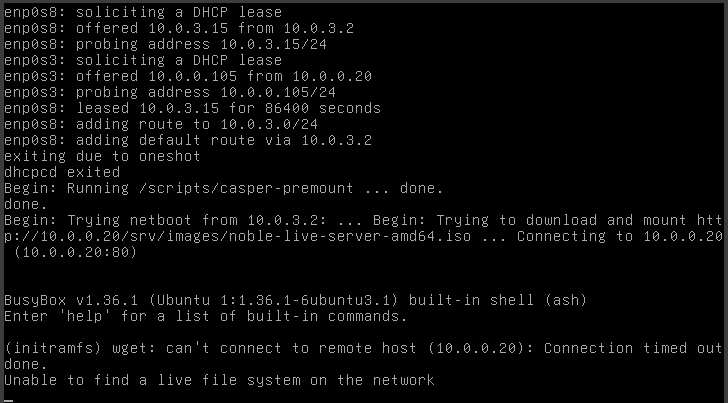
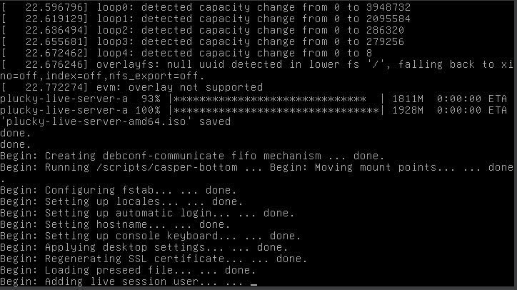
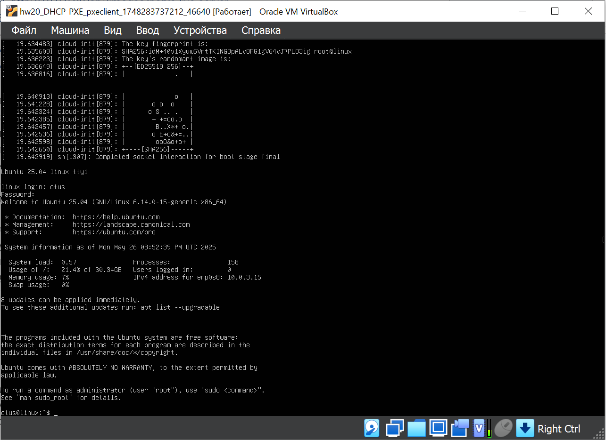

# DHCP-PXE (Dynamic Host Configuration Protocol, Preboot eXecution Environment)

## Задача:
- Настроить загрузку по сети дистрибутива Ubuntu 
- Установка должна проходить из HTTP-репозитория.
- Настроить автоматическую установку c помощью файла user-data


## Выполнение:
1. Развернем две виртуальные машины pxeserver и pxeclient, используя [Vagrantfile](Vagrantfile)
```bash
vagrant up
```
2. Подключаемся к pxeserver:
```bash
vagrant ssh pxeserver
```
3. Настройка DHCP и TFTP-сервера  

3.1 Отключаем firewall:
```bash
sudo -i
systemctl stop ufw
systemctl disable ufw
```

3.2 Обновляем кэш и устанавливаем утилиту dnsmasq:
```bash
sudo apt update
sudo apt install dnsmasq
```  

3.3 Cоздаём файл /etc/dnsmasq.d/pxe.conf:
```bash
nano /etc/dnsmasq.d/pxe.conf
```
```bash
#Указываем интерфейс в на котором будет работать DHCP/TFTP
interface=eth1
bind-interfaces
#Также указаваем интерфейс и range адресов которые будут выдаваться по DHCP
dhcp-range=eth1,10.0.0.100,10.0.0.120
#Имя файла, с которого надо начинать загрузку для Legacy boot (этот пример рассматривается в методичке)
dhcp-boot=pxelinux.0
#Имена файлов, для UEFI-загрузки (не обязательно добавлять)
dhcp-match=set:efi-x86_64,option:client-arch,7
dhcp-boot=tag:efi-x86_64,bootx64.efi
#Включаем TFTP-сервер
enable-tftp
#Указываем каталог для TFTP-сервера
tftp-root=/srv/tftp/amd64
```  

3.4 Cоздаём каталоги для файлов TFTP-сервера:
```bash
mkdir -p /srv/tftp
```  

3.5 Cкачиваем файлы для сетевой установки Ubuntu 25.04 и распаковываем их в каталог /srv/tftp:
```bash
wget http://cdimage.ubuntu.com/ubuntu-server/daily-live/current/plucky-netboot-amd64.tar.gz
tar -xzvf plucky-netboot-amd64.tar.gz -C /srv/tftp
```  

3.6 Перезапускаем службу dnsmasq:
```bash
systemctl restart dnsmasq
```

4. Настройка Web-сервера:  

4.1 Устанавливаем Web-сервер apache2:
```bash
sudo apt install apache2
```  

4.2 Создаём каталог /srv/images в котором будут храниться iso-образы для установки по сети:
```bash
mkdir /srv/images
```  

4.3 Переходим в каталог /srv/images и скачиваем iso-образ ubuntu 25.04:
```bash
cd /srv/images
wget http://cdimage.ubuntu.com/ubuntu-server/daily-live/current/plucky-live-server-amd64.iso

```  

4.4 Cоздаём файл /etc/apache2/sites-available/ks-server.conf и добавлем в него следующее содержимое:
```bash
nano /etc/apache2/sites-available/ks-server.conf
```
```ini
#Указываем IP-адрес хоста и порт на котором будет работать Web-сервер
<VirtualHost 10.0.0.20:80>
DocumentRoot /
# Указываем директорию /srv/images из которой будет загружаться iso-образ
<Directory /srv/images>
Options Indexes MultiViews
AllowOverride All
Require all granted
</Directory>
</VirtualHost>
``` 

4.5 Активируем конфигурацию ks-server в apache
```bash
sudo a2ensite ks-server.conf
systemctl reload apache2
```  

4.6 Вносим изменения в файл /srv/tftp/amd64/pxelinux.cfg/default

```bash
nano /srv/tftp/amd64/pxelinux.cfg/default
```

```
DEFAULT install
LABEL install
  KERNEL linux
  INITRD initrd
  APPEND root=/dev/ram0 ramdisk_size=3000000 ip=dhcp iso-url=http://10.0.0.20/srv/images/plucky-live-server-amd64.iso autoinstall
```  

В данном файле мы указываем что файлы linux и initrd будут забираться по tftp, а сам iso-образ ubuntu 25.04
будет скачиваться из нашего веб-сервера http://10.0.0.20/srv/images/plucky-live-server-amd64.iso
Из-за того, что образ достаточно большой (2.6G) и он сначала загружается в ОЗУ, необходимо указать
размер ОЗУ до 3 гигабайт (root=/dev/ram0 ramdisk_size=3000000)  

4.7 Перезагружаем web-сервер apache:
```bash
systemctl restart apache2
```  

*На этом настройка Web-сервера завершена и на данный момент, если мы запустим ВМ pxeclient, то увидим
загрузку по PXE и далее увидим загрузку iso-образа
и откроется мастер установки ubuntu.  
Так как на хосте pxeclient используется 2 сетевых карты, загрузка может начаться с неправильного адреса, тогда мы получим вот такое сообщение:  
  
В данной ситуации поможет перезапуск виртуальной машины с помощью VirtualBox, либо её удаление и
повторная инициализация с помощью команды vagrant up*

5. Настройка автоматической установки Ubuntu 25.04  

5.1 Создаём каталог для файлов с автоматической установкой:
```bash
mkdir /srv/ks
```  

5.2 Cоздаём файл /srv/ks/user-data и добавляем в него следующее содержимое:
```bash
nano /srv/ks/user-data
```
```
#cloud-config
autoinstall:
  version: 1
  locale: en_US.UTF-8
  preserve_sources_list: false
  apt:
    disable_components: []
    geoip: true
    preserve_sources_list: false
    primary:
    - arches: [amd64,i386]
      uri: http://us.archive.ubuntu.com/ubuntu
    - arches: [default]
      uri: http://us.archive.ubuntu.com/ubuntu/
  identity:
    hostname: linux
    username: otus
    password: $6$rounds=656000$MZLXHvh$TvpBVWhschUOmmPqPBugJuN5iNq0WXH4WRcnfnA/OjOcaMp/RDwHDaz4ShQb3oCHbNOrivxi1HV7Q6KqLO3KF/
    realname: otus
  kernel:
    package: linux-generic
  keyboard:
    layout: us
    toggle: null
    variant: ''
  network:
    version: 2
    ethernets:
      enp0s3:
        dhcp4: true
      enp0s8:
        dhcp4: true
  ssh:
    allow-pw: true
    install-server: true
    updates: security
    version: 1
```  

*В данном файле указываются следующие настройки:
• устанавливается apt-репозиторий http://us.archive.ubuntu.com/ubuntu
• отключена автоматическая загрузка драйверов
• задаётся hostname linux
• создаётся пользователь otus c паролем 123 (пароль зашифрован в SHA512)
• использование английской раскладки
• добавлена настройка получения адресов по DHCP (для обоих портов)
• устанавливается openssh-сервер с доступом по логину и паролю
• и т д.*  

5.3 создаём файл с метаданными /srv/ks/meta-data:
```bash
touch /srv/ks/meta-data
```

*Файл с метаданными хранит дополнительную информацию о хосте, в нашей методичке мы не будем
добавлять дополнительную информацю.*  

5.4 В конфигурации веб-сервера добавим каталог /srv/ks идёнтично каталогу /srv/images:
```bash
nano /etc/apache2/sites-available/ks-server.conf
```
```
<VirtualHost 10.0.0.20:80>
DocumentRoot /
<Directory /srv/ks>
Options Indexes MultiViews
AllowOverride All
Require all granted
</Directory>
<Directory /srv/images>
Options Indexes MultiViews
AllowOverride All
Require all granted
</Directory>
```  

5.5 В файле /srv/tftp/amd64/pxelinux.cfg/default добавляем параметры автоматической установки:
```bash
nano /srv/tftp/amd64/pxelinux.cfg/default
```
```
DEFAULT install

LABEL install
  KERNEL linux
  INITRD initrd
  APPEND root=/dev/ram0 ramdisk_size=3000000 ip=dhcp iso-url=http://10.0.0.20/srv/images/plucky-live-server-amd64.iso autoinstall ds=nocloud-net;s=http://10.0.0.20/srv/ks/
```
5.6 Перезапускаем службы dnsmasq и apache2:
```bash
systemctl restart dnsmasq
systemctl restart apache2
```  

На этом настройка автоматической установки завершена. Теперь можно перезапустить ВМ pxeclient
и мы должны увидеть автоматическую установку:  
  
После успешной установки выключаем ВМ и в её настройках ставим запуск ВМ из диска Далее, после запуска нашей ВМ мы сможем залогиниться под пользователем otus
На этом настройка автоматической установки завершена:

