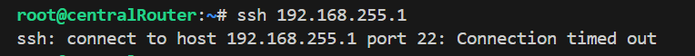
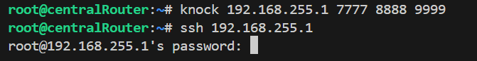
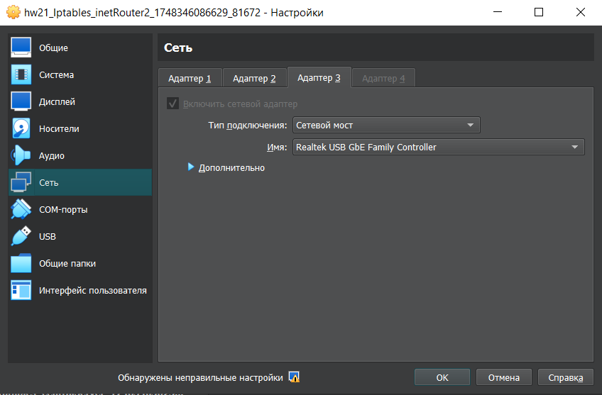
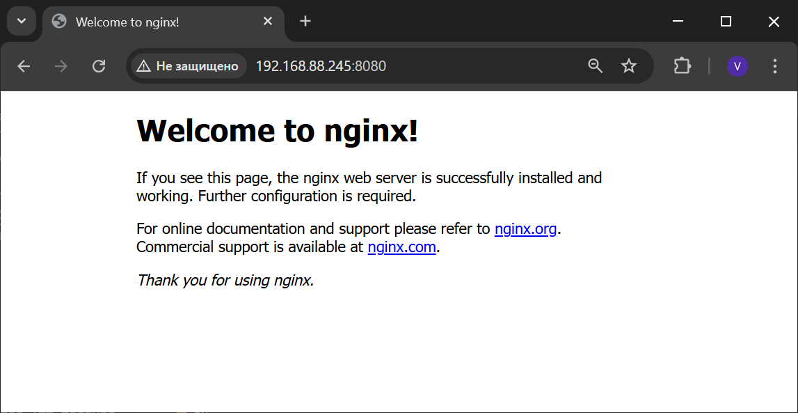

# IPTABLES, knocking port

## Задача:
- реализовать knocking port  
centralRouter может попасть на ssh inetrRouter через knock скрипт.
- добавить inetRouter2, который виден(маршрутизируется (host-only тип сети для виртуалки)) с хоста или форвардится порт через локалхост.
- запустить nginx на centralServer.
- пробросить 80й порт на inetRouter2 8080.
- дефолт в инет оставить через inetRouter.


## Выполнение:

1. Отредактируем Vagrantfile из hw19_Network:
Создадим дополнительный интерфейс на inetRouter "192.168.255.13", 3, "255.255.255.252", "inet2"  
Добавим inetRouter2 с интерфесом "192.168.255.14", 2, "255.255.255.252", "inet2"  
2. Развернем виртуальные машины, используя [Vagrantfile](Vagrantfile)

```bash
vagrant up
```

3. Knocking port  

3.1 Устанавливаем knockd на inetRouter и centralRouter:
```bash
apt install knockd
```
3.2 Редактируем конфиг на inetRouter /etc/knockd.conf:  
```bash 
nano /etc/knockd.conf
```
```
[options]
        UseSyslog
        Interface = eth1

[opencloseSSH]
        sequence = 7777:tcp,8888:tcp,9999:tcp
        seq_timeout   = 15
        tcpflags      = syn
        start_command = /sbin/iptables -I INPUT 1 -s %IP% -p tcp --dport 22 -j ACCEPT
        cmd_timeout   = 30
        stop_command  = /sbin/iptables -D INPUT -s %IP% -p tcp --dport ssh -j ACCEPT
```  

3.3 Редактируем файл /etc/iptables_rules.ipv4:
```bash
nano /etc/iptables_rules.ipv4
```
```
*filter
:INPUT ACCEPT [3746:214611]
:FORWARD ACCEPT [193:14668]
:OUTPUT ACCEPT [2188:172583]
:SSH-INPUT - [0:0]
:SSH-INPUTTWO - [0:0]
:TRAFFIC - [0:0]
-A INPUT -p icmp -j ACCEPT
-A INPUT -i lo -j ACCEPT
-A INPUT -i eth1 -j TRAFFIC
-A SSH-INPUT -m recent --set --name SSH1 --mask 255.255.255.255 --rsource -j DROP
-A SSH-INPUTTWO -m recent --set --name SSH2 --mask 255.255.255.255 --rsource -j DROP
-A TRAFFIC -i eth1 -m state --state RELATED,ESTABLISHED -j ACCEPT
-A TRAFFIC -i eth1 -p tcp -m state --state NEW -m tcp --dport 22 -m recent --rcheck --seconds 30 --name SSH2 --mask 255.255.255.255 --rsource -j ACCEPT
-A TRAFFIC -i eth1 -p tcp -m state --state NEW -m tcp -m recent --remove --name SSH2 --mask 255.255.255.255 --rsource -j DROP
-A TRAFFIC -i eth1 -p tcp -m state --state NEW -m tcp --dport 9999 -m recent --rcheck --name SSH1 --mask 255.255.255.255 --rsource -j SSH-INPUTTWO
-A TRAFFIC -i eth1 -p tcp -m state --state NEW -m tcp -m recent --remove --name SSH1 --mask 255.255.255.255 --rsource -j DROP
-A TRAFFIC -i eth1 -p tcp -m state --state NEW -m tcp --dport 8888 -m recent --rcheck --name SSH0 --mask 255.255.255.255 --rsource -j SSH-INPUT
-A TRAFFIC -i eth1 -p tcp -m state --state NEW -m tcp -m recent --remove --name SSH0 --mask 255.255.255.255 --rsource -j DROP
-A TRAFFIC -i eth1 -p tcp -m state --state NEW -m tcp --dport 7777 -m recent --set --name SSH0 --mask 255.255.255.255 --rsource -j DROP
-A TRAFFIC -i eth1 -j DROP
COMMIT
*nat
:PREROUTING ACCEPT [99:8492]
:INPUT ACCEPT [1:44]
:OUTPUT ACCEPT [61:4301]
:POSTROUTING ACCEPT [21:1271]
-A POSTROUTING ! -d 192.168.0.0/16 -o eth0 -j MASQUERADE
COMMIT
```  

3.4 Перезагружаем сервер: 
```bash
reboot
``` 

3.5 После перезагрузки сервера проверяем правила iptables: 
```bash
iptables-save
```  

```
root@inetRouter:~# iptables-save
# Generated by iptables-save v1.8.7 on Tue May 27 14:27:04 2025
*filter
:INPUT ACCEPT [38:4049]
:FORWARD ACCEPT [0:0]
:OUTPUT ACCEPT [26:4373]
:SSH-INPUT - [0:0]
:SSH-INPUTTWO - [0:0]
:TRAFFIC - [0:0]
-A INPUT -p icmp -j ACCEPT
-A INPUT -i lo -j ACCEPT
-A INPUT -i eth1 -j TRAFFIC
-A SSH-INPUT -m recent --set --name SSH1 --mask 255.255.255.255 --rsource -j DROP
-A SSH-INPUTTWO -m recent --set --name SSH2 --mask 255.255.255.255 --rsource -j DROP
-A TRAFFIC -i eth1 -m state --state RELATED,ESTABLISHED -j ACCEPT
-A TRAFFIC -i eth1 -p tcp -m state --state NEW -m tcp --dport 22 -m recent --rcheck --seconds 30 --name SSH2 --mask 255.255.255.255 --rsource -j ACCEPT        
-A TRAFFIC -i eth1 -p tcp -m state --state NEW -m tcp -m recent --remove --name SSH2 --mask 255.255.255.255 --rsource -j DROP
-A TRAFFIC -i eth1 -p tcp -m state --state NEW -m tcp --dport 9999 -m recent --rcheck --name SSH1 --mask 255.255.255.255 --rsource -j SSH-INPUTTWO
-A TRAFFIC -i eth1 -p tcp -m state --state NEW -m tcp -m recent --remove --name SSH1 --mask 255.255.255.255 --rsource -j DROP
-A TRAFFIC -i eth1 -p tcp -m state --state NEW -m tcp --dport 8888 -m recent --rcheck --name SSH0 --mask 255.255.255.255 --rsource -j SSH-INPUT
-A TRAFFIC -i eth1 -p tcp -m state --state NEW -m tcp -m recent --remove --name SSH0 --mask 255.255.255.255 --rsource -j DROP
-A TRAFFIC -i eth1 -p tcp -m state --state NEW -m tcp --dport 7777 -m recent --set --name SSH0 --mask 255.255.255.255 --rsource -j DROP
-A TRAFFIC -i eth1 -j DROP
COMMIT
# Completed on Tue May 27 14:27:04 2025
# Generated by iptables-save v1.8.7 on Tue May 27 14:27:04 2025
*nat
:PREROUTING ACCEPT [1:44]
:INPUT ACCEPT [1:44]
:OUTPUT ACCEPT [0:0]
:POSTROUTING ACCEPT [0:0]
-A POSTROUTING ! -d 192.168.0.0/16 -o eth0 -j MASQUERADE
COMMIT
# Completed on Tue May 27 14:27:04 2025
```  

3.6 C centralRout пытаемся подключиться к inetRout по ssh:
```bash
ssh 192.168.255.1
```  
  
3.7 Посылаем команду `knock 192.168.255.1 7777 8888 9999` и повторяем попытку подключения:  
 

4. Установим nginx на centralServer:

```bash
apt install nginx
```
```
root@centralServer:~# systemctl status nginx
● nginx.service - A high performance web server and a reverse proxy server
     Loaded: loaded (/lib/systemd/system/nginx.service; enabled; vendor preset: enabled)
     Active: active (running) since Tue 2025-05-27 16:32:03 UTC; 4h 46min ago
       Docs: man:nginx(8)
   Main PID: 5219 (nginx)
      Tasks: 2 (limit: 710)
     Memory: 4.3M
        CPU: 35ms
     CGroup: /system.slice/nginx.service
             ├─5219 "nginx: master process /usr/sbin/nginx -g daemon on; master_process on;"
             └─5222 "nginx: worker process" "" "" "" "" "" "" "" "" "" "" "" "" "" "" "" "" "" "" "" "" "" "" "" "" "" "" ""

May 27 16:32:03 centralServer systemd[1]: Starting A high performance web server and a reverse proxy server...
May 27 16:32:03 centralServer systemd[1]: Started A high performance web server and a reverse proxy server.
```

5. Настроим inetRouter2:  

5.1 Отключаем и удаляем из автозагрузки файервол:
```bash
systemctl stop ufw
systemctl disable ufw
```  

5.2 Включаем forwarding:
```bash
echo "net.ipv4.conf.all.forwarding = 1" >> /etc/sysctl.conf
sysctl -p
```  

5.3 Создаём файл /etc/iptables_rules.ipv4:
```bash
nano /etc/iptables_rules.ipv4
```
```
*nat
:PREROUTING ACCEPT [0:0]
:INPUT ACCEPT [0:0]
:OUTPUT ACCEPT [0:0]
:POSTROUTING ACCEPT [0:0]
-A PREROUTING -p tcp -m tcp --dport 8080 -j DNAT --to-destination 192.168.0.2:80
-A POSTROUTING -d 192.168.0.2/32 -o eth1 -p tcp -m tcp --dport 80 -j SNAT --to-source 192.168.255.14:8080
COMMIT
```  

5.4 Создаём файл, в который добавим скрипт автоматического восстановления правил при перезапуске системы:
```bash
nano /etc/network/if-pre-up.d/iptables
```
```
#!/bin/sh
/sbin/iptables-restore < /etc/iptables_rules.ipv4
```  

5.5 Добавляем права на выполнение файла /etc/network/if-pre-up.d/iptables:
```bash
sudo chmod +x /etc/network/if-pre-up.d/iptables
```  

5.6 Перезагружаем сервер: 
```bash
reboot
```  

5.7 После перезагрузки сервера проверяем правила iptables: 
```bash
iptables-save
```
```
root@inetRouter2:~# iptables-save
# Generated by iptables-save v1.8.7 on Tue May 27 21:39:14 2025
*nat
:PREROUTING ACCEPT [42:6210]
:INPUT ACCEPT [35:4784]
:OUTPUT ACCEPT [6:1908]
:POSTROUTING ACCEPT [6:1908]
-A PREROUTING -p tcp -m tcp --dport 8080 -j DNAT --to-destination 192.168.0.2:80
-A POSTROUTING -d 192.168.0.2/32 -o eth1 -p tcp -m tcp --dport 80 -j SNAT --to-source 192.168.255.14:8080
COMMIT
# Completed on Tue May 27 21:39:14 2025
```  

5.8 Добавим в VirtualBox дополнительный сетевой интерфейс в режиме bridge для возможности обращения к inetRouter2 с хостовой машины:  
  

5.9 Добавим созданный интерфейс eth2 в 00-installer-config.yaml  
```bash
nano /etc/netplan/00-installer-config.yaml
```
```
# This is the network config written by 'subiquity'
network:
  ethernets:
    eth0:
      dhcp4: true
      dhcp6: false
    eth2:
      dhcp4: true
      dhcp6: false
  version: 2
  ```  

5.10 Узнаем ip интерфейса:
```bash
ip a |grep eth2
```
```
root@inetRouter2:~# ip a |grep eth2
4: eth2: <BROADCAST,MULTICAST,UP,LOWER_UP> mtu 1500 qdisc fq_codel state UP group default qlen 1000
    inet 192.168.88.245/24 metric 100 brd 192.168.88.255 scope global dynamic eth2
```  

5.11 Проверяем работу перенаправления портов и доступность nginx сервера с хостовой машины:  

