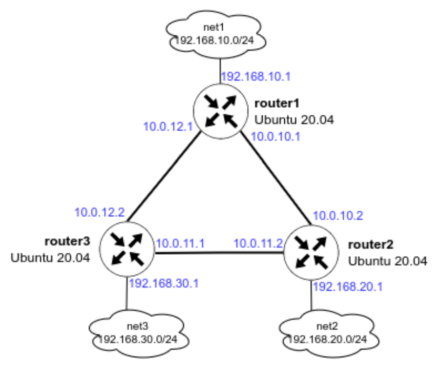
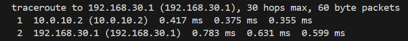
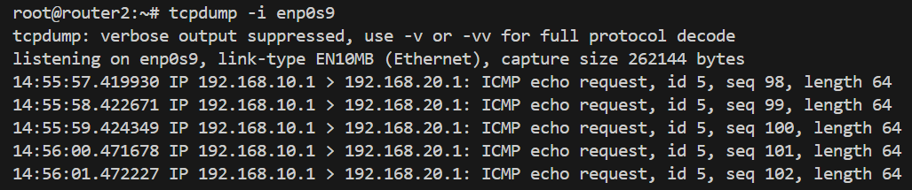
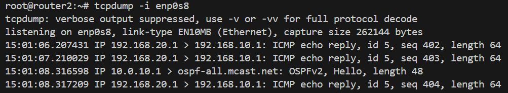
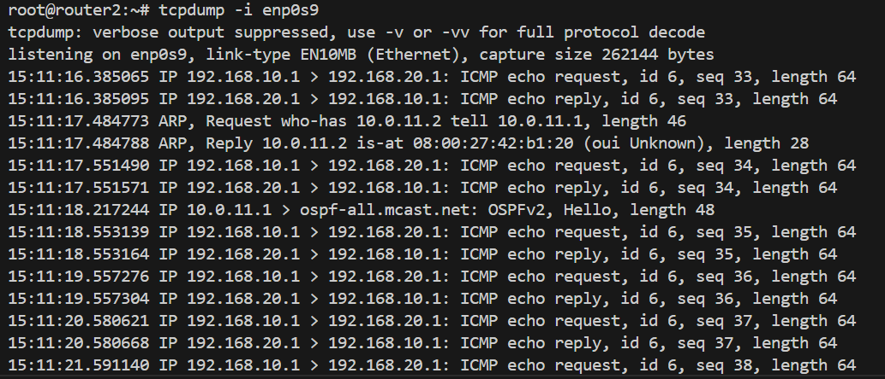

# OSPF (Open Shortest Path First)

## Задача:
1. Поднять три виртуалки
2. Объединить их разными vlan
  - поднять OSPF между машинами на базе FRR;
  - изобразить ассиметричный роутинг;
  - сделать один из линков "дорогим", но что бы при этом роутинг был симметричным.

  

## Выполнение:
1. Развернем виртуальные машины, используя [Vagrantfile](Vagrantfile)
```bash
vagrant up
```
2. На router1, router2, router3:
- Отключаем файерволл ufw и удаляем его из автозагрузки:
   ```bash
   systemctl stop ufw 
   systemctl disable ufw
   ```
- Добавляем gpg ключ:
   ```bash
   curl -s https://deb.frrouting.org/frr/keys.asc | sudo apt-key add -
   ```
- Добавляем репозиторий c пакетом FRR:
  ```bash 
  echo deb https://deb.frrouting.org/frr $(lsb_release -s -c) frr-stable > /etc/apt/sources.list.d/frr.list
  ```
- Обновляем пакеты и устанавливаем FRR и другие пакеты для анализа сетевого трафика:
  ```bash
   sudo apt update
   sudo apt install frr frr-pythontools traceroute tcpdump net-tools
  ```
- Разрешаем (включаем) маршрутизацию транзитных пакетов:
  ```bash
  sysctl net.ipv4.conf.all.forwarding=1
  ```
- Включаем демон ospfd в FRR
Для этого открываем в редакторе файл /etc/frr/daemons и меняем в нём параметры для пакетов zebra и ospfd на yes:
*zebra and staticd daemons are always started*
```bash
nano /etc/frr/daemons
```
```
ospfd=yes
```
3. Настройка OSPF
Для настройки OSPF нам потребуется создать файл /etc/frr/frr.conf который будет содержать в себе информацию о требуемых интерфейсах и OSPF. 
Для начала нам необходимо узнать имена интерфейсов и их адреса. Сделать это можно с помощью двух способов:

- Посмотреть в linux: ip a | grep inet

  inet 127.0.0.1/8 scope host lo
    inet 10.0.2.15/24 metric 100 brd 10.0.2.255 scope global dynamic enp0s3
    inet 10.0.10.1/30 brd 10.0.10.3 scope global enp0s8
    inet 10.0.12.1/30 brd 10.0.12.3 scope global enp0s9
    inet 192.168.10.1/24 brd 192.168.10.255 scope global enp0s10
    inet 192.168.50.10/24 brd 192.168.50.255 scope global enp0s16

router2
    inet 127.0.0.1/8 scope host lo
    inet 10.0.2.15/24 metric 100 brd 10.0.2.255 scope global dynamic enp0s3
    inet 10.0.10.2/30 brd 10.0.10.3 scope global enp0s8
    inet 10.0.11.2/30 brd 10.0.11.3 scope global enp0s9
    inet 192.168.20.1/24 brd 192.168.20.255 scope global enp0s10
    inet 192.168.50.11/24 brd 192.168.50.255 scope global enp0s16

router3
    inet 127.0.0.1/8 scope host lo
    inet 10.0.2.15/24 metric 100 brd 10.0.2.255 scope global dynamic enp0s3
    inet 10.0.11.1/30 brd 10.0.11.3 scope global enp0s8
    inet 10.0.12.2/30 brd 10.0.12.3 scope global enp0s9
    inet 192.168.30.1/24 brd 192.168.30.255 scope global enp0s10
    inet 192.168.50.12/24 brd 192.168.50.255 scope global enp0s16

- Зайти в интерфейс FRR и посмотреть информацию об интерфейсах

root@router1:~# vtysh

Hello, this is FRRouting (version 10.3).
Copyright 1996-2005 Kunihiro Ishiguro, et al.

router1# show interface brief
Interface       Status  VRF             Addresses
---------       ------  ---             ---------
enp0s3          up      default         10.0.2.15/24
                                        fe80::57:f2ff:fee3:2527/64
enp0s8          up      default         10.0.10.1/30
                                        fe80::a00:27ff:fea9:62cc/64
enp0s9          up      default         10.0.12.1/30
                                        fe80::a00:27ff:fe52:3456/64
enp0s10         up      default         192.168.10.1/24
                                        fe80::a00:27ff:fee7:d2ae/64
enp0s16         up      default         192.168.50.10/24
                                        fe80::a00:27ff:fe87:9bee/64
lo              up      default

Исходя из схемы мы понимаем, что для настройки OSPF нам достаточно описать интерфейсы enp0s8, enp0s9, enp0s10 

- Редактируем файл /etc/frr/frr.conf и вносим в него следующую информацию:
```bash
nano /etc/frr/frr.conf
```
```
!Указание версии FRR
frr version 8.1
frr defaults traditional
!Указываем имя машины
hostname router1
log syslog informational
no ipv6 forwarding
service integrated-vtysh-config
!
!Добавляем информацию об интерфейсе enp0s8
interface enp0s8
 !Указываем имя интерфейса
 description r1-r2
 !Указываем ip-aдрес и маску (эту информацию мы получили в прошлом шаге)
 ip address 10.0.10.1/30
 !Указываем параметр игнорирования MTU
 ip ospf mtu-ignore
 !Если потребуется, можно указать «стоимость» интерфейса
 !ip ospf cost 1000
 !Указываем параметры hello-интервала для OSPF пакетов
 ip ospf hello-interval 10
 !Указываем параметры dead-интервала для OSPF пакетов
 !Должно быть кратно предыдущему значению
 ip ospf dead-interval 30
!
interface enp0s9
 description r1-r3
 ip address 10.0.12.1/30
 ip ospf mtu-ignore
 !ip ospf cost 45
 ip ospf hello-interval 10
 ip ospf dead-interval 30

interface enp0s10
 description net_router1
 ip address 192.168.10.1/24
 ip ospf mtu-ignore
 !ip ospf cost 45
 ip ospf hello-interval 10
 ip ospf dead-interval 30 
!
!Начало настройки OSPF
router ospf
 !Указываем router-id 
 router-id 1.1.1.1
 !Указываем сети, которые хотим анонсировать соседним роутерам
 network 10.0.10.0/30 area 0
 network 10.0.12.0/30 area 0
 network 192.168.10.0/24 area 0 
 !Указываем адреса соседних роутеров
 neighbor 10.0.10.2
 neighbor 10.0.12.2

!Указываем адрес log-файла
log file /var/log/frr/frr.log
default-information originate always
```

- На хостах router2 и router3 также потребуется настроить конфигруационные файлы, предварительно поменяв ip -адреса интерфейсов:

для router2:
```
!Указание версии FRR
frr version 8.1
frr defaults traditional
!Указываем имя машины
hostname router2
log syslog informational
no ipv6 forwarding
service integrated-vtysh-config
!
!Добавляем информацию об интерфейсе enp0s8
interface enp0s8
 !Указываем имя интерфейса
 description r2-r1
 !Указываем ip-aдрес и маску (эту информацию мы получили в прошлом шаге)
 ip address 10.0.10.2/30
 !Указываем параметр игнорирования MTU
 ip ospf mtu-ignore
 !Если потребуется, можно указать «стоимость» интерфейса
 !ip ospf cost 1000
 !Указываем параметры hello-интервала для OSPF пакетов
 ip ospf hello-interval 10
 !Указываем параметры dead-интервала для OSPF пакетов
 !Должно быть кратно предыдущему значению
 ip ospf dead-interval 30
!
interface enp0s9
 description r2-r3
 ip address 10.0.11.2/30
 ip ospf mtu-ignore
 !ip ospf cost 45
 ip ospf hello-interval 10
 ip ospf dead-interval 30

interface enp0s10
 description net_router2
 ip address 192.168.20.1/24
 ip ospf mtu-ignore
 !ip ospf cost 45
 ip ospf hello-interval 10
 ip ospf dead-interval 30 
!
!Начало настройки OSPF
router ospf
 !Указываем router-id 
 router-id 2.2.2.2
 !Указываем сети, которые хотим анонсировать соседним роутерам
 network 10.0.10.0/30 area 0
 network 10.0.11.0/30 area 0
 network 192.168.20.0/24 area 0 
 !Указываем адреса соседних роутеров
 neighbor 10.0.10.1
 neighbor 10.0.11.1

!Указываем адрес log-файла
log file /var/log/frr/frr.log
default-information originate always
```

для router3:
```
!Указание версии FRR
frr version 8.1
frr defaults traditional
!Указываем имя машины
hostname router3
log syslog informational
no ipv6 forwarding
service integrated-vtysh-config
!
!Добавляем информацию об интерфейсе enp0s8
interface enp0s8
 !Указываем имя интерфейса
 description r3-r2
 !Указываем ip-aдрес и маску (эту информацию мы получили в прошлом шаге)
 ip address inet 10.0.11.1/30
 !Указываем параметр игнорирования MTU
 ip ospf mtu-ignore
 !Если потребуется, можно указать «стоимость» интерфейса
 !ip ospf cost 1000
 !Указываем параметры hello-интервала для OSPF пакетов
 ip ospf hello-interval 10
 !Указываем параметры dead-интервала для OSPF пакетов
 !Должно быть кратно предыдущему значению
 ip ospf dead-interval 30
!
interface enp0s9
 description r3-r1
 ip address 10.0.12.2/30
 ip ospf mtu-ignore
 !ip ospf cost 45
 ip ospf hello-interval 10
 ip ospf dead-interval 30

interface enp0s10
 description net_router3
 ip address 192.168.30.1/24
 ip ospf mtu-ignore
 !ip ospf cost 45
 ip ospf hello-interval 10
 ip ospf dead-interval 30 
!
!Начало настройки OSPF
router ospf
 !Указываем router-id 
 router-id 3.3.3.3
 !Указываем сети, которые хотим анонсировать соседним роутерам
 network 10.0.11.0/30 area 0
 network 10.0.12.0/30 area 0
 network 192.168.30.0/24 area 0 
 !Указываем адреса соседних роутеров
 neighbor 10.0.11.2
 neighbor 10.0.12.1

!Указываем адрес log-файла
log file /var/log/frr/frr.log
default-information originate always
```

*В ходе создания файла мы видим несколько OSPF-параметров, которые требуются для настройки:  
hello-interval — интервал который указывает через сколько секунд протокол OSPF будет повторно отправлять запросы на другие роутеры. Данный интервал должен быть одинаковый на всех портах и роутерах, между которыми настроен OSPF.  
Dead-interval — если в течении заданного времени роутер не отвечает на запросы, то он считается вышедшим из строя и пакеты уходят на другой роутер (если это возможно). Значение должно быть кратно hello-интервалу. Данный интервал должен быть одинаковый на всех портах и роутерах, между которыми настроен OSPF.  
router-id — идентификатор маршрутизатора (необязательный параметр), если данный параметр задан, то роутеры определяют свои роли по  данному параметру. Если данный идентификатор не задан, то роли маршрутизаторов определяются с помощью Loopback-интерфейса или самого большого ip-адреса на роутере.*

- После создания файлов /etc/frr/frr.conf и /etc/frr/daemons нужно проверить, что владельцем файла является пользователь frr. Группа файла также должна быть frr. Должны быть установленны следующие права:
у владельца на чтение и запись  
у группы только на чтение  
Если права или владелец файла указан неправильно, то нужно поменять владельца и назначить правильные права, например:
```bash
chown frr:frr /etc/frr/frr.conf 
chmod 640 /etc/frr/frr.conf 
```

```
root@router1:~# ls -l /etc/frr
total 24
-rw-r----- 1 frr frr 4128 May 29 12:38 daemons
-rw-r----- 1 frr frr 2363 May 29 13:20 frr.conf
-rw-r----- 1 frr frr 7969 Mar 11 20:38 support_bundle_commands.conf
-rw-r----- 1 frr frr   32 Mar 11 20:38 vtysh.conf
```

- Перезапускаем FRR и добавляем его в автозагрузку
   ```bash
   systemctl restart frr
   systemctl enable frr
   ```

- Проверям, что OSPF перезапустился без ошибок
```bash
root@router1:~# systemctl status frr
```

- Проверим доступность сетей с хоста router1:
попробуем сделать ping до ip-адреса 192.168.30.1
```
root@router1:~# ping 192.168.30.1
PING 192.168.30.1 (192.168.30.1) 56(84) bytes of data.
64 bytes from 192.168.30.1: icmp_seq=1 ttl=64 time=0.574 ms
64 bytes from 192.168.30.1: icmp_seq=2 ttl=64 time=0.709 ms
64 bytes from 192.168.30.1: icmp_seq=3 ttl=64 time=1.28 ms

--- 192.168.30.1 ping statistics ---
3 packets transmitted, 3 received, 0% packet loss, time 4147ms
rtt min/avg/max/mdev = 0.574/0.851/1.284/0.238 ms
```
Запустим трассировку до адреса 192.168.30.1:
```
root@router1:~# traceroute 192.168.30.1
traceroute to 192.168.30.1 (192.168.30.1), 30 hops max, 60 byte packets
 1  192.168.30.1 (192.168.30.1)  0.356 ms  0.476 ms  0.365 ms
```
Попробуем отключить интерфейс enp0s9 и немного подождем:
```
root@router1:~# ifconfig enp0s9 down
root@router1:~# ip a | grep enp0s9
4: enp0s9: <BROADCAST,MULTICAST> mtu 1500 qdisc fq_codel state DOWN group default qlen 1000
```

и снова запустим трассировку до ip-адреса 192.168.30.1
```
root@router1:~# traceroute 192.168.30.1
traceroute to 192.168.30.1 (192.168.30.1), 30 hops max, 60 byte packets
 1  10.0.10.2 (10.0.10.2)  0.417 ms  0.375 ms  0.355 ms
 2  192.168.30.1 (192.168.30.1)  0.783 ms  0.631 ms  0.599 ms
```

Как мы видим, после отключения интерфейса сеть 192.168.30.0/24 нам остаётся доступна.  

Также мы можем проверить из интерфейса vtysh какие маршруты мы видим на данный момент:
```
root@router1:~# 
root@router1:~# vtysh
router1# show ip route ospf
IPv4 unicast VRF default:
O   10.0.10.0/30 [110/100] is directly connected, enp0s8, weight 1, 00:48:31
O>* 10.0.11.0/30 [110/200] via 10.0.10.2, enp0s8, weight 1, 00:32:28
                           via 10.0.12.2, enp0s9 inactive, weight 1, 00:32:28
O>* 10.0.12.0/30 [110/300] via 10.0.10.2, enp0s8, weight 1, 00:32:28
O   192.168.10.0/24 [110/100] is directly connected, enp0s10, weight 1, 00:48:31
O>* 192.168.20.0/24 [110/200] via 10.0.10.2, enp0s8, weight 1, 00:47:55
O>* 192.168.30.0/24 [110/300] via 10.0.10.2, enp0s8, weight 1, 00:32:28
```

4. Настройка ассиметричного роутинга

Для настройки ассиметричного роутинга нам необходимо выключить блокировку ассиметричной маршрутизации: 
```bash
sysctl net.ipv4.conf.all.rp_filter=0
```

Далее, выбираем один из роутеров, на котором изменим «стоимость интерфейса». Например поменяем стоимость интерфейса enp0s8 на router1:
```
root@router1:~# vtysh
router1# conf t
router1(config)# int enp0s8
router1(config-if)# ip ospf cost 1000
router1(config-if)# exit
router1(config)# exit
router1# show ip route ospf
IPv4 unicast VRF default:
O   10.0.10.0/30 [110/1000] is directly connected, enp0s8, weight 1, 00:00:22
O>* 10.0.11.0/30 [110/1100] via 10.0.10.2, enp0s8, weight 1, 00:00:22
                            via 10.0.12.2, enp0s9 inactive, weight 1, 00:00:22
O>* 10.0.12.0/30 [110/1200] via 10.0.10.2, enp0s8, weight 1, 00:00:22
O   192.168.10.0/24 [110/100] is directly connected, enp0s10, weight 1, 00:56:04
O>* 192.168.20.0/24 [110/1100] via 10.0.10.2, enp0s8, weight 1, 00:00:22
O>* 192.168.30.0/24 [110/1200] via 10.0.10.2, enp0s8, weight 1, 00:00:22
```
```
router2# show ip route ospf
IPv4 unicast VRF default:
O   10.0.10.0/30 [110/100] is directly connected, enp0s8, weight 1, 01:07:48
O   10.0.11.0/30 [110/100] is directly connected, enp0s9, weight 1, 01:07:10
O>* 10.0.12.0/30 [110/200] via 10.0.11.1, enp0s9, weight 1, 00:51:49
O>* 192.168.10.0/24 [110/200] via 10.0.10.1, enp0s8, weight 1, 01:07:15
O   192.168.20.0/24 [110/100] is directly connected, enp0s10, weight 1, 01:07:48
O>* 192.168.30.0/24 [110/200] via 10.0.11.1, enp0s9, weight 1, 01:07:10
```
После внесения данных настроек, мы видим, что маршрут до сети 192.168.20.0/30  теперь пойдёт через router2, но обратный трафик от router2 пойдёт по другому пути. Давайте это проверим:

- На router1 запускаем пинг от 192.168.10.1 до 192.168.20.1:
``` 
ping -I 192.168.10.1 192.168.20.1
```
- На router2 запускаем tcpdump, который будет смотреть трафик только на порту enp0s9:
```
root@router2:~# tcpdump -i enp0s9
tcpdump: verbose output suppressed, use -v or -vv for full protocol decode
listening on enp0s9, link-type EN10MB (Ethernet), capture size 262144 bytes
14:55:57.419930 IP 192.168.10.1 > 192.168.20.1: ICMP echo request, id 5, seq 98, length 64
14:55:58.422671 IP 192.168.10.1 > 192.168.20.1: ICMP echo request, id 5, seq 99, length 64
14:55:59.424349 IP 192.168.10.1 > 192.168.20.1: ICMP echo request, id 5, seq 100, length 64
14:56:00.471678 IP 192.168.10.1 > 192.168.20.1: ICMP echo request, id 5, seq 101, length 64
14:56:01.472227 IP 192.168.10.1 > 192.168.20.1: ICMP echo request, id 5, seq 102, length 64
```  
  
Видим что данный порт только получает ICMP-трафик с адреса 192.168.10.1  

На router2 запускаем tcpdump, который будет смотреть трафик только на порту enp0s8:
```
root@router2:~# tcpdump -i enp0s8
tcpdump: verbose output suppressed, use -v or -vv for full protocol decode
listening on enp0s8, link-type EN10MB (Ethernet), capture size 262144 bytes
15:01:06.207431 IP 192.168.20.1 > 192.168.10.1: ICMP echo reply, id 5, seq 402, length 64
15:01:07.210029 IP 192.168.20.1 > 192.168.10.1: ICMP echo reply, id 5, seq 403, length 64
15:01:08.316598 IP 10.0.10.1 > ospf-all.mcast.net: OSPFv2, Hello, length 48
15:01:08.317209 IP 192.168.20.1 > 192.168.10.1: ICMP echo reply, id 5, seq 404, length 64
```

Видим что данный порт только отправляет ICMP-трафик на адрес 192.168.10.1  
Таким образом мы видим ассиметричный роутинг.


5. Настройка симметичного роутинга

Так как у нас уже есть один «дорогой» интерфейс, нам потребуется добавить ещё один дорогой интерфейс, чтобы у нас перестала работать ассиметричная маршрутизация. 
Так как в прошлом задании мы заметили что router2 будет отправлять обратно трафик через порт enp0s8, мы также должны сделать его дорогим и далее проверить, что теперь используется симметричная маршрутизация:  

Поменяем стоимость интерфейса enp0s8 на router2:
```
root@router2:~# vtysh
router2# conf t
router2(config)# int enp0s8
router2(config-if)# ip ospf cost 1000
router2(config-if)# exit
router2(config)# exit
router2# show ip route ospf
IPv4 unicast VRF default:
O   10.0.10.0/30 [110/1000] is directly connected, enp0s8, weight 1, 00:00:20
O   10.0.11.0/30 [110/100] is directly connected, enp0s9, weight 1, 01:25:54
O>* 10.0.12.0/30 [110/200] via 10.0.11.1, enp0s9, weight 1, 00:00:20
O>* 192.168.10.0/24 [110/300] via 10.0.11.1, enp0s9, weight 1, 00:00:20
O   192.168.20.0/24 [110/100] is directly connected, enp0s10, weight 1, 01:26:32
O>* 192.168.30.0/24 [110/200] via 10.0.11.1, enp0s9, weight 1, 01:25:54
```
После внесения данных настроек, мы видим, что маршрут до сети 192.168.10.0/30  пойдёт через router2.
Давайте это проверим:
- На router1 запускаем пинг от 192.168.10.1 до 192.168.20.1:
```
ping -I 192.168.10.1 192.168.20.1
```
- На router2 запускаем tcpdump, который будет смотреть трафик только на порту enp0s9:
```
root@router2:~# tcpdump -i enp0s9
tcpdump: verbose output suppressed, use -v or -vv for full protocol decode
listening on enp0s9, link-type EN10MB (Ethernet), capture size 262144 bytes
15:11:16.385065 IP 192.168.10.1 > 192.168.20.1: ICMP echo request, id 6, seq 33, length 64
15:11:16.385095 IP 192.168.20.1 > 192.168.10.1: ICMP echo reply, id 6, seq 33, length 64
15:11:17.484773 ARP, Request who-has 10.0.11.2 tell 10.0.11.1, length 46
15:11:17.484788 ARP, Reply 10.0.11.2 is-at 08:00:27:42:b1:20 (oui Unknown), length 28
15:11:17.551490 IP 192.168.10.1 > 192.168.20.1: ICMP echo request, id 6, seq 34, length 64
15:11:17.551571 IP 192.168.20.1 > 192.168.10.1: ICMP echo reply, id 6, seq 34, length 64
```

Теперь мы видим, что трафик между роутерами ходит симметрично.
