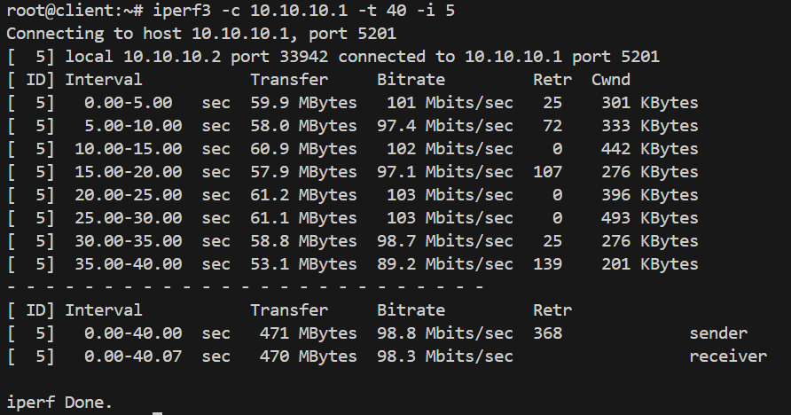

# VPN (Virtual private network)

## Задача:
1. Настроить VPN между двумя ВМ в tun/tap режимах, замерить скорость в туннелях, сделать вывод об отличающихся показателях
2. Поднять RAS на базе OpenVPN с клиентскими сертификатами, подключиться с локальной машины на ВМ

## Выполнение:
1. Развернем две виртуальные машины, используя [Vagrantfile](Vagrantfile):
```bash
vagrant up
```

2. На server и client машинах:
```bash
sudo -i
apt update
apt install openvpn iperf3 selinux-utils
setenforce 0
```

3. Настройка server:

- Cоздаем файл-ключ:
```bash
openvpn --genkey secret /etc/openvpn/static.key
```

- Cоздаем конфигурационный файл OpenVPN:
```bash
nano /etc/openvpn/server.conf
```
Содержимое файла server.conf:
```
dev tap 
ifconfig 10.10.10.1 255.255.255.0 
topology subnet 
secret /etc/openvpn/static.key 
comp-lzo 
status /var/log/openvpn-status.log 
log /var/log/openvpn.log  
verb 3
```

- Создаем service unit для запуска OpenVPN:
```bash
nano /etc/systemd/system/openvpn@.service
```
Содержимое файла-юнита:
```
[Unit] 
Description=OpenVPN Tunneling Application On %I 
After=network.target 
[Service] 
Type=notify 
PrivateTmp=true 
ExecStart=/usr/sbin/openvpn --cd /etc/openvpn/ --config %i.conf 
[Install] 
WantedBy=multi-user.target
```

- Запускаем сервис:
```bash
systemctl start openvpn@server 
systemctl enable openvpn@server
```
  

4. Настройка client: 
- Cоздаем конфигурационный файл OpenVPN:
```bash
nano /etc/openvpn/server.conf
```
Содержимое конфигурационного файла:
```
dev tap 
remote 192.168.56.10 
ifconfig 10.10.10.2 255.255.255.0 
topology subnet 
route 192.168.56.0 255.255.255.0 
secret /etc/openvpn/static.key
comp-lzo
status /var/log/openvpn-status.log 
log /var/log/openvpn.log 
verb 3 
```

- На client в директорию /etc/openvpn необходимо скопировать файл-ключ static.key, который был создан на server.    

- Создаем service unit для запуска OpenVPN:
```bash
nano /etc/systemd/system/openvpn@.service
```
Содержимое файла-юнита:
```
[Unit] 
Description=OpenVPN Tunneling Application On %I 
After=network.target 
[Service] 
Type=notify 
PrivateTmp=true 
ExecStart=/usr/sbin/openvpn --cd /etc/openvpn/ --config %i.conf 
[Install] 
WantedBy=multi-user.target
```
- Запускаем сервис:
```bash
systemctl start openvpn@server 
systemctl enable openvpn@server
```
 

5. Измерение скорости в туннеле: 
- На server  запускаем iperf3 в режиме сервера: 
```bash
iperf3 -s & 
```
- На client  запускаем iperf3 в режиме клиента и замеряем  скорость в туннеле: 
```bash
iperf3 -c 10.10.10.1 -t 40 -i 5
```


- На server и client в /etc/openvpn/server.conf мняем `dev tap` -> `dev tun` и перезапускаем сервис:
```bash
nano /etc/openvpn/server.conf
systemctl restart openvpn@server.service
```

- Повторяем замерскорости для режима работы tun:


Вывод:
Режим TUN  
- Работает на уровне 3 (сетевом уровне) модели OSI.  
- Передаёт только IP-пакеты (т.е. работает с маршрутизацией IP-трафика).  
- Создаётся виртуальный IP-интерфейс (обычно tun0).  
 Преимущества:  
- Меньшие накладные расходы, что позволяет эффективнее передавать IP-трафик.  
- Идеально подходит для организации VPN-маршрутизации между сетями (например, для подключения удалённых офисов).  
 Ограничения:
- Не передаёт широковещательные или мультикастовые Ethernet-пакеты, так как работает только с IP-трафиком.  

Режим TAP  
- Работает на уровне 2 (канальном уровне) модели OSI.  
- Передаёт полные Ethernet-кадры (включая информацию о MAC-адресах, протоколах и т.д.).  
- Создаётся виртуальный Ethernet-интерфейс (обычно tap0).  
Преимущества:  
- Поддерживает передачу широковещательных и мультикастовых пакетов.  
- Позволяет эмулировать локальную сеть, что удобно для приложений, требующих Ethernet-связи (например, для работы некоторых VPN-приложений или игровых серверов).  
Ограничения:  
- Больше накладных расходов за счёт передачи дополнительных данных уровня Ethernet.  
- Возможно, сложнее в настройке для маршрутизации IP-трафика, так как в первую очередь используется для мостовых соединений.  

Выбор режима  
- Для организации VPN, когда требуется передавать в основном IP-трафик и важна высокая производительность, лучше использовать режим TUN.
- Если требуется создать прозрачный мост для удалённых устройств (например, для совместного использования ресурсов локальной сети или эмуляции Ethernet-сети), выбирают режим TAP.  
Таким образом, основное различие состоит в уровне туннелирования:  
- TUN – туннелирование на сетевом уровне, подходит для IP-маршрутизации.
- TAP – туннелирование на канальном уровне, эмулирует Ethernet-сеть и поддерживает широковещательный трафик.

6. RAS на базе OpenVPN  
Настройка сервера:  

- Устанавливаем необходимые пакеты:  
```bash
sudo -i
apt update
apt install openvpn easy-rsa
```

- Переход в директорию и инициализация PKI:
```bash 
cd /etc/openvpn
/usr/share/easy-rsa/easyrsa init-pki
```
- Создание центра сертификации (CA):
```bash
/usr/share/easy-rsa/easyrsa build-ca
```
- Генерация запроса сертификата для сервера:
```bash
echo 'rasvpn' | /usr/share/easy-rsa/easyrsa gen-req server nopass
```
- Подписание запроса сертификата сервера:
```bash
echo 'yes' | /usr/share/easy-rsa/easyrsa sign-req server server
```
- Генерация DH-параметров, ключей и прочих необходимых файлов:
```bash
/usr/share/easy-rsa/easyrsa gen-dh
openvpn --genkey secret ca.key
```
- Генерируем необходимые ключи и сертификаты для клиента:
```bash
echo 'client' | /usr/share/easy-rsa/easyrsa gen-req client nopass
echo 'yes' | /usr/share/easy-rsa/easyrsa sign-req client client
```

- Создаем конфигурационный файл сервера:  
```bash
nano /etc/openvpn/server.conf
```
Содержимое файла server.conf:  
```
port 1207 
proto udp 
dev tun 
ca /etc/openvpn/pki/ca.crt 
cert /etc/openvpn/pki/issued/server.crt 
key /etc/openvpn/pki/private/server.key 
dh /etc/openvpn/pki/dh.pem 
server 10.10.10.0 255.255.255.0 
ifconfig-pool-persist ipp.txt 
client-to-client 
client-config-dir /etc/openvpn/client 
keepalive 10 120 
comp-lzo 
persist-key 
persist-tun 
status /var/log/openvpn-status.log 
log /var/log/openvpn.log 
verb 3
```

- Зададим параметр iroute для клиента: 
```bash 
echo 'iroute 10.10.10.0 255.255.255.0' > /etc/openvpn/client/client
```

- Запускаем сервис (при необходимости создать файл юнита как в задании 1):
```bash
systemctl start openvpn@server
systemctl enable openvpn@server
```

7. Настройка хост-машины:
- Устанавливаем OpenVPN:
```bash
sudo apt update
sudo apt install openvpn
```
- Необходимо создать файл client.conf:
```bash
nano /etc/openvpn/client.conf
```
Содержимое файла client.conf:
```
dev tun
proto udp
remote 192.168.56.10 1207
client
resolv-retry infinite
remote-cert-tls server
ca /etc/openvpn/ca.crt
cert /etc/openvpn/client.crt
key /etc/openvpn/client.key
route 10.10.10.0 255.255.255.0
persist-key
persist-tun
comp-lzo
verb 3
```
- Копируем файлы client.conf, ca.crt, client.crt и client.key в директорию /etc/openvpn/
- Для проверки подключения к VPN-серверу выполняем команду:
```bash
sudo openvpn --config /etc/openvpn/client.conf
```
  
- Автозапуск OpenVPN
```bash
nano /etc/systemd/system/openvpn-client@.service
```
```
[Unit]
Description=OpenVPN connection to %i
After=network.target

[Service]
Type=simple
ExecStart=/usr/sbin/openvpn --config /etc/openvpn/%i.conf
Restart=on-failure

[Install]
WantedBy=multi-user.target
```

```bash
systemctl enable openvpn-client@client
systemctl start openvpn-client@client
```
- Проверяем пинг по внутреннему IP адресу  сервера в туннеле: 
```bash
ping -c 4 10.10.10.1
```
  
- Проверяем командой `ip r` (netstat -rn) на хостовой машине что сеть туннеля импортирована в таблицу маршрутизации:
  