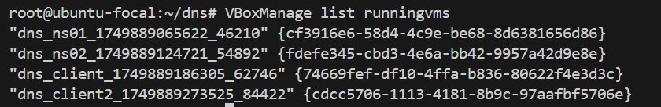

# DNS - Split DNS (Domain Name System)

## Задача:
1. взять стенд https://github.com/erlong15/vagrant-bind 
- добавить еще один сервер client2
- завести в зоне dns.lab имена:
    - web1 - смотрит на клиент1
    - web2  смотрит на клиент2
- завести еще одну зону newdns.lab
- завести в ней запись
    - www - смотрит на обоих клиентов

2. настроить split-dns
- клиент1 - видит обе зоны, но в зоне dns.lab только web1
- клиент2 видит только dns.lab


## Выполнение:
Для выполнения задания использовалась хостоваяя машина на ubuntu/focal64, VirtualBox 6.1, Vagrant 2.2.19, ansible 2.9.6
<details>
  <summary>Vagrantfile</summary>

```
Vagrant.configure("2") do |config|
  config.vm.box = "ubuntu/focal64"  # или другой образ (например, "ubuntu/focal64")

  # Настройка сети
  config.vm.network "forwarded_port", guest: 22, host: 2222

  # Проброс папки
  config.vm.synced_folder "./local_folder", "/home/vagrant/shared_folder"

  # Настройка ресурсов VM 
  config.vm.provider "virtualbox" do |vb|
    vb.memory = 6096  # 4 ГБ ОЗУ
    vb.cpus = 4       # 4 ядра CPU
    vb.customize ["modifyvm", :id, "--nested-hw-virt", "on"]  # Для вложенной виртуализации
  end

  # Установка современных версий
  config.vm.provision "shell", inline: <<-SHELL
    # Обновление системы
    sudo apt-get update -y
    sudo apt-get upgrade -y
    
    # Установка зависимостей
    sudo apt-get install -y software-properties-common wget curl gnupg2

    # Установка VirtualBox 6.1 (совместим с Vagrant 2.2.19+)
    echo "deb [arch=amd64] https://download.virtualbox.org/virtualbox/debian $(lsb_release -cs) contrib" | sudo tee /etc/apt/sources.list.d/virtualbox.list
    wget -q https://www.virtualbox.org/download/oracle_vbox_2016.asc -O- | sudo apt-key add -
    sudo apt-get update
    sudo apt-get install -y virtualbox-6.1
    
    # Установка Vagrant 2.2.19 (последняя стабильная для VirtualBox 6.1)
    wget https://releases.hashicorp.com/vagrant/2.2.19/vagrant_2.2.19_x86_64.deb
    sudo dpkg -i vagrant_2.2.19_x86_64.deb || sudo apt-get install -f -y
    rm vagrant_2.2.19_x86_64.deb
    
    # Установка дополнительных пакетов
    sudo apt-get install -y git ansible build-essential

    # Проверка версий
    echo "=== Установленные версии ==="
    echo "VirtualBox: $(VBoxManage --version)"
    echo "Vagrant: $(vagrant --version)"
  SHELL
end 
```
</details>

1. Клонируем репозиторий:
```bash
git clone https://github.com/Schukinsky/Linux.Professional/tree/main/hw24_DNS.git
```
2. Разворачиваем стенд:  
*Выполнял в два этапа:*  
*1. `vagrant up` с закомментированным блоком provision*  
*2. `vagrant provision` с блоком provision*

```bash
vagrant up
vagrant provision
```
<details>
  <summary>Результат выполнения команды</summary>

```
root@ubuntu-focal:~/dns# vagrant up
==> vagrant: A new version of Vagrant is available: 2.4.6 (installed version: 2.2.19)!
==> vagrant: To upgrade visit: https://www.vagrantup.com/downloads.html

Bringing machine 'ns01' up with 'virtualbox' provider...
Bringing machine 'ns02' up with 'virtualbox' provider...
Bringing machine 'client' up with 'virtualbox' provider...
Bringing machine 'client2' up with 'virtualbox' provider...
==> ns01: Box 'centos/7' could not be found. Attempting to find and install...
    ns01: Box Provider: virtualbox
    ns01: Box Version: >= 0
==> ns01: Loading metadata for box 'centos/7'
    ns01: URL: https://vagrantcloud.com/centos/7
==> ns01: Adding box 'centos/7' (v2004.01) for provider: virtualbox
    ns01: Downloading: https://vagrantcloud.com/centos/boxes/7/versions/2004.01/providers/virtualbox/unknown/vagrant.box
    ns01: Calculating and comparing box checksum...
==> ns01: Successfully added box 'centos/7' (v2004.01) for 'virtualbox'!
==> ns01: Importing base box 'centos/7'...
==> ns01: Matching MAC address for NAT networking...
==> ns01: Checking if box 'centos/7' version '2004.01' is up to date...
==> ns01: Setting the name of the VM: dns_ns01_1749889065622_46210
==> ns01: Clearing any previously set network interfaces...
==> ns01: Preparing network interfaces based on configuration...
    ns01: Adapter 1: nat
    ns01: Adapter 2: intnet
==> ns01: Forwarding ports...
    ns01: 22 (guest) => 2222 (host) (adapter 1)
==> ns01: Running 'pre-boot' VM customizations...
==> ns01: Booting VM...
==> ns01: Waiting for machine to boot. This may take a few minutes...
    ns01: SSH address: 127.0.0.1:2222
    ns01: SSH username: vagrant
    ns01: SSH auth method: private key
    ns01: 
    ns01: Vagrant insecure key detected. Vagrant will automatically replace
    ns01: this with a newly generated keypair for better security.
    ns01: 
    ns01: Inserting generated public key within guest...
    ns01: Removing insecure key from the guest if it's present...
    ns01: Key inserted! Disconnecting and reconnecting using new SSH key...
==> ns01: Machine booted and ready!
==> ns01: Checking for guest additions in VM...
    ns01: No guest additions were detected on the base box for this VM! Guest
    ns01: additions are required for forwarded ports, shared folders, host only
    ns01: networking, and more. If SSH fails on this machine, please install
    ns01: the guest additions and repackage the box to continue.
    ns01:
    ns01: This is not an error message; everything may continue to work properly,
    ns01: in which case you may ignore this message.
==> ns01: Setting hostname...
==> ns01: Configuring and enabling network interfaces...
==> ns01: Rsyncing folder: /root/dns/ => /vagrant
==> ns02: Box 'centos/7' could not be found. Attempting to find and install...
    ns02: Box Provider: virtualbox
    ns02: Box Version: >= 0
==> ns02: Loading metadata for box 'centos/7'
    ns02: URL: https://vagrantcloud.com/centos/7
==> ns02: Adding box 'centos/7' (v2004.01) for provider: virtualbox
==> ns02: Importing base box 'centos/7'...
==> ns02: Matching MAC address for NAT networking...
==> ns02: Checking if box 'centos/7' version '2004.01' is up to date...
==> ns02: Setting the name of the VM: dns_ns02_1749889124721_54892
==> ns02: Fixed port collision for 22 => 2222. Now on port 2200.
==> ns02: Clearing any previously set network interfaces...
==> ns02: Preparing network interfaces based on configuration...
    ns02: Adapter 1: nat
    ns02: Adapter 2: intnet
==> ns02: Forwarding ports...
    ns02: 22 (guest) => 2200 (host) (adapter 1)
==> ns02: Running 'pre-boot' VM customizations...
==> ns02: Booting VM...
==> ns02: Waiting for machine to boot. This may take a few minutes...
    ns02: SSH address: 127.0.0.1:2200
    ns02: SSH username: vagrant
    ns02: SSH auth method: private key
    ns02: 
    ns02: Vagrant insecure key detected. Vagrant will automatically replace
    ns02: this with a newly generated keypair for better security.
    ns02: 
    ns02: Inserting generated public key within guest...
    ns02: Removing insecure key from the guest if it's present...
    ns02: Key inserted! Disconnecting and reconnecting using new SSH key...
==> ns02: Machine booted and ready!
==> ns02: Checking for guest additions in VM...
    ns02: No guest additions were detected on the base box for this VM! Guest
    ns02: additions are required for forwarded ports, shared folders, host only
    ns02: networking, and more. If SSH fails on this machine, please install
    ns02: the guest additions and repackage the box to continue.
    ns02:
    ns02: This is not an error message; everything may continue to work properly,
    ns02: in which case you may ignore this message.
==> ns02: Setting hostname...
==> ns02: Configuring and enabling network interfaces...
==> ns02: Rsyncing folder: /root/dns/ => /vagrant
==> client: Box 'centos/7' could not be found. Attempting to find and install...
    client: Box Provider: virtualbox
    client: Box Version: >= 0
==> client: Loading metadata for box 'centos/7'
    client: URL: https://vagrantcloud.com/centos/7
==> client: Adding box 'centos/7' (v2004.01) for provider: virtualbox
==> client: Importing base box 'centos/7'...
==> client: Matching MAC address for NAT networking...
==> client: Checking if box 'centos/7' version '2004.01' is up to date...
==> client: Setting the name of the VM: dns_client_1749889186305_62746
==> client: Fixed port collision for 22 => 2222. Now on port 2201.
==> client: Clearing any previously set network interfaces...
==> client: Preparing network interfaces based on configuration...
    client: Adapter 1: nat
    client: Adapter 2: intnet
==> client: Forwarding ports...
    client: 22 (guest) => 2201 (host) (adapter 1)
==> client: Running 'pre-boot' VM customizations...
==> client: Booting VM...
==> client: Waiting for machine to boot. This may take a few minutes...
    client: SSH address: 127.0.0.1:2201
    client: SSH username: vagrant
    client: SSH auth method: private key
    client: 
    client: Vagrant insecure key detected. Vagrant will automatically replace
    client: this with a newly generated keypair for better security.
    client: 
    client: Inserting generated public key within guest...
    client: Removing insecure key from the guest if it's present...
    client: Key inserted! Disconnecting and reconnecting using new SSH key...
==> client: Machine booted and ready!
==> client: Checking for guest additions in VM...
    client: No guest additions were detected on the base box for this VM! Guest
    client: additions are required for forwarded ports, shared folders, host only
    client: networking, and more. If SSH fails on this machine, please install
    client: the guest additions and repackage the box to continue.
    client:
    client: This is not an error message; everything may continue to work properly,
    client: in which case you may ignore this message.
==> client: Setting hostname...
==> client: Configuring and enabling network interfaces...
==> client: Rsyncing folder: /root/dns/ => /vagrant
==> client2: Box 'centos/7' could not be found. Attempting to find and install...
    client2: Box Provider: virtualbox
    client2: Box Version: >= 0
==> client2: Loading metadata for box 'centos/7'
    client2: URL: https://vagrantcloud.com/centos/7
==> client2: Adding box 'centos/7' (v2004.01) for provider: virtualbox
==> client2: Importing base box 'centos/7'...
==> client2: Matching MAC address for NAT networking...
==> client2: Checking if box 'centos/7' version '2004.01' is up to date...
==> client2: Setting the name of the VM: dns_client2_1749889273525_84422
==> client2: Fixed port collision for 22 => 2222. Now on port 2202.
==> client2: Clearing any previously set network interfaces...
==> client2: Preparing network interfaces based on configuration...
    client2: Adapter 1: nat
    client2: Adapter 2: intnet
==> client2: Forwarding ports...
    client2: 22 (guest) => 2202 (host) (adapter 1)
==> client2: Running 'pre-boot' VM customizations...
==> client2: Booting VM...
==> client2: Waiting for machine to boot. This may take a few minutes...
    client2: SSH address: 127.0.0.1:2202
    client2: SSH username: vagrant
    client2: SSH auth method: private key
    client2: 
    client2: Vagrant insecure key detected. Vagrant will automatically replace
    client2: this with a newly generated keypair for better security.
    client2: 
    client2: Inserting generated public key within guest...
    client2: Removing insecure key from the guest if it's present...
    client2: Key inserted! Disconnecting and reconnecting using new SSH key...
==> client2: Machine booted and ready!
==> client2: Checking for guest additions in VM...
    client2: No guest additions were detected on the base box for this VM! Guest
    client2: additions are required for forwarded ports, shared folders, host only
    client2: networking, and more. If SSH fails on this machine, please install
    client2: the guest additions and repackage the box to continue.
    client2:
    client2: This is not an error message; everything may continue to work properly,
    client2: in which case you may ignore this message.
==> client2: Setting hostname...
==> client2: Configuring and enabling network interfaces...
==> client2: Rsyncing folder: /root/dns/ => /vagrant
```
```
root@ubuntu-focal:~/dns# vagrant provision
==> ns01: Running provisioner: ansible...
    ns01: Running ansible-playbook...

PLAY [all] *********************************************************************

TASK [Gathering Facts] *********************************************************
ok: [ns01]

TASK [shell] *******************************************************************
changed: [ns01]
[WARNING]: Consider using the replace, lineinfile or template module rather
than running 'sed'.  If you need to use command because replace, lineinfile or
template is insufficient you can add 'warn: false' to this command task or set
'command_warnings=False' in ansible.cfg to get rid of this message.

TASK [install packages] ********************************************************
changed: [ns01]

TASK [start chronyd] ***********************************************************
ok: [ns01]

TASK [copy transferkey to all servers and the client] **************************
changed: [ns01]

PLAY [ns01] ********************************************************************

TASK [Gathering Facts] *********************************************************
ok: [ns01]

TASK [copy named.conf] *********************************************************
changed: [ns01]

TASK [Copy named.d* zones] *****************************************************
changed: [ns01] => (item=/root/dns/provisioning/named.dns.lab.client)
changed: [ns01] => (item=/root/dns/provisioning/named.dns.lab.rev)
changed: [ns01] => (item=/root/dns/provisioning/named.dns.lab)
changed: [ns01] => (item=/root/dns/provisioning/named.ddns.lab)

TASK [Copy named.newdns.lab zone] **********************************************
changed: [ns01]

TASK [copy resolv.conf to the servers] *****************************************
changed: [ns01]

TASK [set /etc/named permissions] **********************************************
changed: [ns01]

TASK [ensure named is running and enabled] *************************************
changed: [ns01]

PLAY [ns02] ********************************************************************
skipping: no hosts matched

PLAY [client,client2] **********************************************************
skipping: no hosts matched

PLAY RECAP *********************************************************************
ns01                       : ok=12   changed=9    unreachable=0    failed=0    skipped=0    rescued=0    ignored=0

==> ns02: Running provisioner: ansible...
    ns02: Running ansible-playbook...

PLAY [all] *********************************************************************

TASK [Gathering Facts] *********************************************************
ok: [ns02]

TASK [shell] *******************************************************************
[WARNING]: Consider using the replace, lineinfile or template module rather
than running 'sed'.  If you need to use command because replace, lineinfile or
template is insufficient you can add 'warn: false' to this command task or set
'command_warnings=False' in ansible.cfg to get rid of this message.
changed: [ns02]

TASK [install packages] ********************************************************
changed: [ns02]

TASK [start chronyd] ***********************************************************
ok: [ns02]

TASK [copy transferkey to all servers and the client] **************************
changed: [ns02]

PLAY [ns01] ********************************************************************
skipping: no hosts matched

PLAY [ns02] ********************************************************************

TASK [Gathering Facts] *********************************************************
ok: [ns02]

TASK [copy named.conf] *********************************************************
changed: [ns02]

TASK [copy resolv.conf to the servers] *****************************************
changed: [ns02]

TASK [set /etc/named permissions] **********************************************
changed: [ns02]

TASK [ensure named is running and enabled] *************************************
changed: [ns02]

PLAY [client,client2] **********************************************************
skipping: no hosts matched

PLAY RECAP *********************************************************************
ns02                       : ok=10   changed=7    unreachable=0    failed=0    skipped=0    rescued=0    ignored=0

==> client: Running provisioner: ansible...
    client: Running ansible-playbook...

PLAY [all] *********************************************************************

TASK [Gathering Facts] *********************************************************
ok: [client]

TASK [shell] *******************************************************************
[WARNING]: Consider using the replace, lineinfile or template module rather
than running 'sed'.  If you need to use command because replace, lineinfile or
template is insufficient you can add 'warn: false' to this command task or set
'command_warnings=False' in ansible.cfg to get rid of this message.
changed: [client]

TASK [install packages] ********************************************************
changed: [client]

TASK [start chronyd] ***********************************************************
ok: [client]

TASK [copy transferkey to all servers and the client] **************************
changed: [client]

PLAY [ns01] ********************************************************************
skipping: no hosts matched

PLAY [ns02] ********************************************************************
skipping: no hosts matched

PLAY [client,client2] **********************************************************

TASK [Gathering Facts] *********************************************************
ok: [client]

TASK [copy resolv.conf to the client] ******************************************
changed: [client]

TASK [copy rndc conf file] *****************************************************
changed: [client]

TASK [copy motd to the client] *************************************************
changed: [client]

PLAY RECAP *********************************************************************
client                     : ok=9    changed=6    unreachable=0    failed=0    skipped=0    rescued=0    ignored=0

==> client2: Running provisioner: ansible...
    client2: Running ansible-playbook...

PLAY [all] *********************************************************************

TASK [Gathering Facts] *********************************************************
ok: [client2]

TASK [shell] *******************************************************************
[WARNING]: Consider using the replace, lineinfile or template module rather
than running 'sed'.  If you need to use command because replace, lineinfile or
template is insufficient you can add 'warn: false' to this command task or set
'command_warnings=False' in ansible.cfg to get rid of this message.
changed: [client2]

TASK [install packages] ********************************************************
changed: [client2]

TASK [start chronyd] ***********************************************************
ok: [client2]

TASK [copy transferkey to all servers and the client] **************************
changed: [client2]

PLAY [ns01] ********************************************************************
skipping: no hosts matched

PLAY [ns02] ********************************************************************
skipping: no hosts matched

PLAY [ns01] ********************************************************************
skipping: no hosts matched

PLAY [ns02] ********************************************************************
skipping: no hosts matched

PLAY [client,client2] **********************************************************

TASK [Gathering Facts] *********************************************************
ok: [client2]

TASK [copy resolv.conf to the client] ******************************************
changed: [client2]

TASK [copy rndc conf file] *****************************************************
changed: [client2]

TASK [copy motd to the client] *************************************************
changed: [client2]
PLAY [ns01] ********************************************************************
skipping: no hosts matched

PLAY [ns02] ********************************************************************
skipping: no hosts matched

PLAY [client,client2] **********************************************************

TASK [Gathering Facts] *********************************************************
ok: [client2]

TASK [copy resolv.conf to the client] ******************************************
changed: [client2]

TASK [copy rndc conf file] *****************************************************
changed: [client2]

TASK [copy motd to the client] *************************************************
PLAY [ns01] ********************************************************************
skipping: no hosts matched

PLAY [ns02] ********************************************************************
skipping: no hosts matched

PLAY [client,client2] **********************************************************

TASK [Gathering Facts] *********************************************************
ok: [client2]

TASK [copy resolv.conf to the client] ******************************************
changed: [client2]

TASK [copy rndc conf file] *****************************************************
changed: [client2]

PLAY [ns01] ********************************************************************
skipping: no hosts matched

PLAY [ns02] ********************************************************************
skipping: no hosts matched

PLAY [client,client2] **********************************************************

TASK [Gathering Facts] *********************************************************
ok: [client2]

TASK [copy resolv.conf to the client] ******************************************
changed: [client2]

TASK [copy rndc conf file] *****************************************************
PLAY [ns01] ********************************************************************
skipping: no hosts matched

PLAY [ns02] ********************************************************************
skipping: no hosts matched

PLAY [client,client2] **********************************************************

TASK [Gathering Facts] *********************************************************
ok: [client2]

TASK [copy resolv.conf to the client] ******************************************
PLAY [ns01] ********************************************************************
skipping: no hosts matched

PLAY [ns02] ********************************************************************
skipping: no hosts matched

PLAY [client,client2] **********************************************************

TASK [Gathering Facts] *********************************************************
ok: [client2]
PLAY [ns01] ********************************************************************
skipping: no hosts matched

PLAY [ns02] ********************************************************************
skipping: no hosts matched

PLAY [client,client2] **********************************************************

PLAY [ns01] ********************************************************************
skipping: no hosts matched

PLAY [ns02] ********************************************************************
skipping: no hosts matched

skipping: no hosts matched

PLAY [ns02] ********************************************************************
skipping: no hosts matched


PLAY [ns02] ********************************************************************
skipping: no hosts matched

skipping: no hosts matched

PLAY [client,client2] **********************************************************

TASK [Gathering Facts] *********************************************************
PLAY [client,client2] **********************************************************

TASK [Gathering Facts] *********************************************************
ok: [client2]

TASK [Gathering Facts] *********************************************************
ok: [client2]

TASK [copy resolv.conf to the client] ******************************************
ok: [client2]

TASK [copy resolv.conf to the client] ******************************************
TASK [copy resolv.conf to the client] ******************************************
changed: [client2]
changed: [client2]


TASK [copy rndc conf file] *****************************************************
changed: [client2]

TASK [copy motd to the client] *************************************************
changed: [client2]

PLAY RECAP *********************************************************************
client2                    : ok=9    changed=6    unreachable=0    failed=0    skipped=0    rescued=0    ignored=0

root@ubuntu-focal:~/dns#
TASK [copy motd to the client] *************************************************
changed: [client2]

PLAY RECAP *********************************************************************
client2                    : ok=9    changed=6    unreachable=0    failed=0    skipped=0    rescued=0    ignored=0
TASK [copy motd to the client] *************************************************
changed: [client2]

TASK [copy motd to the client] *************************************************
TASK [copy motd to the client] *************************************************
TASK [copy motd to the client] *************************************************
changed: [client2]
TASK [copy motd to the client] *************************************************
changed: [client2]

TASK [copy motd to the client] *************************************************
TASK [copy motd to the client] *************************************************
changed: [client2]
TASK [copy motd to the client] *************************************************
changed: [client2]
TASK [copy motd to the client] *************************************************
changed: [client2]
TASK [copy motd to the client] *************************************************
TASK [copy motd to the client] *************************************************
TASK [copy motd to the client] *************************************************
changed: [client2]

PLAY RECAP *********************************************************************
client2                    : ok=9    changed=6    unreachable=0    failed=0    skipped=0    rescued=0    ignored=0
```
</details>

После выполнения команды `vagrant up` была развернута тестовая среда, состоящая из четырех виртуальных машин.  
  
Затем система применила Ansible-сценарий provisioning/playbook.yml, который произвел настройку всех ВМ в соответствии с требованиями задания.

3. Подключимся к client и выполним проверки:
```bash
vagrant ssh client
ping www.newdns.lab
ping web1.dns.lab
ping web2.dns.lab
```
```
root@ubuntu-focal:~/dns# vagrant ssh client
Last login: Sat Jun 14 08:30:12 2025 from 10.0.2.2
### Welcome to the DNS lab! ###

- Use this client to test the enviroment, with dig or nslookup.
    dig @192.168.50.10 ns01.dns.lab
    dig @192.168.50.11 -x 192.168.50.10

- nsupdate is available in the ddns.lab zone. Ex:
    nsupdate -k /etc/named.zonetransfer.key
    server 192.168.50.10
    zone ddns.lab
    update add www.ddns.lab. 60 A 192.168.50.15
    send

- rndc is also available to manage the servers
    rndc -c ~/rndc.conf reload

Enjoy!
[vagrant@client ~]$  ping www.newdns.lab
PING www.newdns.lab (192.168.50.15) 56(84) bytes of data.
64 bytes from client (192.168.50.15): icmp_seq=1 ttl=64 time=0.020 ms
64 bytes from client (192.168.50.15): icmp_seq=2 ttl=64 time=0.031 ms
64 bytes from client (192.168.50.15): icmp_seq=3 ttl=64 time=0.037 ms
64 bytes from client (192.168.50.15): icmp_seq=4 ttl=64 time=0.037 ms
^C
--- www.newdns.lab ping statistics ---
4 packets transmitted, 4 received, 0% packet loss, time 3001ms
rtt min/avg/max/mdev = 0.020/0.031/0.037/0.008 ms
[vagrant@client ~]$ ping web1.dns.lab
PING web1.dns.lab (192.168.50.15) 56(84) bytes of data.
64 bytes from client (192.168.50.15): icmp_seq=1 ttl=64 time=0.017 ms
64 bytes from client (192.168.50.15): icmp_seq=2 ttl=64 time=0.086 ms
64 bytes from client (192.168.50.15): icmp_seq=3 ttl=64 time=0.086 ms
64 bytes from client (192.168.50.15): icmp_seq=4 ttl=64 time=0.026 ms
^C
--- web1.dns.lab ping statistics ---
4 packets transmitted, 4 received, 0% packet loss, time 3009ms
rtt min/avg/max/mdev = 0.017/0.053/0.086/0.033 ms
[vagrant@client ~]$ ping web2.dns.lab
ping: web2.dns.lab: Name or service not known
```
Мы видим, что client видит обе зоны (dns.lab и newdns.lab), однако информацию о хосте web2.dns.lab он получить не может.

4. Подключимся к client2 и выполним проверки:
```bash
vagrant ssh client2
ping www.newdns.lab
ping web1.dns.lab
ping web2.dns.lab
```
```
root@ubuntu-focal:~/dns# vagrant ssh client2
Last login: Sat Jun 14 08:32:52 2025 from 10.0.2.2
### Welcome to the DNS lab! ###

- Use this client to test the enviroment, with dig or nslookup.
    dig @192.168.50.10 ns01.dns.lab
    dig @192.168.50.11 -x 192.168.50.10

- nsupdate is available in the ddns.lab zone. Ex:
    nsupdate -k /etc/named.zonetransfer.key
    server 192.168.50.10
    zone ddns.lab
    update add www.ddns.lab. 60 A 192.168.50.15
    send

- rndc is also available to manage the servers
    rndc -c ~/rndc.conf reload

Enjoy!
[vagrant@client2 ~]$ ping www.newdns.lab
ping: www.newdns.lab: Name or service not known
[vagrant@client2 ~]$ ping web1.dns.lab
PING web1.dns.lab (192.168.50.15) 56(84) bytes of data.
64 bytes from 192.168.50.15 (192.168.50.15): icmp_seq=1 ttl=64 time=2.80 ms
64 bytes from 192.168.50.15 (192.168.50.15): icmp_seq=2 ttl=64 time=2.93 ms
64 bytes from 192.168.50.15 (192.168.50.15): icmp_seq=3 ttl=64 time=2.41 ms
64 bytes from 192.168.50.15 (192.168.50.15): icmp_seq=4 ttl=64 time=3.24 ms
^C
--- web1.dns.lab ping statistics ---
4 packets transmitted, 4 received, 0% packet loss, time 3009ms
rtt min/avg/max/mdev = 2.418/2.852/3.247/0.297 ms
[vagrant@client2 ~]$ ping web2.dns.lab
PING web2.dns.lab (192.168.50.16) 56(84) bytes of data.
64 bytes from client2 (192.168.50.16): icmp_seq=1 ttl=64 time=0.027 ms
64 bytes from client2 (192.168.50.16): icmp_seq=2 ttl=64 time=0.084 ms
64 bytes from client2 (192.168.50.16): icmp_seq=3 ttl=64 time=0.028 ms
64 bytes from client2 (192.168.50.16): icmp_seq=4 ttl=64 time=0.104 ms
^C
--- web2.dns.lab ping statistics ---
4 packets transmitted, 4 received, 0% packet loss, time 3007ms
rtt min/avg/max/mdev = 0.027/0.060/0.104/0.035 ms
```
Мы видим, что client2 видит всю зону dns.lab и не видит зону newdns.lab
  

