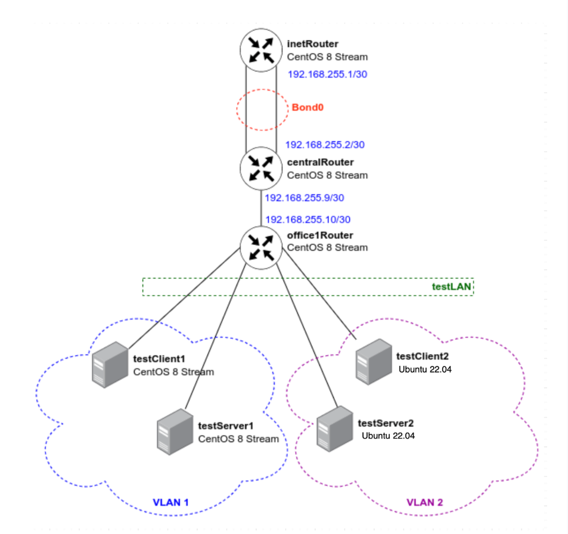
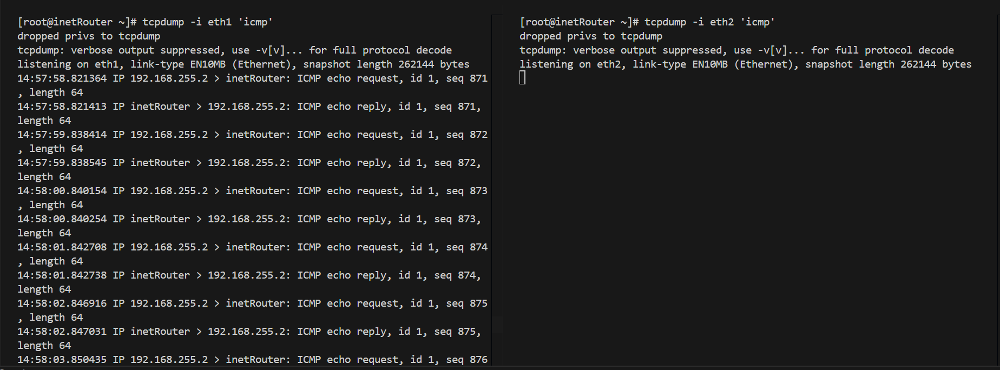
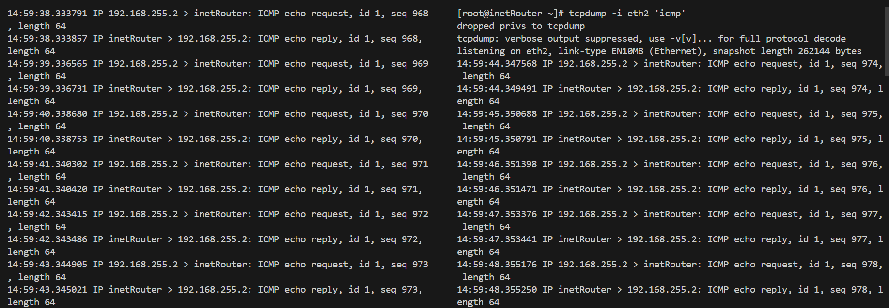

# VLAN-LACP (Virtual Local Area Network, link aggregation control protocol)

## Задача:
в Office1 в тестовой подсети появляется сервера с доп интерфейсами и адресами
в internal сети testLAN: 
- testClient1 - 10.10.10.254
- testClient2 - 10.10.10.254
- testServer1- 10.10.10.1 
- testServer2- 10.10.10.1

Равести вланами:
testClient1 <-> testServer1
testClient2 <-> testServer2

Между centralRouter и inetRouter "пробросить" 2 линка (общая inernal сеть) и объединить их в бонд, проверить работу c отключением интерфейсов  


## Выполнение:
1. Развернем стенд, используя [Vagrantfile](Vagrantfile):
```
vagrant up
```
2. Устанавливаем утилиты:
 - на Centos:
 ```
 sudo -i
 yum install -y nano traceroute tcpdump net-tools 
```
 - на Ubuntu:
```
sudo -i
apt apdate
apt install -y traceroute tcpdump net-tools
```
3. Настройка VLAN на хостах  

3.1 Настройка VLAN на RHEL-based системах:

- На хосте testClient1 требуется создать файл /etc/sysconfig/network-scripts/ifcfg-vlan1 
```
nano /etc/sysconfig/network-scripts/ifcfg-vlan1
```
со следующим параметрами:
```
VLAN=yes
#Тип интерфейса - VLAN
TYPE=Vlan
#Указываем физическое устройство, через которые будет работать VLAN
PHYSDEV=eth1
#Указываем номер VLAN (VLAN_ID)
VLAN_ID=1
VLAN_NAME_TYPE=DEV_PLUS_VID_NO_PAD
PROXY_METHOD=none
BROWSER_ONLY=no
BOOTPROTO=none
#Указываем IP-адрес интерфейса
IPADDR=10.10.10.254
#Указываем префикс (маску) подсети
PREFIX=24
#Указываем имя vlan
NAME=vlan1
#Указываем имя подинтерфейса
DEVICE=eth1.1
ONBOOT=yes
```
- На хосте testServer1 создадим идентичный файл с другим IP-адресом (10.10.10.1)
```
nano /etc/sysconfig/network-scripts/ifcfg-vlan1
```
с параметрами:
```
VLAN=yes
#Тип интерфейса - VLAN
TYPE=Vlan
#Указываем физическое устройство, через которые будет работать VLAN
PHYSDEV=eth1
#Указываем номер VLAN (VLAN_ID)
VLAN_ID=1
VLAN_NAME_TYPE=DEV_PLUS_VID_NO_PAD
PROXY_METHOD=none
BROWSER_ONLY=no
BOOTPROTO=none
#Указываем IP-адрес интерфейса
IPADDR=10.10.10.1
#Указываем префикс (маску) подсети
PREFIX=24
#Указываем имя vlan
NAME=vlan1
#Указываем имя подинтерфейса
DEVICE=eth1.1
ONBOOT=yes
```
- После создания файлов нужно перезапустить сеть на обоих хостах:
```
systemctl restart NetworkManager
```
- Проверим настройку интерфейса, если настройка произведена правильно, то с хоста testClient1 будет проходить ping до хоста testServer1:
```
[root@testClient1 ~]# ip a
1: lo: <LOOPBACK,UP,LOWER_UP> mtu 65536 qdisc noqueue state UNKNOWN group default qlen 1000
    link/loopback 00:00:00:00:00:00 brd 00:00:00:00:00:00
    inet 127.0.0.1/8 scope host lo
       valid_lft forever preferred_lft forever
    inet6 ::1/128 scope host
       valid_lft forever preferred_lft forever
2: eth0: <BROADCAST,MULTICAST,UP,LOWER_UP> mtu 1500 qdisc fq_codel state UP group default qlen 1000
    link/ether 52:54:00:ca:7d:37 brd ff:ff:ff:ff:ff:ff
    altname enp0s3
    inet 10.0.2.15/24 brd 10.0.2.255 scope global dynamic noprefixroute eth0
       valid_lft 86320sec preferred_lft 86320sec
    inet6 fe80::5054:ff:feca:7d37/64 scope link
       valid_lft forever preferred_lft forever
3: eth1: <BROADCAST,MULTICAST,UP,LOWER_UP> mtu 1500 qdisc fq_codel state UP group default qlen 1000
    link/ether 08:00:27:f7:eb:57 brd ff:ff:ff:ff:ff:ff
    altname enp0s8
    inet6 fe80::9b1f:116b:7455:f73f/64 scope link noprefixroute
       valid_lft forever preferred_lft forever
4: eth2: <BROADCAST,MULTICAST,UP,LOWER_UP> mtu 1500 qdisc fq_codel state UP group default qlen 1000
    link/ether 08:00:27:a6:ad:33 brd ff:ff:ff:ff:ff:ff
    altname enp0s19
    inet 192.168.56.21/24 brd 192.168.56.255 scope global noprefixroute eth2
       valid_lft forever preferred_lft forever
    inet6 fe80::a00:27ff:fea6:ad33/64 scope link
       valid_lft forever preferred_lft forever
5: eth1.1@eth1: <BROADCAST,MULTICAST,UP,LOWER_UP> mtu 1500 qdisc noqueue state UP group default qlen 1000
    link/ether 08:00:27:f7:eb:57 brd ff:ff:ff:ff:ff:ff
    inet 10.10.10.254/24 brd 10.10.10.255 scope global noprefixroute eth1.1
       valid_lft forever preferred_lft forever
    inet6 fe80::a00:27ff:fef7:eb57/64 scope link
       valid_lft forever preferred_lft forever
```
```
[root@testClient1 ~]# ping 10.10.10.1
PING 10.10.10.1 (10.10.10.1) 56(84) bytes of data.       
64 bytes from 10.10.10.1: icmp_seq=1 ttl=64 time=0.936 ms
64 bytes from 10.10.10.1: icmp_seq=2 ttl=64 time=1.81 ms
64 bytes from 10.10.10.1: icmp_seq=3 ttl=64 time=0.433 ms
```
```
[root@testServer1 ~]# ping 10.10.10.254
PING 10.10.10.254 (10.10.10.254) 56(84) bytes of data.     
64 bytes from 10.10.10.254: icmp_seq=1 ttl=64 time=0.274 ms
64 bytes from 10.10.10.254: icmp_seq=2 ttl=64 time=0.857 ms
64 bytes from 10.10.10.254: icmp_seq=3 ttl=64 time=1.29 ms
```

3.2 Настройка VLAN на Ubuntu:

- На хосте testClient2 требуется создать файл /etc/netplan/50-cloud-init.yaml 
```
nano /etc/netplan/50-cloud-init.yaml
```
со следующим параметрами:
```
# This file is generated from information provided by the datasource.  Changes
# to it will not persist across an instance reboot.  To disable cloud-init's
# network configuration capabilities, write a file
# /etc/cloud/cloud.cfg.d/99-disable-network-config.cfg with the following:
# network: {config: disabled}
network:
    version: 2
    ethernets:
        enp0s3:
            dhcp4: true
        #В разделе ethernets добавляем порт, на котором будем настраивать VLAN
        enp0s8: {}
    #Настройка VLAN
    vlans:
        #Имя VLANа
        vlan2:
          #Указываем номер VLAN`а
          id: 2
          #Имя физического интерфейса
          link: enp0s8
          #Отключение DHCP-клиента
          dhcp4: no
          #Указываем ip-адрес
          addresses: [10.10.10.254/24]
```
- На хосте testServer2 создадим идентичный файл с другим IP-адресом (10.10.10.1).
```
nano /etc/netplan/50-cloud-init.yaml
```
со следующим параметрами:
```
# This file is generated from information provided by the datasource.  Changes
# to it will not persist across an instance reboot.  To disable cloud-init's
# network configuration capabilities, write a file
# /etc/cloud/cloud.cfg.d/99-disable-network-config.cfg with the following:
# network: {config: disabled}
network:
    version: 2
    ethernets:
        enp0s3:
            dhcp4: true
        #В разделе ethernets добавляем порт, на котором будем настраивать VLAN
        enp0s8: {}
    #Настройка VLAN
    vlans:
        #Имя VLANа
        vlan2:
          #Указываем номер VLAN`а
          id: 2
          #Имя физического интерфейса
          link: enp0s8
          #Отключение DHCP-клиента
          dhcp4: no
          #Указываем ip-адрес
          addresses: [10.10.10.1/24]
```
- После создания файлов нужно перезапустить сеть на обоих хостах: 
```
netplan apply
```
После настройки второго VLAN`а ping должен работать между хостами testClient1, testServer1 и между хостами testClient2, testServer2.
```
root@testClient2:~# ping 10.10.10.1
PING 10.10.10.1 (10.10.10.1) 56(84) bytes of data.
64 bytes from 10.10.10.1: icmp_seq=1 ttl=64 time=0.777 ms
64 bytes from 10.10.10.1: icmp_seq=2 ttl=64 time=1.48 ms
64 bytes from 10.10.10.1: icmp_seq=3 ttl=64 time=1.34 ms
```
```
root@testServer2:~# ping 10.10.10.254
PING 10.10.10.254 (10.10.10.254) 56(84) bytes of data.     
64 bytes from 10.10.10.254: icmp_seq=1 ttl=64 time=0.429 ms
64 bytes from 10.10.10.254: icmp_seq=2 ttl=64 time=1.38 ms
64 bytes from 10.10.10.254: icmp_seq=3 ttl=64 time=1.56 ms
```
Примечание: до остальных хостов ping работать не будет, так как не настроена маршрутизация.

4. Настройка LACP между хостами inetRouter и centralRouter

- Bond интерфейс будет работать через порты eth1 и eth2. Необходимо на обоих хостах добавить конфигурационные файлы для интерфейсов eth1 и eth2:
```
nano /etc/sysconfig/network-scripts/ifcfg-eth1
```
```
#Имя физического интерфейса
DEVICE=eth1
#Включать интерфейс при запуске системы
ONBOOT=yes
#Отключение DHCP-клиента
BOOTPROTO=none
#Указываем, что порт часть bond-интерфейса
MASTER=bond0
#Указываем роль bond
SLAVE=yes
NM_CONTROLLED=yes
USERCTL=no
```
- У интерфейса ifcfg-eth2 идентичный конфигурационный файл, в котором нужно изменить имя интерфейса: 
```
nano /etc/sysconfig/network-scripts/ifcfg-eth2
```
```
#Имя физического интерфейса
DEVICE=eth2
#Включать интерфейс при запуске системы
ONBOOT=yes
#Отключение DHCP-клиента
BOOTPROTO=none
#Указываем, что порт часть bond-интерфейса
MASTER=bond0
#Указываем роль bond
SLAVE=yes
NM_CONTROLLED=yes
USERCTL=no
```
- После настройки интерфейсов eth1 и eth2 нужно настроить bond-интерфейс, для этого создадим файл /etc/sysconfig/network-scripts/ifcfg-bond0
```
nano /etc/sysconfig/network-scripts/ifcfg-bond0
```
для inetRouter:
```
DEVICE=bond0
NAME=bond0
#Тип интерфейса — bond
TYPE=Bond
BONDING_MASTER=yes
#Указаваем IP-адрес 
IPADDR=192.168.255.1
#Указываем маску подсети
NETMASK=255.255.255.252
ONBOOT=yes
BOOTPROTO=static
#Указываем режим работы bond-интерфейса Active-Backup
# fail_over_mac=1 — данная опция «разрешает отвалиться» одному интерфейсу
BONDING_OPTS="mode=1 miimon=100 fail_over_mac=1"
NM_CONTROLLED=yes
```
для cenrtalRouter:
```
DEVICE=bond0
NAME=bond0
#Тип интерфейса — bond
TYPE=Bond
BONDING_MASTER=yes
#Указаваем IP-адрес 
IPADDR=192.168.255.2
#Указываем маску подсети
NETMASK=255.255.255.252
ONBOOT=yes
BOOTPROTO=static
#Указываем режим работы bond-интерфейса Active-Backup
# fail_over_mac=1 — данная опция «разрешает отвалиться» одному интерфейсу
BONDING_OPTS="mode=1 miimon=100 fail_over_mac=1"
NM_CONTROLLED=yes
```
- После создания данных конфигурационных файлов необходимо перезапустить сеть:
```
systemctl restart NetworkManager
```
На некоторых версиях RHEL/CentOS перезапуск сетевого интерфейса не запустит bond-интерфейс, в этом случае рекомендуется перезапустить хост.

5. Проверка:
- После настройки агрегации портов, необходимо проверить работу bond-интерфейса, для этого, на хосте inetRouter (192.168.255.1) запустим ping до centralRouter (192.168.255.2):
```
[root@inetRouter ~]# ping 192.168.255.2
PING 192.168.255.2 (192.168.255.2) 56(84) bytes of data.
64 bytes from 192.168.255.2: icmp_seq=1 ttl=64 time=2.03 ms
64 bytes from 192.168.255.2: icmp_seq=2 ttl=64 time=0.467 ms
64 bytes from 192.168.255.2: icmp_seq=3 ttl=64 time=0.484 ms
64 bytes from 192.168.255.2: icmp_seq=4 ttl=64 time=1.31 ms
64 bytes from 192.168.255.2: icmp_seq=5 ttl=64 time=0.717 ms
64 bytes from 192.168.255.2: icmp_seq=6 ttl=64 time=0.534 ms
```
- Запустим ping c centralRouter на inetRouter
```
[root@centralRouter ~]# ping 192.168.255.1
PING 192.168.255.1 (192.168.255.1) 56(84) bytes of data.    
64 bytes from 192.168.255.1: icmp_seq=1 ttl=64 time=0.349 ms
64 bytes from 192.168.255.1: icmp_seq=2 ttl=64 time=0.523 ms
64 bytes from 192.168.255.1: icmp_seq=3 ttl=64 time=1.44 ms
64 bytes from 192.168.255.1: icmp_seq=4 ttl=64 time=1.76 ms
64 bytes from 192.168.255.1: icmp_seq=5 ttl=64 time=0.608 ms
64 bytes from 192.168.255.1: icmp_seq=6 ttl=64 time=1.52 ms
64 bytes from 192.168.255.1: icmp_seq=7 ttl=64 time=1.10 ms
```
- C помощью tcpdump на inetRouter в разных терминалах запустим мониторинг 'icmp' трафика на `eth1` и `eth2`:
```
tcpdump -i eth1 'icmp'
tcpdump -i eth2 'icmp'
```
 
Видим, что трафик идет через `eth1`.  
- Через третий терминал отключим `eth1` на inetRouter:
```
[root@inetRouter ~]# ip link set down eth1 
```

Видим, что трафик начинает идти через `eth2`, при этом ping не прирывался.
