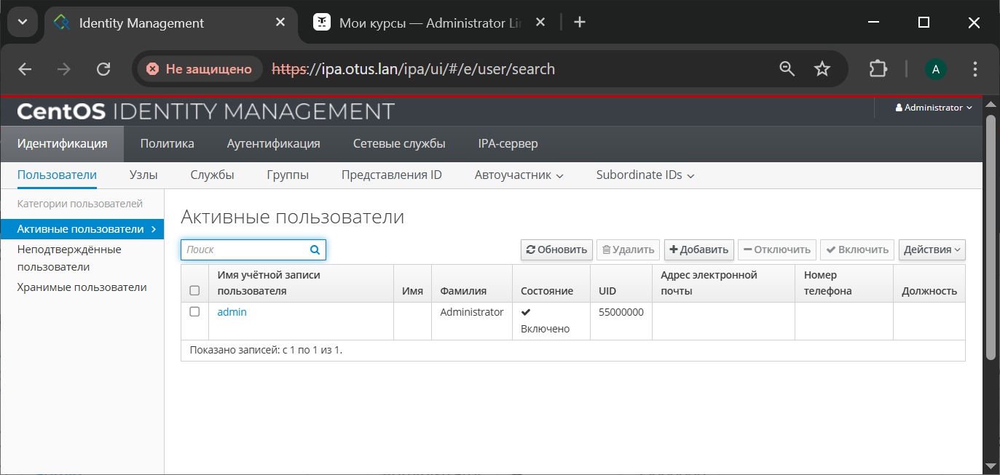

# LDAP (Lightweight Directory Access Protocol)

## Задача:
- Установить FreeIPA
- Написать Ansible-playbook для конфигурации клиента

## Выполнение:
1. Развернем стенд, используя [Vagrantfile](Vagrantfile):
```
vagrant up
```
2. Установка FreeIPA сервера:
- Подключимся к нему по SSH с помощью команды:
```
vagrant ssh ipa.otus.lan
sudo -i
```
- Установим часовой пояс: 
```
timedatectl set-timezone Europe/Moscow
```
- Установим утилиту chrony:
```
yum install -y chrony nano
```
- Запустим chrony и добавим его в автозагрузку: 
```
systemctl enable chronyd --now
```
- Выключим Firewall: 
```
systemctl stop firewalld
```
- Отключаем автозапуск Firewalld: 
```
systemctl disable firewalld
```
- Остановим Selinux: 
```
setenforce 0
```
- Поменяем в файле /etc/selinux/config, параметр Selinux на disabled:
```
nano /etc/selinux/config
```
```
# https://access.redhat.com/documentation/en-us/red_hat_enterprise_linux/9/html/using_selinux/chan>#
# NOTE: Up to RHEL 8 release included, SELINUX=disabled would also
# fully disable SELinux during boot. If you need a system with SELinux
# fully disabled instead of SELinux running with no policy loaded, you
# need to pass selinux=0 to the kernel command line. You can use grubby
# to persistently set the bootloader to boot with selinux=0:
#
#    grubby --update-kernel ALL --args selinux=0
#
# To revert back to SELinux enabled:
#
#    grubby --update-kernel ALL --remove-args selinux
#
SELINUX=disabled
# SELINUXTYPE= can take one of these three values:
#     targeted - Targeted processes are protected,
#     minimum - Modification of targeted policy. Only selected processes are protected.
#     mls - Multi Level Security protection.
SELINUXTYPE=targeted
```
- Для дальнейшей настройки FreeIPA нам потребуется, чтобы DNS-сервер хранил запись о нашем LDAP-сервере. В рамках данной лабораторной работы мы не будем настраивать отдельный DNS-сервер и просто добавим запись в файл /etc/hosts:
```
nano /etc/hosts
```
```
127.0.0.1   localhost localhost.localdomain 
127.0.1.1 ipa.otus.lan ipa
192.168.57.10 ipa.otus.lan ipa
```
- Устанавливаем FreeIPA сервер и клиент:
```
yum install -y freeipa-server freeipa-client
```
- Запустим скрипт установки: 
```
ipa-server-install
```
<details>
  <summary>Результат установки</summary>

```
[root@ipa ~]# ipa-server-install

The log file for this installation can be found in /var/log/ipaserver-install.log
==============================================================================
This program will set up the IPA Server.
Version 4.12.2

This includes:
  * Configure a stand-alone CA (dogtag) for certificate management
  * Configure the NTP client (chronyd)
  * Create and configure an instance of Directory Server
  * Create and configure a Kerberos Key Distribution Center (KDC)
  * Configure Apache (httpd)
  * Configure SID generation
  * Configure the KDC to enable PKINIT

To accept the default shown in brackets, press the Enter key.

Do you want to configure integrated DNS (BIND)? [no]: no

Enter the fully qualified domain name of the computer
on which you're setting up server software. Using the form
<hostname>.<domainname>
Example: master.example.com


Server host name [ipa.otus.lan]:

The domain name has been determined based on the host name.

Please confirm the domain name [otus.lan]:

The kerberos protocol requires a Realm name to be defined.
This is typically the domain name converted to uppercase.

Please provide a realm name [OTUS.LAN]:
Certain directory server operations require an administrative user.
This user is referred to as the Directory Manager and has full access
to the Directory for system management tasks and will be added to the
instance of directory server created for IPA.
The password must be at least 8 characters long.

Directory Manager password:
Password (confirm):

The IPA server requires an administrative user, named 'admin'.
This user is a regular system account used for IPA server administration.

IPA admin password:
Password (confirm):

Invalid IP address 127.0.1.1 for ipa.otus.lan: cannot use loopback IP address 127.0.1.1
Trust is configured but no NetBIOS domain name found, setting it now.
Enter the NetBIOS name for the IPA domain.
Only up to 15 uppercase ASCII letters, digits and dashes are allowed.
Example: EXAMPLE.


NetBIOS domain name [OTUS]:

Do you want to configure chrony with NTP server or pool address? [no]: no

The IPA Master Server will be configured with:
Hostname:       ipa.otus.lan
IP address(es): 192.168.57.10
Domain name:    otus.lan
Realm name:     OTUS.LAN

The CA will be configured with:
Subject DN:   CN=Certificate Authority,O=OTUS.LAN
Subject base: O=OTUS.LAN
Chaining:     self-signed

Continue to configure the system with these values? [no]: yes

The following operations may take some minutes to complete.
Please wait until the prompt is returned.

Disabled p11-kit-proxy
Synchronizing time
No SRV records of NTP servers found and no NTP server or pool address was provided.
Using default chrony configuration.
Attempting to sync time with chronyc.
Time synchronization was successful.
Configuring directory server (dirsrv). Estimated time: 30 seconds
  [1/43]: creating directory server instance
Validate installation settings ...
Create file system structures ...
Perform SELinux labeling ...
Create database backend: dc=otus,dc=lan ...
Perform post-installation tasks ...
  [2/43]: tune ldbm plugin
  [3/43]: adding default schema
  [4/43]: enabling memberof plugin
  [5/43]: enabling winsync plugin
  [6/43]: configure password logging
  [7/43]: configuring replication version plugin
  [8/43]: enabling IPA enrollment plugin
  [9/43]: configuring uniqueness plugin
  [10/43]: configuring uuid plugin
  [11/43]: configuring modrdn plugin
  [12/43]: configuring DNS plugin
  [13/43]: enabling entryUSN plugin
  [14/43]: configuring lockout plugin
  [15/43]: configuring graceperiod plugin
  [16/43]: configuring topology plugin
  [17/43]: creating indices
  [18/43]: enabling referential integrity plugin
  [19/43]: configuring certmap.conf
  [20/43]: configure new location for managed entries
  [21/43]: configure dirsrv ccache and keytab
  [22/43]: enabling SASL mapping fallback
  [23/43]: restarting directory server
  [24/43]: adding sasl mappings to the directory
  [25/43]: adding default layout
  [26/43]: adding delegation layout
  [27/43]: creating container for managed entries
  [28/43]: configuring user private groups
  [29/43]: configuring netgroups from hostgroups
  [30/43]: creating default Sudo bind user
  [31/43]: creating default Auto Member layout
  [32/43]: adding range check plugin
  [33/43]: creating default HBAC rule allow_all
  [34/43]: adding entries for topology management
  [35/43]: initializing group membership
  [36/43]: adding master entry
  [37/43]: initializing domain level
  [38/43]: configuring Posix uid/gid generation
  [39/43]: adding replication acis
  [40/43]: activating sidgen plugin
  [41/43]: activating extdom plugin
  [42/43]: configuring directory to start on boot
  [43/43]: restarting directory server
Done configuring directory server (dirsrv).
Configuring Kerberos KDC (krb5kdc)
  [1/11]: adding kerberos container to the directory
  [2/11]: configuring KDC
  [3/11]: initialize kerberos container
  [4/11]: adding default ACIs
  [5/11]: creating a keytab for the directory
  [6/11]: creating a keytab for the machine
  [7/11]: adding the password extension to the directory
  [8/11]: creating anonymous principal
  [9/11]: starting the KDC
  [10/11]: configuring KDC to start on boot
  [11/11]: enable PAC ticket signature support
Done configuring Kerberos KDC (krb5kdc).
Configuring kadmin
  [1/2]: starting kadmin
  [2/2]: configuring kadmin to start on boot
Done configuring kadmin.
Configuring ipa-custodia
  [1/5]: Making sure custodia container exists
  [2/5]: Generating ipa-custodia config file
  [3/5]: Generating ipa-custodia keys
  [4/5]: starting ipa-custodia 
  [5/5]: configuring ipa-custodia to start on boot
Done configuring ipa-custodia.
Configuring certificate server (pki-tomcatd). Estimated time: 3 minutes
  [1/32]: configuring certificate server instance
  [2/32]: stopping certificate server instance to update CS.cfg
  [3/32]: backing up CS.cfg
  [4/32]: Add ipa-pki-wait-running
Set start up timeout of pki-tomcatd service to 90 seconds
  [5/32]: secure AJP connector
  [6/32]: reindex attributes
  [7/32]: exporting Dogtag certificate store pin
  [8/32]: disabling nonces
  [9/32]: set up CRL publishing
  [10/32]: enable PKIX certificate path discovery and validation
  [11/32]: authorizing RA to modify profiles
  [12/32]: authorizing RA to manage lightweight CAs
  [13/32]: Ensure lightweight CAs container exists
  [14/32]: Enable lightweight CA monitor
  [15/32]: Ensuring backward compatibility
  [16/32]: updating IPA configuration
  [17/32]: starting certificate server instance
  [18/32]: configure certmonger for renewals
  [19/32]: requesting RA certificate from CA
  [20/32]: publishing the CA certificate
  [21/32]: adding RA agent as a trusted user
  [22/32]: configure certificate renewals
  [23/32]: Configure HTTP to proxy connections
  [24/32]: enabling CA instance
  [25/32]: importing IPA certificate profiles
  [26/32]: migrating certificate profiles to LDAP
  [27/32]: adding default CA ACL
  [28/32]: adding 'ipa' CA entry
  [29/32]: Recording random serial number state
  [30/32]: Recording HSM configuration state
  [31/32]: configuring certmonger renewal for lightweight CAs
  [32/32]: deploying ACME service
Done configuring certificate server (pki-tomcatd).
Configuring directory server (dirsrv)
  [1/3]: configuring TLS for DS instance
  [2/3]: adding CA certificate entry
  [3/3]: restarting directory server
Done configuring directory server (dirsrv).
Configuring ipa-otpd
  [1/2]: starting ipa-otpd
  [2/2]: configuring ipa-otpd to start on boot
Done configuring ipa-otpd.
Configuring the web interface (httpd)
  [1/22]: stopping httpd
  [2/22]: backing up ssl.conf
  [3/22]: disabling nss.conf
  [4/22]: configuring mod_ssl certificate paths
  [5/22]: setting mod_ssl protocol list
  [6/22]: configuring mod_ssl log directory
  [7/22]: disabling mod_ssl OCSP
  [8/22]: adding URL rewriting rules
  [9/22]: configuring httpd
Nothing to do for configure_httpd_wsgi_conf
  [10/22]: setting up httpd keytab
  [11/22]: configuring Gssproxy
  [12/22]: setting up ssl
  [13/22]: configure certmonger for renewals
  [14/22]: publish CA cert
  [15/22]: clean up any existing httpd ccaches
  [16/22]: enable ccache sweep
  [17/22]: configuring SELinux for httpd
  [18/22]: create KDC proxy config
  [19/22]: enable KDC proxy
  [20/22]: starting httpd
  [21/22]: configuring httpd to start on boot
  [22/22]: enabling oddjobd
Done configuring the web interface (httpd).
Configuring Kerberos KDC (krb5kdc)
  [1/1]: installing X509 Certificate for PKINIT
Done configuring Kerberos KDC (krb5kdc).
Applying LDAP updates
Upgrading IPA:. Estimated time: 1 minute 30 seconds
  [1/10]: stopping directory server
  [2/10]: saving configuration
  [3/10]: disabling listeners
  [4/10]: enabling DS global lock
  [5/10]: disabling Schema Compat
  [6/10]: starting directory server
  [7/10]: upgrading server
  [8/10]: stopping directory server
  [9/10]: restoring configuration
  [10/10]: starting directory server
Done.
Restarting the KDC
Configuring SID generation
  [1/8]: adding RID bases
  [2/8]: creating samba domain object
  [3/8]: adding admin(group) SIDs
  [4/8]: updating Kerberos config
'dns_lookup_kdc' already set to 'true', nothing to do.
  [5/8]: activating sidgen task
  [6/8]: restarting Directory Server to take MS PAC and LDAP plugins changes into account
  [7/8]: adding fallback group
  [8/8]: adding SIDs to existing users and groups
This step may take considerable amount of time, please wait..
Done.
Configuring client side components
This program will set up IPA client.
Version 4.12.2

Using existing certificate '/etc/ipa/ca.crt'.
Client hostname: ipa.otus.lan
Realm: OTUS.LAN
DNS Domain: otus.lan
IPA Server: ipa.otus.lan
BaseDN: dc=otus,dc=lan

Configured /etc/sssd/sssd.conf
Systemwide CA database updated.
Adding SSH public key from /etc/ssh/ssh_host_rsa_key.pub
Adding SSH public key from /etc/ssh/ssh_host_ecdsa_key.pub
Adding SSH public key from /etc/ssh/ssh_host_ed25519_key.pub
Could not update DNS SSHFP records.
SSSD enabled
Configured /etc/openldap/ldap.conf
Configured /etc/ssh/ssh_config
Configured /etc/ssh/sshd_config.d/04-ipa.conf
Configuring otus.lan as NIS domain.
Client configuration complete.
The ipa-client-install command was successful

Invalid IP address fe80::a00:27ff:fef4:4375 for ipa.otus.lan.: cannot use link-local IP address fe80::a00:27ff:fef4:4375
Invalid IP address fe80::5054:ff:feca:7d37 for ipa.otus.lan.: cannot use link-local IP address fe80::5054:ff:feca:7d37
Invalid IP address fe80::a00:27ff:fef4:4375 for ipa.otus.lan.: cannot use link-local IP address fe80::a00:27ff:fef4:4375
Invalid IP address fe80::5054:ff:feca:7d37 for ipa.otus.lan.: cannot use link-local IP address fe80::5054:ff:feca:7d37
Please add records in this file to your DNS system: /tmp/ipa.system.records.pecr4mnz.db
==============================================================================
Setup complete

Next steps:
        1. You must make sure these network ports are open:
                TCP Ports:
                  * 80, 443: HTTP/HTTPS
                  * 389, 636: LDAP/LDAPS
                  * 88, 464: kerberos
                  * 53: bind
                UDP Ports:
                  * 88, 464: kerberos
                  * 53: bind
                  * 123: ntp

        2. You can now obtain a kerberos ticket using the command: 'kinit admin'
           This ticket will allow you to use the IPA tools (e.g., ipa user-add)
           and the web user interface.

Be sure to back up the CA certificates stored in /root/cacert.p12
These files are required to create replicas. The password for these
files is the Directory Manager password
The ipa-server-install command was successful
```
</details>

- После успешной установки FreeIPA, проверим, что сервер Kerberos может выдать нам билет:
```
[root@ipa ~]# kinit admin
Password for admin@OTUS.LAN: 
[root@ipa ~]# klist
Ticket cache: KCM:0
Default principal: admin@OTUS.LAN

Valid starting       Expires              Service principal
06/15/2025 14:33:10  06/16/2025 13:55:20  krbtgt/OTUS.LAN@OTUS.LAN
```
- Для удаление полученного билета воспользуемся командой: 
```
kdestroy
```
- Мы можем зайти в Web-интерфейс нашего FreeIPA-сервера, для этого на нашей хостой машине нужно прописать следующую строку в файле Hosts:
```
192.168.57.10 ipa.otus.lan
```
Откроется окно управления FreeIPA-сервером:
  
  
  
В имени пользователя укажем admin, в пароле укажем наш IPA admin password и нажмём войти:  
  
  

3. Ansible playbook для конфигурации клиента:
```
ansible-playbook -i inventory/hosts playbooks/main.yml
```
<details>
  <summary>Результат</summary>

```
[vagrant@ipa ansible_project]$ ansible-playbook -i inventory/hosts playbooks/main.yml

PLAY [Base set up] ********************************************************************************************************************************************
TASK [Gathering Facts] ****************************************************************************************************************************************ok: [client2.otus.lan]
ok: [client1.otus.lan]

TASK [install softs on CentOS] ********************************************************************************************************************************ok: [client2.otus.lan]
ok: [client1.otus.lan]

TASK [disable firewalld] **************************************************************************************************************************************ok: [client2.otus.lan]
ok: [client1.otus.lan]

TASK [disable SElinux] ****************************************************************************************************************************************[WARNING]: SELinux state change will take effect next reboot
ok: [client1.otus.lan]
ok: [client2.otus.lan]

TASK [disable SElinux now] ************************************************************************************************************************************changed: [client1.otus.lan]
changed: [client2.otus.lan]

TASK [Set up timezone] ****************************************************************************************************************************************ok: [client1.otus.lan]
TASK [Set up timezone] ****************************************************************************************************************************************ok: [client1.otus.lan]
ok: [client1.otus.lan]
ok: [client2.otus.lan]

TASK [enable chrony] ******************************************************************************************************************************************TASK [enable chrony] ******************************************************************************************************************************************changed: [client2.otus.lan]
changed: [client1.otus.lan]

TASK [change /etc/hosts] **************************************************************************************************************************************changed: [client1.otus.lan]
changed: [client2.otus.lan]

TASK [install module ipa-client] ******************************************************************************************************************************changed: [client1.otus.lan]
changed: [client2.otus.lan]

TASK [add host to ipa-server] *********************************************************************************************************************************changed: [client2.otus.lan]
changed: [client1.otus.lan]

PLAY RECAP ****************************************************************************************************************************************************client1.otus.lan           : ok=10   changed=5    unreachable=0    failed=0    skipped=0    rescued=0    ignored=0
client2.otus.lan           : ok=10   changed=5    unreachable=0    failed=0    skipped=0    rescued=0    ignored=0
```
</details>


4. Проверка:  
После подключения хостов к FreeIPA-сервер нужно проверить, что мы можем получить билет от Kerberos сервера: kinit admin  
Если подключение выполнено правильно, то мы сможем получить билет, после ввода пароля.  

Давайте проверим работу LDAP, для этого на сервере FreeIPA создадим пользователя и попробуем залогиниться к клиенту:
- Авторизируемся на сервере: 
```
kinit admin
```
- Создадим пользователя otus-user:
```
ipa user-add otus-user --first=Otus --last=User --password
```
```
[root@ipa ~]# kinit admin
Password for admin@OTUS.LAN:
[root@ipa ~]# ipa user-add otus-user --first=Otus --last=User --password
Password:
Enter Password again to verify:
----------------------
Added user "otus-user"
----------------------
  User login: otus-user
  First name: Otus
  Last name: User
  Full name: Otus User
  Display name: Otus User
  Initials: OU
  Home directory: /home/otus-user
  GECOS: Otus User
  Login shell: /bin/sh
  Principal name: otus-user@OTUS.LAN
  Principal alias: otus-user@OTUS.LAN
  User password expiration: 20250615140426Z
  Email address: otus-user@otus.lan
  UID: 55000003
  GID: 55000003
  Password: True
  Member of groups: ipausers
  Kerberos keys available: True
  ```
- На хосте client1 выполним команду:
```
kinit otus-user
```
```
[root@client1 ~]# kinit otus-user
Password for otus-user@OTUS.LAN: 
Password expired.  You must change it now.
Enter new password: 
Enter it again:
```
Система запросит у нас пароль и попросит ввести новый пароль. 
На этом процесс добавления хостов к FreeIPA-серверу завершен.  
  

