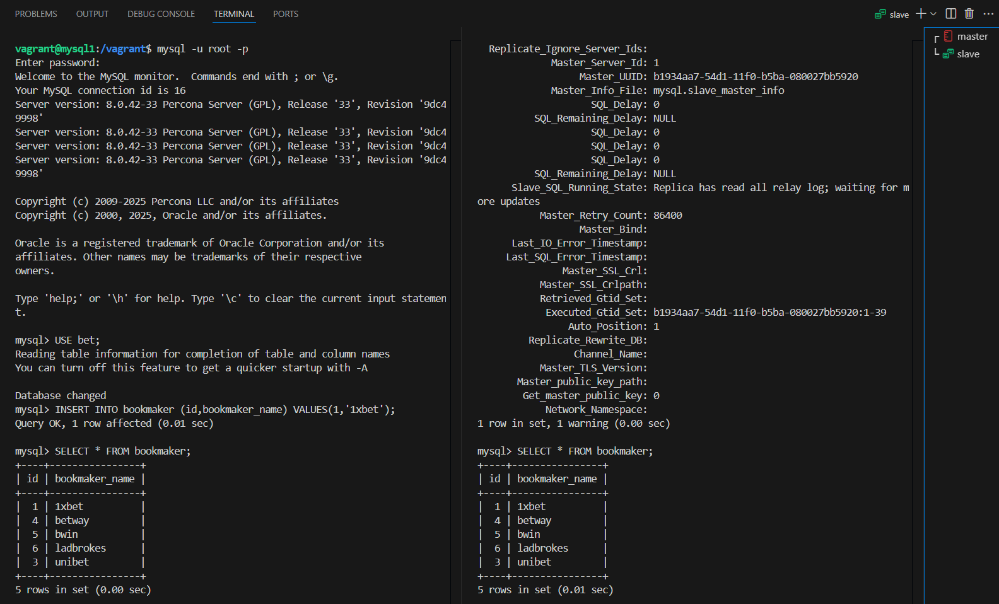

# MySQL

## Задача:
- На мастере развернуть дамп базы bet.dmp  и настроить репликацию так, чтобы реплицировались таблицы:
bookmaker, competition, market, odds, outcome


## Выполнение:
1. Отключаем range control:
```
sudo nano /etc/vbox/networks.conf
```
```
#disabling range control:
* 0.0.0.0/0 ::/0
```
2. Развернем стенд, используя [Vagrantfile](Vagrantfile):
```
vagrant up
```
<details>
  <summary>Результат выполнения команды</summary>

```
user@user-P43E:~/Документы/vagrant-mysql-repl$ vagrant up
Bringing machine 'mysql1' up with 'virtualbox' provider...
Bringing machine 'mysql2' up with 'virtualbox' provider...
==> mysql1: Checking if box 'bento/ubuntu-22.04' version '202502.21.0' is up to date...
==> mysql1: Clearing any previously set network interfaces...
==> mysql1: Preparing network interfaces based on configuration...
    mysql1: Adapter 1: nat
    mysql1: Adapter 2: hostonly
==> mysql1: Forwarding ports...
    mysql1: 22 (guest) => 2222 (host) (adapter 1)
==> mysql1: Running 'pre-boot' VM customizations...
==> mysql1: Booting VM...
==> mysql1: Waiting for machine to boot. This may take a few minutes...
    mysql1: SSH address: 127.0.0.1:2222
    mysql1: SSH username: vagrant
    mysql1: SSH auth method: private key
    mysql1: Warning: Connection reset. Retrying...
    mysql1:
    mysql1: Vagrant insecure key detected. Vagrant will automatically replace
    mysql1: this with a newly generated keypair for better security.
    mysql1:
    mysql1: Inserting generated public key within guest...
    mysql1: Removing insecure key from the guest if it's present...
    mysql1: Key inserted! Disconnecting and reconnecting using new SSH key...
==> mysql1: Machine booted and ready!
==> mysql1: Checking for guest additions in VM...
    mysql1: The guest additions on this VM do not match the installed version of
    mysql1: VirtualBox! In most cases this is fine, but in rare cases it can
    mysql1: prevent things such as shared folders from working properly. If you see
    mysql1: shared folder errors, please make sure the guest additions within the
    mysql1: virtual machine match the version of VirtualBox you have installed on
    mysql1: your host and reload your VM.
    mysql1:
    mysql1: Guest Additions Version: 7.1.6
    mysql1: VirtualBox Version: 7.0
==> mysql1: Setting hostname...
==> mysql1: Configuring and enabling network interfaces...
==> mysql1: Mounting shared folders...
    mysql1: /home/user/Документы/vagrant-mysql-repl => /vagrant
==> mysql2: Importing base box 'bento/ubuntu-22.04'...
==> mysql2: Matching MAC address for NAT networking...
==> mysql2: Checking if box 'bento/ubuntu-22.04' version '202502.21.0' is up to date...
==> mysql2: Setting the name of the VM: mysql2
==> mysql2: Fixed port collision for 22 => 2222. Now on port 2200.
==> mysql2: Clearing any previously set network interfaces...
==> mysql2: Preparing network interfaces based on configuration...
    mysql2: Adapter 1: nat
    mysql2: Adapter 2: hostonly
==> mysql2: Forwarding ports...
    mysql2: 22 (guest) => 2200 (host) (adapter 1)
==> mysql2: Running 'pre-boot' VM customizations...
    mysql1: /home/user/Документы/vagrant-mysql-repl => /vagrant
==> mysql2: Importing base box 'bento/ubuntu-22.04'...
==> mysql2: Matching MAC address for NAT networking...
==> mysql2: Checking if box 'bento/ubuntu-22.04' version '202502.21.0' is up to date...
==> mysql2: Setting the name of the VM: mysql2
==> mysql2: Fixed port collision for 22 => 2222. Now on port 2200.
==> mysql2: Clearing any previously set network interfaces...
==> mysql2: Preparing network interfaces based on configuration...
    mysql2: Adapter 1: nat
    mysql2: Adapter 2: hostonly
==> mysql2: Forwarding ports...
    mysql2: 22 (guest) => 2200 (host) (adapter 1)
==> mysql2: Running 'pre-boot' VM customizations...
==> mysql2: Importing base box 'bento/ubuntu-22.04'...
==> mysql2: Matching MAC address for NAT networking...
==> mysql2: Checking if box 'bento/ubuntu-22.04' version '202502.21.0' is up to date...
==> mysql2: Setting the name of the VM: mysql2
==> mysql2: Fixed port collision for 22 => 2222. Now on port 2200.
==> mysql2: Clearing any previously set network interfaces...
==> mysql2: Preparing network interfaces based on configuration...
    mysql2: Adapter 1: nat
    mysql2: Adapter 2: hostonly
==> mysql2: Forwarding ports...
    mysql2: 22 (guest) => 2200 (host) (adapter 1)
==> mysql2: Running 'pre-boot' VM customizations...
==> mysql2: Matching MAC address for NAT networking...
==> mysql2: Checking if box 'bento/ubuntu-22.04' version '202502.21.0' is up to date...
==> mysql2: Setting the name of the VM: mysql2
==> mysql2: Fixed port collision for 22 => 2222. Now on port 2200.
==> mysql2: Clearing any previously set network interfaces...
==> mysql2: Preparing network interfaces based on configuration...
    mysql2: Adapter 1: nat
    mysql2: Adapter 2: hostonly
==> mysql2: Forwarding ports...
    mysql2: 22 (guest) => 2200 (host) (adapter 1)
==> mysql2: Running 'pre-boot' VM customizations...
==> mysql2: Checking if box 'bento/ubuntu-22.04' version '202502.21.0' is up to date...
==> mysql2: Setting the name of the VM: mysql2
==> mysql2: Fixed port collision for 22 => 2222. Now on port 2200.
==> mysql2: Clearing any previously set network interfaces...
==> mysql2: Preparing network interfaces based on configuration...
    mysql2: Adapter 1: nat
    mysql2: Adapter 2: hostonly
==> mysql2: Forwarding ports...
    mysql2: 22 (guest) => 2200 (host) (adapter 1)
==> mysql2: Running 'pre-boot' VM customizations...
==> mysql2: Setting the name of the VM: mysql2
==> mysql2: Fixed port collision for 22 => 2222. Now on port 2200.
==> mysql2: Clearing any previously set network interfaces...
==> mysql2: Preparing network interfaces based on configuration...
    mysql2: Adapter 1: nat
    mysql2: Adapter 2: hostonly
==> mysql2: Forwarding ports...
    mysql2: 22 (guest) => 2200 (host) (adapter 1)
==> mysql2: Running 'pre-boot' VM customizations...
==> mysql2: Clearing any previously set network interfaces...
==> mysql2: Preparing network interfaces based on configuration...
    mysql2: Adapter 1: nat
    mysql2: Adapter 2: hostonly
==> mysql2: Forwarding ports...
    mysql2: 22 (guest) => 2200 (host) (adapter 1)
==> mysql2: Running 'pre-boot' VM customizations...
==> mysql2: Preparing network interfaces based on configuration...
    mysql2: Adapter 1: nat
    mysql2: Adapter 2: hostonly
==> mysql2: Forwarding ports...
    mysql2: 22 (guest) => 2200 (host) (adapter 1)
==> mysql2: Running 'pre-boot' VM customizations...
    mysql2: Adapter 1: nat
    mysql2: Adapter 2: hostonly
==> mysql2: Forwarding ports...
    mysql2: 22 (guest) => 2200 (host) (adapter 1)
==> mysql2: Running 'pre-boot' VM customizations...
    mysql2: Adapter 2: hostonly
==> mysql2: Forwarding ports...
    mysql2: 22 (guest) => 2200 (host) (adapter 1)
==> mysql2: Running 'pre-boot' VM customizations...
==> mysql2: Booting VM...
==> mysql2: Waiting for machine to boot. This may take a few minutes...
    mysql2: 22 (guest) => 2200 (host) (adapter 1)
==> mysql2: Running 'pre-boot' VM customizations...
==> mysql2: Booting VM...
==> mysql2: Waiting for machine to boot. This may take a few minutes...
    mysql2: SSH address: 127.0.0.1:2200
==> mysql2: Booting VM...
==> mysql2: Waiting for machine to boot. This may take a few minutes...
    mysql2: SSH address: 127.0.0.1:2200
    mysql2: SSH address: 127.0.0.1:2200
    mysql2: SSH username: vagrant
    mysql2: SSH username: vagrant
    mysql2: SSH auth method: private key
    mysql2: Warning: Connection reset. Retrying...
    mysql2: Warning: Remote connection disconnect. Retrying...
    mysql2:
    mysql2: Vagrant insecure key detected. Vagrant will automatically replace
    mysql2: this with a newly generated keypair for better security.
    mysql2:
    mysql2: Inserting generated public key within guest...
    mysql2: Removing insecure key from the guest if it's present...
    mysql2: Key inserted! Disconnecting and reconnecting using new SSH key...
==> mysql2: Machine booted and ready!
==> mysql2: Checking for guest additions in VM...
    mysql2: The guest additions on this VM do not match the installed version of
    mysql2: VirtualBox! In most cases this is fine, but in rare cases it can
    mysql2: prevent things such as shared folders from working properly. If you see
    mysql2: shared folder errors, please make sure the guest additions within the
    mysql2: virtual machine match the version of VirtualBox you have installed on
    mysql2: your host and reload your VM.
    mysql2:
    mysql2: Guest Additions Version: 7.1.6
    mysql2: VirtualBox Version: 7.0
==> mysql2: Setting hostname...
==> mysql2: Configuring and enabling network interfaces...
==> mysql2: Mounting shared folders...
    mysql2: /home/user/Документы/vagrant-mysql-repl => /vagrant
```
</details>

3. Устанавливаем Percona Server for MySQL на mysql1 и mysql2:  

- Добавьте репозиторий Percona:
```
wget https://repo.percona.com/apt/percona-release_latest.$(lsb_release -sc)_all.deb
sudo dpkg -i percona-release_latest.$(lsb_release -sc)_all.deb
```
- Включите репозиторий PS-80:
```
sudo percona-release setup ps80
```
- Установите:
```
sudo apt update
sudo apt install -y percona-server-server
```
- Проверьте версию:
```
vagrant@mysql1:~$ mysql -V
mysql  Ver 8.0.42-33 for Linux on x86_64 (Percona Server (GPL), Release '33', Revision '9dc49998')
```

4. Настраиваем Percona Server for MySQL на mysql1:  

- Копируем конфиги из /vagrant/conf.d в /etc/mysql/conf.d/
```
sudo cp /vagrant/conf/conf.d/* /etc/mysql/conf.d/
```
- Перезапускаем службу MySQL:
```
sudo systemctl restart mysql
```
- Подключаемся к mysql:
```
mysql -u root -p
```
- Проверяем атрибут server-id:
```
mysql> SELECT @@server_id;
+-------------+
| @@server_id |
+-------------+
|           1 |
+-------------+
```
- Убеждаемся что GTID включен:
```
mysql> SHOW VARIABLES LIKE 'gtid_mode';
+---------------+-------+
| Variable_name | Value |
+---------------+-------+
| gtid_mode     | ON    |
+---------------+-------+
```
- Создадим тестовую базу bet и загрузим в нее дамп и проверим:

```
mysql> CREATE DATABASE bet;
Query OK, 1 row affected (0.03 sec)
```
```
mysql> exit
Bye
vagrant@mysql1:/vagrant$ mysql -uroot -p -D bet < /vagrant/bet-224190-d906e5.dmp
```
```
mysql> USE bet;
Reading table information for completion of table and column names
You can turn off this feature to get a quicker startup with -A

Database changed
mysql> SHOW TABLES;
+------------------+
| Tables_in_bet    |
+------------------+
| bookmaker        |
| competition      |
| events_on_demand |
| market           |
| odds             |
| outcome          |
| v_same_event     |
+------------------+
7 rows in set (0.01 sec)
```
- Создадим пользователя для репликации и назначим ему права:
```
mysql> CREATE USER 'repl'@'%' IDENTIFIED BY '!OtusLinux2025';
Query OK, 0 rows affected (0.03 sec)

mysql> SELECT user,host FROM mysql.user where user='repl';
+------+------+
| user | host |
+------+------+
| repl | %    |
+------+------+
1 row in set (0.00 sec)

mysql> GRANT REPLICATION SLAVE ON *.* TO 'repl'@'%' IDENTIFIED BY '!OtusLinux2025';
ERROR 1064 (42000): You have an error in your SQL syntax; check the manual that corresponds to your MySQL server version for the right syntax to use near 'IDENTIFIED BY '!OtusLinux2025'' at line 1    
mysql> GRANT REPLICATION SLAVE ON *.* TO 'repl'@'%';
Query OK, 0 rows affected (0.01 sec)

mysql> FLUSH PRIVILEGES;
Query OK, 0 rows affected (0.01 sec)
```
- Дампим базу для последующего залива на слэйв и игнорируем таблиц по заданию:
```
vagrant@mysql1:/vagrant$ mysqldump --all-databases --triggers --routines --source-data=2 \
--ignore-table=bet.events_on_demand --ignore-table=bet.v_same_event \
-uroot -p > master.sql
Enter password: 
Warning: A partial dump from a server that has GTIDs will by default include the GTIDs of all transactions, even those that changed suppressed parts of the database. If you don't want to restore GTIDs, pass --set-gtid-purged=OFF. To make a complete dump, pass --all-databases --triggers --routines --events.
```
5. Настраиваем Percona Server for MySQL на mysql2:
- Копируем конфиги из /vagrant/conf.d в /etc/mysql/conf.d/
```
sudo cp /vagrant/conf/conf.d/* /etc/mysql/conf.d/
```
- Правим в /etc/mysql/conf.d/01-base.cnf директиву server-id = 2
```
sudo nano /etc/mysql/conf.d/01-base.cnf
```
- Раскомментируем в /etc/mysql/conf.d/05-binlog.cnf строки:
```
#replicate-ignore-table=bet.events_on_demand
#replicate-ignore-table=bet.v_same_event
```
```
sudo nano /etc/mysql/conf.d/05-binlog.cnf
```
- Перезапускаем службу MySQL:
```
sudo systemctl restart mysql
```
- Подключаемся к mysql:
```
mysql -u root -p
```
- Проверяем атрибут server-id:
```
mysql> SELECT @@server_id;
+-------------+
| @@server_id |
+-------------+
|           2 |
+-------------+
```
- Заливаем дамп мастера и убеждаемся что база есть и она без лишних таблиц:
```
mysql> SOURCE /vagrant/master.sql
```

```
mysql> SHOW DATABASES LIKE 'bet';
+----------------+
| Database (bet) |
+----------------+
| bet            |
+----------------+
1 row in set (0.01 sec)

mysql> USE bet;
Database changed
mysql> SHOW TABLES;
+---------------+
| Tables_in_bet |
+---------------+
| bookmaker     |
| competition   |
| market        |
| odds          |
| outcome       |
+---------------+
5 rows in set (0.00 sec)
```
- Запускаем слейв:
```
mysql> CHANGE MASTER TO MASTER_HOST = "10.0.26.101", MASTER_PORT = 3306, MASTER_USER = "repl", MASTER_PASSWORD = "!OtusLinux2025", MASTER_AUTO_POSITION = 1;
Query OK, 0 rows affected, 8 warnings (0.09 sec)

mysql> START SLAVE;
Query OK, 0 rows affected, 1 warning (0.16 sec)

mysql> SHOW SLAVE STATUS\G
*************************** 1. row ***************************
               Slave_IO_State: Waiting for source to send event
                  Master_Host: 10.0.26.101
                  Master_User: repl
                  Master_Port: 3306
                Connect_Retry: 60
              Master_Log_File: mysql-bin.000003
          Read_Master_Log_Pos: 120311
               Relay_Log_File: mysql2-relay-bin.000002
                Relay_Log_Pos: 420
        Relay_Master_Log_File: mysql-bin.000003
             Slave_IO_Running: Yes
            Slave_SQL_Running: Yes
              Replicate_Do_DB:
          Replicate_Ignore_DB:
           Replicate_Do_Table:
       Replicate_Ignore_Table: bet.events_on_demand,bet.v_same_event
      Replicate_Wild_Do_Table:
  Replicate_Wild_Ignore_Table:
                   Last_Errno: 0
                   Last_Error:
                 Skip_Counter: 0
          Exec_Master_Log_Pos: 120311
              Relay_Log_Space: 631
              Until_Condition: None
               Until_Log_File:
                Until_Log_Pos: 0
           Master_SSL_Allowed: No
           Master_SSL_CA_File:
           Master_SSL_CA_Path:
              Master_SSL_Cert:
            Master_SSL_Cipher:
               Master_SSL_Key:
        Seconds_Behind_Master: 0
Master_SSL_Verify_Server_Cert: No
                Last_IO_Errno: 0
                Last_IO_Error:
               Last_SQL_Errno: 0
               Last_SQL_Error:
  Replicate_Ignore_Server_Ids:
             Master_Server_Id: 1
                  Master_UUID: b1934aa7-54d1-11f0-b5ba-080027bb5920
             Master_Info_File: mysql.slave_master_info
                    SQL_Delay: 0
          SQL_Remaining_Delay: NULL
      Slave_SQL_Running_State: Replica has read all relay log; waiting for more updates
           Master_Retry_Count: 86400
                  Master_Bind:
      Last_IO_Error_Timestamp:
     Last_SQL_Error_Timestamp:
               Master_SSL_Crl:
           Master_SSL_Crlpath:
           Retrieved_Gtid_Set:
            Executed_Gtid_Set: b1934aa7-54d1-11f0-b5ba-080027bb5920:1-39
                Auto_Position: 1
         Replicate_Rewrite_DB:
                 Channel_Name:
           Master_TLS_Version:
       Master_public_key_path:
        Get_master_public_key: 0
            Network_Namespace:
1 row in set, 1 warning (0.00 sec)
```
6. Проверим репликацию: 
- На мастере:
```
mysql> USE bet;
Reading table information for completion of table and column names
You can turn off this feature to get a quicker startup with -A

Database changed
mysql> INSERT INTO bookmaker (id,bookmaker_name) VALUES(1,'1xbet');
Query OK, 1 row affected (0.01 sec)

mysql> SELECT * FROM bookmaker;
+----+----------------+
| id | bookmaker_name |
+----+----------------+
|  1 | 1xbet          |
|  4 | betway         |
|  5 | bwin           |
|  6 | ladbrokes      |
|  3 | unibet         |
+----+----------------+
5 rows in set (0.00 sec)
```
- На слейве:
```
mysql> SELECT * FROM bookmaker;
+----+----------------+
| id | bookmaker_name |
+----+----------------+
|  1 | 1xbet          |
|  4 | betway         |
|  5 | bwin           |
|  6 | ladbrokes      |
|  3 | unibet         |
+----+----------------+
5 rows in set (0.01 sec)
```  

  

- В binlog-ах на cлейве также видно последнее изменение, туда же он пишет информацию о GTID:
```
sudo mysqlbinlog /var/lib/mysql/mysql-bin.000002 
```
```
# The proper term is pseudo_replica_mode, but we use this compatibility alias
# to make the statement usable on server versions 8.0.24 and older.
/*!50530 SET @@SESSION.PSEUDO_SLAVE_MODE=1*/;
/*!50003 SET @OLD_COMPLETION_TYPE=@@COMPLETION_TYPE,COMPLETION_TYPE=0*/;    
DELIMITER /*!*/;
# at 4
#250629 11:42:53 server id 2  end_log_pos 126 CRC32 0xe6cd4f3b  Start: binlog v 4, server v 8.0.42-33 created 250629 11:42:53 at startup
# Warning: this binlog is either in use or was not closed properly.
ROLLBACK/*!*/;
BINLOG '
vSZhaA8CAAAAegAAAH4AAAABAAQAOC4wLjQyLTMzAAAAAAAAAAAAAAAAAAAAAAAAAAAAAAAAAAAA
AAAAAAAAAAAAAAAAAAC9JmFoEwANAAgAAAAABAAEAAAAYgAEGggAAAAICAgCAAAACgoKKioAEjQA
CigAATtPzeY=
'/*!*/;
# at 126
#250629 11:42:53 server id 2  end_log_pos 157 CRC32 0x89a8e772  Previous-GTIDs
# [empty]
# at 157
#250629 11:56:49 server id 1  end_log_pos 243 CRC32 0x459ba640  GTID    last_committed=0    sequence_number=1       rbr_only=no     original_committed_timestamp=1751198209450585       immediate_commit_timestamp=1751198209481283transaction_length=323
# original_commit_timestamp=1751198209450585 (2025-06-29 11:56:49.450585 UTC)
# immediate_commit_timestamp=1751198209481283 (2025-06-29 11:56:49.481283 UTC)
/*!80001 SET @@session.original_commit_timestamp=1751198209450585*//*!*/;   
/*!80014 SET @@session.original_server_version=80042*//*!*/;
/*!80014 SET @@session.immediate_server_version=80042*//*!*/;
SET @@SESSION.GTID_NEXT= 'b1934aa7-54d1-11f0-b5ba-080027bb5920:40'/*!*/;  
# at 243
#250629 11:56:49 server id 1  end_log_pos 319 CRC32 0x091e02fc  Query   thread_id=16        exec_time=0     error_code=0
SET TIMESTAMP=1751198209/*!*/;
SET @@session.pseudo_thread_id=16/*!*/;
SET @@session.foreign_key_checks=1, @@session.sql_auto_is_null=0, @@session.unique_checks=1, @@session.autocommit=1/*!*/;
SET @@session.sql_mode=1168113696/*!*/;
SET @@session.auto_increment_increment=1, @@session.auto_increment_offset=1/*!*/;
/*!\C utf8mb4 *//*!*/;
SET @@session.character_set_client=255,@@session.collation_connection=255,@@session.collation_server=255/*!*/;
SET @@session.lc_time_names=0/*!*/;
SET @@session.collation_database=DEFAULT/*!*/;
/*!80011 SET @@session.default_collation_for_utf8mb4=255*//*!*/;
BEGIN
/*!*/;
# at 319
#250629 11:56:49 server id 1  end_log_pos 449 CRC32 0x399a1102  Query   thread_id=16        exec_time=0     error_code=0
use `bet`/*!*/;
SET TIMESTAMP=1751198209/*!*/;
INSERT INTO bookmaker (id,bookmaker_name) VALUES(1,'1xbet')
/*!*/;
# at 449
#250629 11:56:49 server id 1  end_log_pos 480 CRC32 0x73f09c6b  Xid = 432   
COMMIT/*!*/;
SET @@SESSION.GTID_NEXT= 'AUTOMATIC' /* added by mysqlbinlog */ /*!*/;      
DELIMITER ;
# End of log file
/*!50003 SET COMPLETION_TYPE=@OLD_COMPLETION_TYPE*/;
/*!50530 SET @@SESSION.PSEUDO_SLAVE_MODE=0*/;
```
