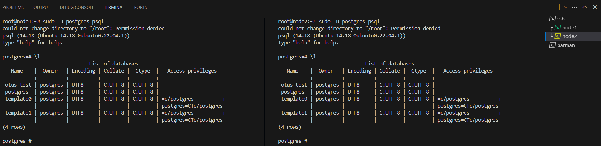
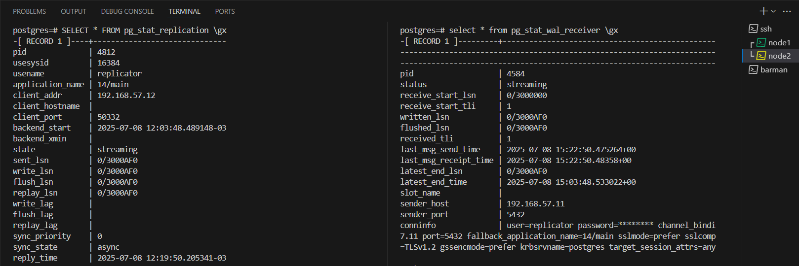
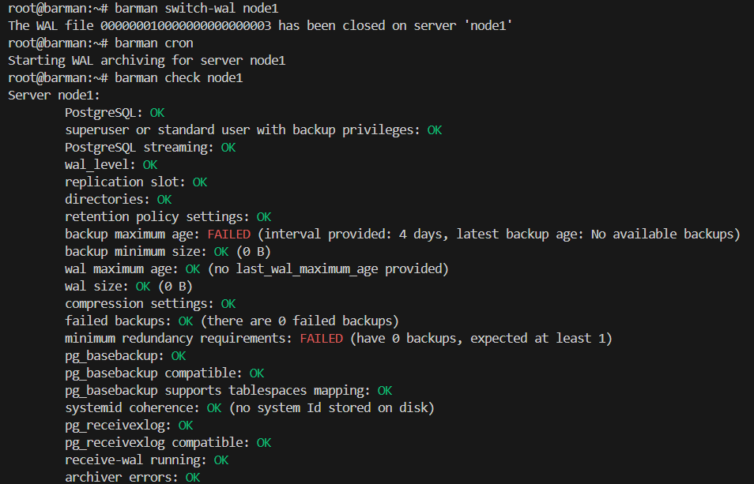

# PostgreSQL

## Задача:
Научиться настраивать репликацию и создавать резервные копии в СУБД PostgreSQL:
- настроить hot_standby репликацию с использованием слотов
- настроить правильное резервное копирование

## Выполнение:
Развернем стенд, используя [Vagrantfile](Vagrantfile)

1. Настройка hot_standby репликации с использованием слотов:  
- Установим postgres-server на хосты node1 и node2:
```
apt install postgresql postgresql-contrib
systemctl start postgresql
systemctl enable postgresql
```
1.1  На node1:  
- Заходим в psql:
```
sudo -u postgres psql
```
- В psql создаём пользователя replicator c правами репликации и паролем «Otus2022!»:
```
CREATE USER replicator WITH REPLICATION Encrypted PASSWORD 'Otus2022!';
```
- В файле /etc/postgresql/14/main/postgresql.conf указываем следующие параметры:
```
nano /etc/postgresql/14/main/postgresql.conf
```

```
data_directory = '/var/lib/postgresql/14/main'
#Указываем ip-адреса, на которых postgres будет слушать трафик на порту 5432 (параметр port)
listen_addresses = 'localhost, 192.168.57.11'
#Указываем порт порт postgres
port = 5432 
#Устанавливаем максимально 100 одновременных подключений
max_connections = 100
log_directory = 'log' 
log_filename = 'postgresql-%a.log' 
log_rotation_age = 1d 
log_rotation_size = 0 
log_truncate_on_rotation = on 
max_wal_size = 1GB
min_wal_size = 80MB
log_line_prefix = '%m [%p] ' 
#Указываем часовой пояс для Москвы
log_timezone = 'UTC+3'
timezone = 'UTC+3'
datestyle = 'iso, mdy'
lc_messages = 'en_US.UTF-8'
lc_monetary = 'en_US.UTF-8' 
lc_numeric = 'en_US.UTF-8' 
lc_time = 'en_US.UTF-8' 
default_text_search_config = 'pg_catalog.english'
#можно или нет подключаться к postgresql для выполнения запросов в процессе восстановления; 
hot_standby = on
#Включаем репликацию
wal_level = replica
#Количество планируемых слейвов
max_wal_senders = 3
#Максимальное количество слотов репликации
max_replication_slots = 3
#будет ли сервер slave сообщать мастеру о запросах, которые он выполняет.
hot_standby_feedback = on
#Включаем использование зашифрованных паролей
password_encryption = scram-sha-256
```
- Настраиваем параметры подключения в файле /etc/postgresql/14/main/pg_hba.conf:

```
nano /etc/postgresql/14/main/pg_hba.conf
```

```
# TYPE  DATABASE        USER            ADDRESS                 METHOD
# "local" is for Unix domain socket connections only
local   all                  all                                                peer
# IPv4 local connections:
host    all                  all             127.0.0.1/32              scram-sha-256
# IPv6 local connections:
host    all                  all             ::1/128                       scram-sha-256
# Allow replication connections from localhost, by a user with the
# replication privilege.
local   replication      all                                                peer
host    replication     all             127.0.0.1/32               scram-sha-256
host    replication     all             ::1/128                        scram-sha-256
host    replication replicator    192.168.57.11/32        scram-sha-256
host    replication replicator    192.168.57.12/32        scram-sha-256
```
- Перезапускаем postgresql-server: 
```
systemctl restart postgresql
```

1.2 На node2:
- Останавливаем postgresql-server: 
```
systemctl stop postgresql
```
- Очищаем дирикторию data:
```
sudo rm -rf /var/lib/postgresql/14/main
```
- С помощью утилиты pg_basebackup копируем данные с node1:
```
root@node2:~# pg_basebackup -h 192.168.57.11 -U replicator -D /var/lib/postgresql/14/main/ -R -P    
Password:
26275/26275 kB (100%), 1/1 tablespace
```
- Меняем права:
```
sudo chown -R postgres:postgres /var/lib/postgresql/14/main/
sudo chmod 700 /var/lib/postgresql/14/main/
```
- В файле  /etc/postgresql/14/main/postgresql.conf меняем параметр:  
`listen_addresses = 'localhost, 192.168.57.12'`  
- Запускаем службу postgresql-server: 
```
systemctl start postgresql
```
1.3 Проверка репликации: 
- На node1 в psql создадим базу otus_test и выведем список БД: 
```
postgres=# CREATE DATABASE otus_test;
CREATE DATABASE
postgres=# \l
                                  List of databases
   Name    |  Owner   | Encoding |   Collate   |    Ctype    |   Access privileges   
-----------+----------+----------+-------------+-------------+-----------------------
 otus_test | postgres | UTF8     | en_US.UTF-8 | en_US.UTF-8 | 
 postgres  | postgres | UTF8     | en_US.UTF-8 | en_US.UTF-8 | 
 template0 | postgres | UTF8     | en_US.UTF-8 | en_US.UTF-8 | =c/postgres  
 template1 | postgres | UTF8     | en_US.UTF-8 | en_US.UTF-8 | =c/postgres    
(4 rows)
```
- На node2 также в psql также проверим список БД (команда \l), в списке БД должна появится БД otus_test  


- Также можно проверить репликацию другим способом:  

Способ 1:  
-на мастере:  
```
SELECT * FROM pg_stat_replication \gx
```
-на реплике:  
```
select * from pg_stat_wal_receiver \gx
```


Способ 2:  
-на мастере: `SELECT * FROM pg_current_wal_lsn();` --Возвращает текущую позицию записи в WAL (Write-Ahead Log) на мастер-сервере

```
postgres=# SELECT * FROM pg_current_wal_lsn();
 pg_current_wal_lsn 
--------------------
 0/3000AF0
(1 row)
```

-на реплике:  

`select pg_last_wal_receive_lsn();` --Возвращает последнюю позицию WAL, полученную репликой (даже если она ещё не применена)
```
postgres=# select pg_last_wal_receive_lsn();
 pg_last_wal_receive_lsn 
-------------------------
 0/3000AF0
(1 row)
```
`select pg_last_wal_replay_lsn();` --Возвращает последнюю позицию WAL, применённую репликой (т.е. воспроизведённую в БД).

```
postgres=# select pg_last_wal_replay_lsn();
 pg_last_wal_replay_lsn 
------------------------
 0/3000AF0
(1 row)
```

2. Настройка резервного копирования:  

На node1 и node2 установить утилиту barman-cli: 
```
apt update
apt install barman-cli
```

На barman:  

- Устанавливаем пакеты barman и postgresql-client: 
```
apt update
apt install barman-cli barman postgresql
```

- Переходим в пользователя barman и генерируем ssh-ключ: 
```
su barman
cd 
ssh-keygen -t rsa -b 4096
```

На node1: 
- Переходим в пользователя postgres и генерируем ssh-ключ: 
```
su postgres
cd 
ssh-keygen -t rsa -b 4096
```

- Выводим содержимое файла ~/.ssh/id_rsa.pub и копируем содержимое файла на сервер barman в файл /var/lib/barman/.ssh/authorized_keys: 
```
cat ~/.ssh/id_rsa.pub 
```
- В psql создаём пользователя barman c правами суперпользователя: 
```
postgres=# CREATE USER barman WITH SUPERUSER REPLICATION Encrypted PASSWORD 'Otus2022!';
CREATE ROLE
```

- В файл /etc/postgresql/14/main/pg_hba.conf добавляем разрешения для пользователя barman: 
```
# TYPE  DATABASE        USER            ADDRESS                 METHOD
# "local" is for Unix domain socket connections only
local   all             all                                     peer
# IPv4 local connections:
host    all             all             127.0.0.1/32            scram-sha-256
# IPv6 local connections:
host    all             all             ::1/128                 scram-sha-256
# Allow replication connections from localhost, by a user with the
# replication privilege.
local   replication     all                                     peer
host    replication     all             127.0.0.1/32                 scram-sha-256
host    replication     all             ::1/128                            scram-sha-256
host    replication replication   192.168.57.11/32        scram-sha-256
host    replication replication   192.168.57.12/32        scram-sha-256
host    all                 barman       192.168.57.13/32        scram-sha-256
host    replication   barman       192.168.57.13/32      scram-sha-256
```
- Перезапускаем службу postgresql-14: 
```
systemctl restart postgresql
```
- В psql создадим тестовую базу otus: 
```
postgres=# CREATE DATABASE otus;
CREATE DATABASE
```
- В базе создаём таблицу test в базе otus: 
```
postgres=# \c otus;
You are now connected to database "otus" as user "postgres".
otus=#
```
```
otus=# CREATE TABLE test (id int, name varchar(30));
CREATE TABLE

otus=# INSERT INTO test VALUES (1, 'alex');
INSERT 0 1
```

На barman: 
После генерации ключа, выводим содержимое файла ~/.ssh/id_rsa.pub: 
```
cat ~/.ssh/id_rsa.pub 
```
Копируем содержимое файла на сервер postgres в файл /var/lib/postgresql/.ssh/authorized_keys

- Находясь в пользователе barman создаём файл ~/.pgpass со следующим содержимым: 

`192.168.57.11:5432:*:barman:Otus2022!`

```
nano ~/.pgpass
chmod 600 ~/.pgpass
```

После создания postgres-пользователя barman необходимо проверить, что права для пользователя настроены корректно: 

- Проверяем возможность подключения к postgres-серверу: 
```
barman@barman:~$ psql -h 192.168.57.11 -U barman -d postgres
psql (14.18 (Ubuntu 14.18-0ubuntu0.22.04.1))
Type "help" for help.
```

- Проверяем репликацию:
```
barman@barman:~$ psql -h 192.168.57.11 -U barman -c "IDENTIFY_SYSTEM" replication=1
      systemid       | timeline |  xlogpos  | dbname 
---------------------+----------+-----------+--------
 7524707755762245640 |        1 | 0/301A1D0 |
(1 row)
```

- Создаём файл /etc/barman.conf со следующим содержимым 
```
nano /etc/barman.conf
```
```
[barman]
#Указываем каталог, в котором будут храниться бекапы
barman_home = /var/lib/barman
#Указываем каталог, в котором будут храниться файлы конфигурации бекапов
configuration_files_directory = /etc/barman.d
#пользователь, от которого будет запускаться barman
barman_user = barman
#расположение файла с логами
log_file = /var/log/barman/barman.log
#Используемый тип сжатия
compression = gzip
#Используемый метод бекапа
backup_method = rsync
archiver = on
retention_policy = REDUNDANCY 3
immediate_checkpoint = true
#Глубина архива
last_backup_maximum_age = 4 DAYS
minimum_redundancy = 1
```

- Создаём файл /etc/barman.d/node1.conf со следующим содержимым:
```
nano /etc/barman.d/node1.conf
```
```
[node1]
#Описание задания
description = "backup node1"
#Команда подключения к хосту node1
ssh_command = ssh postgres@192.168.57.11 
#Команда для подключения к postgres-серверу
conninfo = host=192.168.57.11 user=barman port=5432 dbname=postgres
retention_policy_mode = auto
retention_policy = RECOVERY WINDOW OF 7 days
wal_retention_policy = main
streaming_archiver=on
#Указание префикса, который будет использоваться как $PATH на хосте node1
path_prefix = /usr/pgsql-14/bin/
#настройки слота
create_slot = auto
slot_name = node1
#Команда для потоковой передачи от postgres-сервера
streaming_conninfo = host=192.168.57.11 user=barman 
#Тип выполняемого бекапа
backup_method = postgres
archiver = off
```
На этом настройка бекапа завершена. Теперь проверим работу barman: 
```
root@barman:~# barman switch-wal node1
The WAL file 000000010000000000000003 has been closed on server 'node1'
root@barman:~# barman cron
Starting WAL archiving for server node1
root@barman:~# barman check node1
Server node1:
        PostgreSQL: OK
        superuser or standard user with backup privileges: OK
        PostgreSQL streaming: OK
        wal_level: OK
        replication slot: OK
        directories: OK
        retention policy settings: OK
        backup maximum age: FAILED (interval provided: 4 days, latest backup age: No available backups)        
        backup minimum size: OK (0 B)
        wal maximum age: OK (no last_wal_maximum_age provided)
        wal size: OK (0 B)
        compression settings: OK
        failed backups: OK (there are 0 failed backups)
        minimum redundancy requirements: FAILED (have 0 backups, expected at least 1)
        pg_basebackup: OK
        pg_basebackup compatible: OK
        pg_basebackup supports tablespaces mapping: OK
        systemid coherence: OK (no system Id stored on disk)
        pg_receivexlog: OK
        pg_receivexlog compatible: OK
        receive-wal running: OK
        archiver errors: OK
```
  

- После этого запускаем резервную копию:
```
root@barman:~# barman backup node1
Starting backup using postgres method for server node1 in /var/lib/barman/node1/base/20250708T164044
Backup start at LSN: 0/4000148 (000000010000000000000004, 00000148)
Starting backup copy via pg_basebackup for 20250708T164044
WARNING: pg_basebackup does not copy the PostgreSQL configuration files that reside outside PGDATA. Please manually backup the following files:
        /etc/postgresql/14/main/postgresql.conf
        /etc/postgresql/14/main/pg_hba.conf
        /etc/postgresql/14/main/pg_ident.conf

Copy done (time: 1 second)
Finalising the backup.
This is the first backup for server node1
WAL segments preceding the current backup have been found:
        000000010000000000000003 from server node1 has been removed
Backup size: 41.8 MiB
Backup end at LSN: 0/6000000 (000000010000000000000005, 00000000)
Backup completed (start time: 2025-07-08 16:40:44.176997, elapsed time: 1 second)
Processing xlog segments from streaming for node1
        000000010000000000000004
WARNING: IMPORTANT: this backup is classified as WAITING_FOR_WALS, meaning that Barman has not received yet all the required WAL files for the backup consistency.
This is a common behaviour in concurrent backup scenarios, and Barman automatically set the backup as DONE once all the required WAL files have been archived.
Hint: execute the backup command with '--wait'
```

Проверка восстановления из бекапов:
- На хосте node1 в psql удаляем базы Otus:
```
postgres=# DROP DATABASE otus;
DROP DATABASE
postgres=# DROP DATABASE otus_test;
DROP DATABASE
postgres=# \l 
                              List of databases
   Name    |  Owner   | Encoding | Collate |  Ctype  |   Access privileges
-----------+----------+----------+---------+---------+-----------------------
 postgres  | postgres | UTF8     | C.UTF-8 | C.UTF-8 |
 template0 | postgres | UTF8     | C.UTF-8 | C.UTF-8 | =c/postgres          +
           |          |          |         |         | postgres=CTc/postgres
 template1 | postgres | UTF8     | C.UTF-8 | C.UTF-8 | =c/postgres          +
           |          |          |         |         | postgres=CTc/postgres
(3 rows)
```

- Далее на хосте barman запустим восстановление:
```
root@barman:~# barman list-backup node1
node1 20250708T164044 - Tue Jul  8 13:40:45 2025 - Size: 41.8 MiB - WAL Size: 0 B
barman recover node1 20250708T164044  /var/lib/postgresql/14/main/ --remote-ssh-comman "ssh postgres@192.168.57.11"
Starting remote restore for server node1 using backup 20250708T164044
Destination directory: /var/lib/postgresql/14/main/
Remote command: ssh postgres@192.168.57.11
Copying the base backup.
Copying required WAL segments.
Generating archive status files
Identify dangerous settings in destination directory.

WARNING
The following configuration files have not been saved during backup, hence they have not been restored.
You need to manually restore them in order to start the recovered PostgreSQL instance:

    postgresql.conf
    pg_hba.conf
    pg_ident.conf

Recovery completed (start time: 2025-07-08 16:47:57.021716, elapsed time: 39 seconds)

Your PostgreSQL server has been successfully prepared for recovery!
```
- Далее на хосте node1 потребуется перезапустить postgresql-сервер и снова проверить список БД. Базы otus должны вернуться обратнo:
```
systemctl restart postgresql
```
```
postgres=# \l 
                              List of databases
   Name    |  Owner   | Encoding | Collate |  Ctype  |   Access privileges
-----------+----------+----------+---------+---------+-----------------------
 otus      | postgres | UTF8     | C.UTF-8 | C.UTF-8 |
 otus_test | postgres | UTF8     | C.UTF-8 | C.UTF-8 |
 postgres  | postgres | UTF8     | C.UTF-8 | C.UTF-8 |
 template0 | postgres | UTF8     | C.UTF-8 | C.UTF-8 | =c/postgres          +
           |          |          |         |         | postgres=CTc/postgres
 template1 | postgres | UTF8     | C.UTF-8 | C.UTF-8 | =c/postgres          +
           |          |          |         |         | postgres=CTc/postgres
```