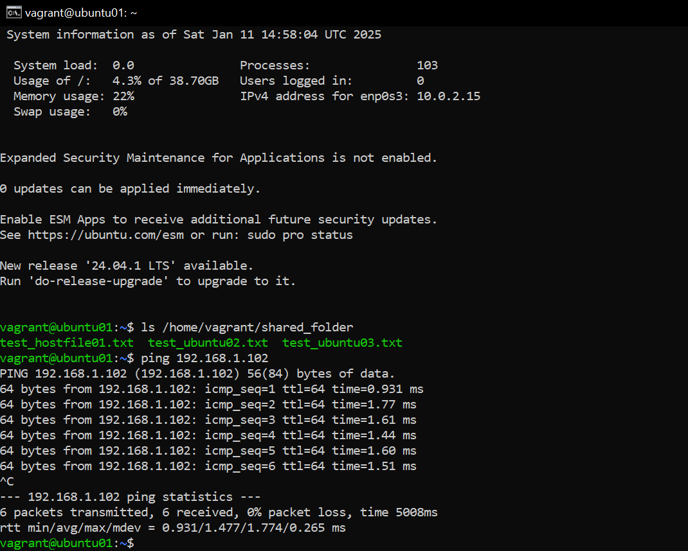

## Использование инструмента Vagrant
В данной работе будут использовались хостовая машина на Windows 10, ПО VirtualBox версия 7.0.14, ПО Vagrant версия 2.4.3, Vagrant Box ubuntu/jammy64
### Ход выполнения работы:
1. Устанавливаем Vagrant
2. Добавляем переменную vagrant в системные переменные, проверяем версию Vagrant:
```
C:\Windows\system32>set PATH=%PATH%;C:\Program Files\Vagrant\bin
```
```
C:\Windows\system32>vagrant -v
Vagrant 2.4.3
```
3. Создаем каталог для проетка и переходим в него:
```
mkdir C:\Users\Admin\Documents\GitHub\Linux.Professional\hw2_Vagrant\ubuntu_jammy64
cd C:\Users\Admin\Documents\GitHub\Linux.Professional\hw2_Vagrant\ubuntu_jammy64
```
4. Cозданием рабочее окружение, в котором будет выполняться код приложения:
```
vagrant init -m ubuntu/jammy64
```
Получаем сообщение об успешном создании Vagrantfile:
```
A `Vagrantfile` has been placed in this directory. You are now
ready to `vagrant up` your first virtual environment! Please read
the comments in the Vagrantfile as well as documentation on
`vagrantup.com` for more information on using Vagrant.
```
5. Редактируем созданный Vagrantfile для разворачивания 2-х виртуальных машин:
```
Vagrant.configure("2") do |config|
  # Настройки первой виртуальной машины
  config.vm.define "ubuntu01" do |machine1|
    machine1.vm.box = "ubuntu/jammy64" # Используем образ Ubuntu 22.04
    machine1.vm.network "public_network", ip: "192.168.1.101" # Настройка сетевого интерфейса типа "мост"
    machine1.vm.hostname = "ubuntu01" # Установка имени хоста
    machine1.vm.provider "virtualbox" do |vb|
      vb.cpus = 2 # Установка количества ядер
      vb.memory = 1024 # Установка объема виртуальной памяти (в МБ)
      vb.gui = false # Отключение графического интерфейса
    end

    # Прокидываем общий каталог
    machine1.vm.synced_folder "./shared_folder", "/home/vagrant/shared_folder" 

    # Запуск скрипта provision.sh
    machine1.vm.provision "shell", path: "provision.sh"
  end

  # Настройки второй виртуальной машины
  config.vm.define "ubuntu02" do |machine2|
    machine2.vm.box = "ubuntu/jammy64" # Используем тот же образ
    machine2.vm.network "public_network", ip: "192.168.1.102" # Настройка сетевого интерфейса типа "мост"
    machine2.vm.hostname = "ubuntu02" # Установка имени хоста
    machine2.vm.provider "virtualbox" do |vb|
      vb.cpus = 2 # Установка количества ядер
      vb.memory = 1024 # Установка объема виртуальной памяти (в МБ)
      vb.gui = false # Отключение графического интерфейса
    end

    # Прокидываем общий каталог
    machine2.vm.synced_folder "./shared_folder", "/home/vagrant/shared_folder" 

    # Запуск скрипта provision.sh
    machine2.vm.provision "shell", path: "provision.sh"
  end
end
```
6. Формируем файл provision.sh:
```bash
#!/bin/bash

# Обновление списка пакетов
sudo apt-get update

# Обновление установленных пакетов
sudo apt-get upgrade -y

# Очистка ненужных пакетов
sudo apt-get autoremove -y

# Путь к каталогу
SHARED_FOLDER="/home/vagrant/shared_folder"

# Проверка, существует ли каталог
if [ ! -d "$SHARED_FOLDER" ]; then
  echo "Каталог $SHARED_FOLDER не существует."
  exit 1
fi

# Получение количества файлов в каталоге
FILE_COUNT=$(ls -1 "$SHARED_FOLDER" | wc -l)

# Создание нового файла с порядковым номером
NEW_FILE_NAME="test_ubuntu$(printf "%02d" $((FILE_COUNT + 1))).txt"
touch "$SHARED_FOLDER/$NEW_FILE_NAME"

echo "Создан файл: $NEW_FILE_NAME"
```
7. Создаем виртуальные машины:
```
vagrant up
```
[Лог выполнения](vagrant_up.log)

8. Подключаемся по ssh к созданной виртуальной машине:
```
vagrant ssh ubuntu01
```
9. Проверяем работу общего каталога и сети:
```bash
ls /home/vagrant/shared_folder
ping 192.168.1.102
```

10. Проводим обновление ядра системы по [инструкции](https://github.com/Schukinsky/Linux.Professional/tree/main/hw1_kernel%20update)

