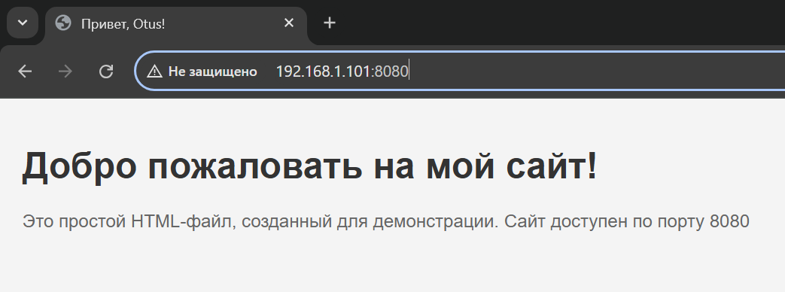

## Использование инструмента Ansible
В данной работе  c помощью инструментов Vagrant и Ansible разворачивается стенд из двух серверов:  
Ubuntu01 - web сервер  
Ubuntu02 - вспомогательный сервер управления Ansible

### Ход выполнения работы:
1. Формируем [Vagrantfile](ubuntu_jammy64/Vagrantfile) для разворачивания 2-х виртуальных машин:
```
Vagrant.configure("2") do |config|
  # Настройки первой виртуальной машины
  config.vm.define "ubuntu01" do |machine1|
    machine1.vm.box = "ubuntu/jammy64" # Используем образ Ubuntu 22.04
    machine1.vm.network "public_network", ip: "192.168.1.101" # Настройка сетевого интерфейса типа "мост"
    machine1.vm.hostname = "ubuntu01" # Установка имени хоста
    machine1.vm.provider "virtualbox" do |vb|
      vb.cpus = 2 # Установка количества ядер
      vb.memory = 1024 # Установка объема виртуальной памяти (в МБ)
      vb.gui = false # Отключение графического интерфейса
    end

    # Запуск скрипта provision01.sh
    machine1.vm.provision "shell", path: "provision01.sh"
  end

  # Настройки второй виртуальной машины
  config.vm.define "ubuntu02" do |machine2|
    machine2.vm.box = "ubuntu/jammy64" # Используем тот же образ
    machine2.vm.network "public_network", ip: "192.168.1.102" # Настройка сетевого интерфейса типа "мост"
    machine2.vm.hostname = "ubuntu02" # Установка имени хоста
    machine2.vm.provider "virtualbox" do |vb|
      vb.cpus = 2 # Установка количества ядер
      vb.memory = 1024 # Установка объема виртуальной памяти (в МБ)
      vb.gui = false # Отключение графического интерфейса
    end

    # Прокидываем общий каталог
    machine2.vm.synced_folder "./ansible", "/home/vagrant/ansible" 

    # Копирование приватного ключа
    machine2.vm.provision "file", source: "C:/Users/Admin/Documents/GitHub/Linux.Professional/hw3_Ansible/ubuntu_jammy64/.vagrant/machines/ubuntu01/virtualbox/private_key", destination: "/home/vagrant/.ssh/id_rsa2"

    # Установка правильных прав доступа к ключу
    machine2.vm.provision "shell", inline: <<-SHELL
      chmod 600 /home/vagrant/.ssh/id_rsa2
      chown vagrant:vagrant /home/vagrant/.ssh/id_rsa2
    SHELL

    # Запуск скрипта provision02.sh
    machine2.vm.provision "shell", path: "provision02.sh"
  end
end
```
2. Формируем файл [provision01.sh](ubuntu_jammy64/provision01.sh) обновления пакетов для сервера Ubuntu01:
```
# Обновление списка пакетов
sudo apt-get update

# Обновление установленных пакетов
sudo apt-get upgrade -y

# Очистка ненужных пакетов
sudo apt-get autoremove -y
```
3. Формируем файл [provision02.sh](ubuntu_jammy64/provision02.sh) обновления пакетов и установки Ansible для сервера Ubuntu02:
```
# Обновление списка пакетов
echo "Обновление списка пакетов..."
sudo apt-get update

# Обновление установленных пакетов
echo "Обновление установленных пакетов..."
sudo apt-get upgrade -y

# Очистка ненужных пакетов
echo "Очистка ненужных пакетов..."
sudo apt-get autoremove -y

# Установка Ansible
echo "Установка Ansible..."
sudo apt-get install -y ansible
```
4. Формируем шаблоны index.html и nginx.conf с использованием переменных :
 [index.j2](ubuntu_jammy64/ansible/templates/index.j2) 
```
<!DOCTYPE html>
<html lang="ru">
<head>
    <meta charset="UTF-8">
    <meta name="viewport" content="width=device-width, initial-scale=1.0">
    <title>Привет, Otus!</title>
    <style>
        body {
            font-family: Arial, sans-serif;
            background-color: #f4f4f4;
            margin: 0;
            padding: 20px;
        }
        h1 {
            color: #333;
        }
        p {
            color: #666;
        }
    </style>
</head>
<body>
    <h1>Добро пожаловать на мой сайт!</h1>
    <p>Это простой HTML-файл, созданный для демонстрации. Сайт доступен по порту {{ nginx_port }}</p>
</body>
</html>
```

 [nginx.conf.j2](ubuntu_jammy64/ansible/templates/nginx.conf.j2) 
```
server {
    listen {{ nginx_port }};
    server_name ubuntu01;

    location / {
        root /var/www/html;
        index index.html index.htm;
    }
}
```
5. Формируем файл [inventory](ubuntu_jammy64/ansible/inventory)
```
all:
  hosts:
    webserver:
      ansible_host: 192.168.1.101
      ansible_ssh_private_key_file: /home/vagrant/.ssh/id_rsa2
```
6. Формируем playbook [site.yml](ubuntu_jammy64/ansible/site.yml)
```
---
- hosts: all
  become: yes
  vars:
    nginx_port: 8080

  tasks:
    - name: Install Nginx
      package:
        name: nginx
        state: present

    - name: Copy nginx.conf
      template:
        src: nginx.conf.j2
        dest: /etc/nginx/sites-available/default
      notify: Reload Nginx

    - name: Configure HTML page
      template:
        src: index.j2
        dest: /var/www/html/index.html
      notify: Reload Nginx

    - name: Start Nginx systemd
      systemd:
        name: nginx
        enabled: yes
        state: started

  handlers:
    - name: Reload Nginx
      systemd:
        name: nginx
        state: restarted
```
### Запуск стенда:
1. Vagrant up
``` 
vagrant up
```
2. Подключаемся по ssh к ubuntu02:
```
vagrant ssh ubuntu02
```
3. Запускаем playbook
```
ansible-playbook -i inventory site.yml
```
8. Проверяем доступлость web сервера:
```
curl http://192.168.1.101:8080/
```

