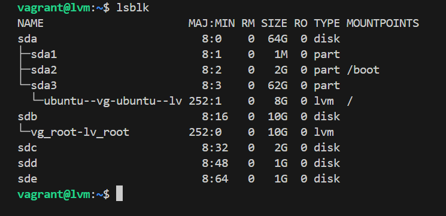
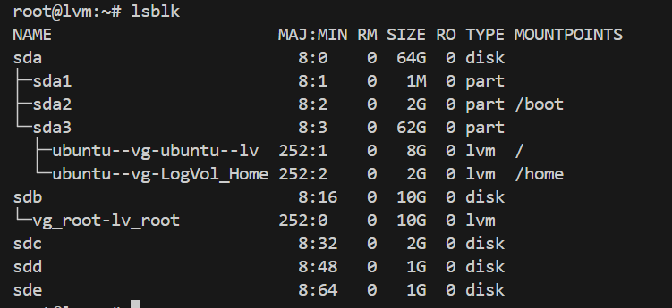
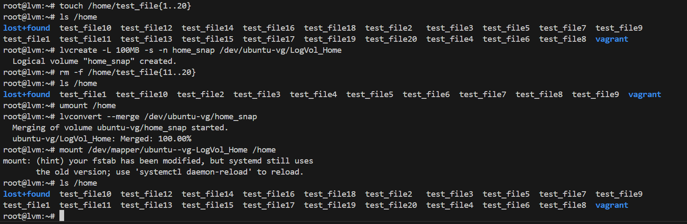

## LVM. Работа с LVM
Задача:  
На имеющемся образе bento/ubuntu-24.04 [Vagrantfile](Vagrantfile)
1. Уменьшить том под / до 8G
2. Выделить том под /home
3. Выделить том под /var - сделать в mirror
4. /home - сделать том для снапшотов:  
        сгенерить файлы в /home/;  
        снять снапшот;  
        удалить часть файлов;  
        восстановится со снапшота.

### Ход выполнения работы:
1. Уменьшить том под / до 8G

1.1 Создадим physical volume /dev/sdb:
```
pvcreate /dev/sdb
```
1.2 Создадим volume group vg_root:
```
vgcreate vg_root /dev/sdb
```
1.3 Создадим logical volume lv_root на volume group vg_root:
```
lvcreate -n lv_root -l +100%FREE /dev/vg_root
```
1.4 Создадим файловую систему ext4 на logical volume lv_root:
```
mkfs.ext4 /dev/vg_root/lv_root
```
1.5 Смонтируем /dev/vg_root/lv_root в /mnt:
```
mount /dev/vg_root/lv_root /mnt
```
1.6 Скопируем все данные из / в /mnt:
```
rsync -avxHAX --progress / /mnt/
```
1.7 Изменим корневой каталог:
```
for i in /proc/ /sys/ /dev/ /run/ /boot/; \
do mount --bind $i /mnt/$i; done
chroot /mnt/
```
1.8 Сконфигурируем grub:
```
grub-mkconfig -o /boot/grub/grub.cfg
```
1.9 Обновим образ initrd:
```
update-initramfs -u
```
1.10 Перезагружаем систему:
```
reboot
```
1.11 Удаляем старый LV ubuntu-lv и создаём новый на 8G
```
lvremove /dev/ubuntu-vg/ubuntu-lv
lvcreate -n ubuntu-vg/ubuntu-lv -L 8G /dev/ubuntu-vg
```
1.12 Создадим файловую систему ext4 на logical volume ubuntu-lv
```
mkfs.ext4 /dev/ubuntu-vg/ubuntu-lv
```
1.13 Смонтируем /dev/ubuntu-vg/ubuntu-lv в /mnt:
```
mount /dev/ubuntu-vg/ubuntu-lv /mnt
```
1.14  Скопируем все данные из / в /mnt:
```
rsync -avxHAX --progress / /mnt/
```
1.15 Изменим корневой каталог:
```
for i in /proc/ /sys/ /dev/ /run/ /boot/; \
do mount --bind $i /mnt/$i; done
chroot /mnt/
```
1.16 Сконфигурируем grub:
```
grub-mkconfig -o /boot/grub/grub.cfg
```
1.17 Обновим образ initrd:
```
update-initramfs -u
```
1.18 Перезагружаем систему:
```
reboot
```
  

2. Выделить том под /home
 
2.1 Создадим logical volume, файловую систему на нем и примонтируем его:
```
lvcreate -n LogVol_Home -L 2G /dev/ubuntu-vg
mkfs.ext4 /dev/ubuntu-vg/LogVol_Home
mount /dev/ubuntu-vg/LogVol_Home /mnt/
```
2.2 Скопируем все из /home/ в /mnt/
```
cp -aR /home/* /mnt/
```
2.3 Удалим все из /home/ и отмонтируем /mnt:
```
rm -rf /home/*
umount /mnt
```
2.4 Примонтируем /dev/ubuntu-vg/LogVol_Home в /home/
```
mount /dev/ubuntu-vg/LogVol_Home /home/
```
2.5 Обновим fstab для автоматического монтирования /home:
```
echo "`blkid | grep Home | awk '{print $2}'` \
 /home xfs defaults 0 0" >> /etc/fstab
```
  

3. Выделить том под /var - сделать в mirror  

3.1 Создадим два physical volume:
```
pvcreate /dev/sdc /dev/sdd
```
3.2 Создадим volume group vg_var из двух physical volume:
```
vgcreate vg_var /dev/sdc /dev/sdd
```
3.3 Создадим logical volume lv_var c зеркалом
```
lvcreate --mirrors 1 -L 950M -n lv_var vg_var
```
3.4 Создадим файловую систему ext4 на logical volume lv_var и примонтируем его:
```
mksf.ex4 /dev/vg_var/lv_var
mount /dev/vg_var/lv_var /mnt
```
3.5 Копируем /var/ в /mnt/ и переносим все из /var/ в /tmp/oldvar
```
cp -aR /var/* /mnt/
mkdir /tmp/oldvar && mv /var/* /tmp/oldvar
```
3.6 Отмонтируем /mnt и монтируем /dev/vg_var/lv_var в /var
```
umount /mnt
mount /dev/vg_var/lv_var /var
```
3.7 Обновим fstab для автоматического монтирования /var:
```
echo "`blkid | grep var: | awk '{print $2}'` \
 /var ext4 defaults 0 0" >> /etc/fstab
```

4. /home - сделать том для снапшотов
   
4.1 Генерируем файлы в /home:
```
touch /home/test_file{1..20}
```
4.2 Создадим снимок логического тома LogVol_Home:
```
lvcreate -L 100MB -s -n home_snap /dev/ubuntu-vg/LogVol_Home
```
4.3 Удалим часть файлов из /home:
```
rm -f /home/test_file{11..20}
```
4.4 Восстановим данные из снапшота:
```
umount /home
lvconvert --merge /dev/ubuntu-vg/home_snap
```
4.5 Примонтируем LogVol_Home в /home и проверим восстановленные файлы:
```
mount /dev/mapper/ubuntu--vg-LogVol_Home /home
ls /home
```

Файлы успешно восстановлены с помощью снапшота.
