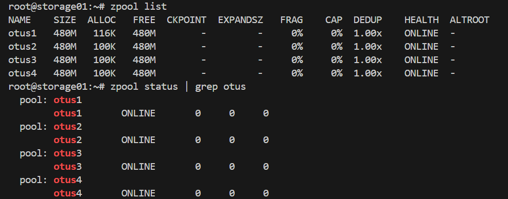
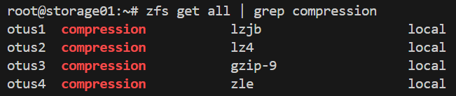
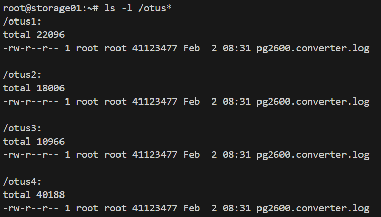
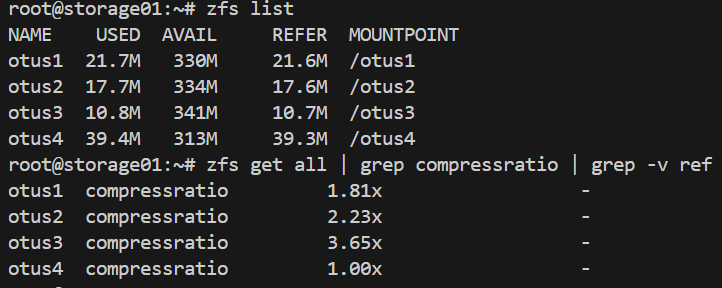
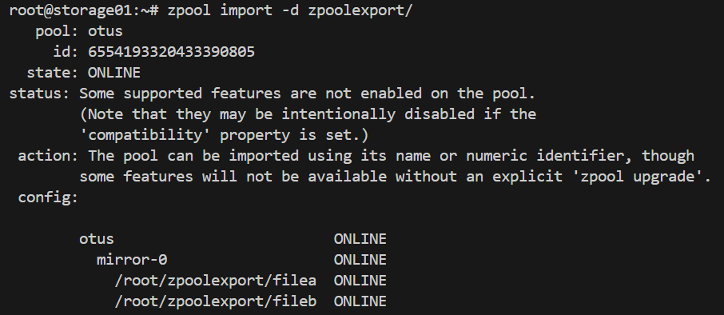
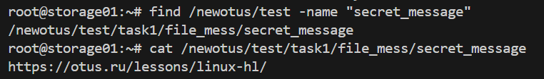

## ZFS. Работа с  файловой системой ZFS
Задача:  
1. Определить алгоритм с наилучшим сжатием:
- определить какие алгоритмы сжатия поддерживает zfs (gzip, zle, lzjb, lz4);
- создать 4 файловых системы на каждой применить свой алгоритм сжатия;
- для сжатия использовать либо текстовый файл, либо группу файлов.
2. Определить настройки пула.
С помощью команды zfs import собрать pool ZFS.
Командами zfs определить настройки:
- размер хранилища;
- тип pool;
- значение recordsize;
- какое сжатие используется;
- какая контрольная сумма используется.
3. Работа со снапшотами:
- скопировать файл из удаленной директории;
- восстановить файл локально. zfs receive;
- найти зашифрованное сообщение в файле secret_message.

### Ход выполнения работы:
Устанавливаем ZFS:
```
sudo apt update
sudo apt upgrade
sudo apt install zfsutils-linux
zfs --version
```
1. 
sudo -i
1.1 Создаём пул из двух дисков в режиме RAID 1:
```
zpool create otus1 mirror /dev/sdc /dev/sdd
```
1.2 Создадим ещё 3 пула:
```
zpool create otus2 mirror /dev/sde /dev/sdf
zpool create otus3 mirror /dev/sdg /dev/sdh
zpool create otus4 mirror /dev/sdi /dev/sdj
```
1.3 Смотрим информацию о пулах: 
```
zpool list  # показывает информацию о размере пула, количеству занятого и свободного места, дедупликации и т.д.
zpool status # показывает информацию о каждом диске, состоянии сканирования и об ошибках чтения, записи и совпадения хэш-сумм.
```
  

1.4 Добавим разные алгоритмы сжатия в каждую файловую систему:
```
zfs set compression=lzjb otus1 # Алгоритм lzjb
zfs set compression=lz4 otus2 # Алгоритм lz4
zfs set compression=gzip-9 otus3 # Алгоритм gzip
zfs set compression=zle otus4 # Алгоритм zle
```
1.5 Проверим, что все файловые системы имеют разные методы сжатия:
```
zfs get all | grep compression
```
  

1.6 Скачаем один и тот же текстовый файл во все пулы и проверяем, что файл успешно скачан:
```
for i in {1..4}; do wget -P /otus$i https://gutenberg.org/cache/epub/2600/pg2600.converter.log; done
ls -l /otus*
```
  

1.7 Проверим, сколько места занимает один и тот же файл в разных пулах и проверим степень сжатия файлов:
```
zfs list
zfs get all | grep compressratio | grep -v ref
```
  

Таким образом, у нас получается, что алгоритм gzip-9 самый эффективный по сжатию.  

2. Определение настроек пула
2.1 Скачиваем архив в домашний каталог: 
```
wget -O archive.tar.gz --no-check-certificate 'https://drive.usercontent.google.com/download?id=1MvrcEp-WgAQe57aDEzxSRalPAwbNN1Bb&export=download'
```
2.2 Разархивируем его:
```
tar -xzvf archive.tar.gz
```
2.3 Проверим, возможно ли импортировать данный каталог в пул:
```
zpool import -d zpoolexport/
```
  

Данный вывод показывает нам имя пула, тип raid и его состав.
2.4 Сделаем импорт данного пула к нам в ОС:
```
zpool import -d zpoolexport/ otus
zpool import -d zpoolexport/ otus newotus # импорт с новым именем
zpool status
```
2.5 Далее нам нужно определить настройки:
```
zpool get all otus
```
<details>
<summary>Результат выполнения команды</summary>
```
root@storage01:~# zpool get all newotus
NAME     PROPERTY                       VALUE                          SOURCE
newotus  size                           480M                           -
newotus  capacity                       0%                             -
newotus  altroot                        -                              default
newotus  health                         ONLINE                         -
newotus  guid                           6554193320433390805            -
newotus  version                        -                              default
newotus  bootfs                         -                              default
newotus  delegation                     on                             default
newotus  autoreplace                    off                            default
newotus  cachefile                      -                              default
newotus  failmode                       wait                           default
newotus  listsnapshots                  off                            default
newotus  autoexpand                     off                            default
newotus  dedupratio                     1.00x                          -
newotus  free                           478M                           -
newotus  allocated                      2.09M                          -
newotus  readonly                       off                            -
newotus  ashift                         0                              default
newotus  comment                        -                              default
newotus  expandsize                     -                              -
newotus  freeing                        0                              -
newotus  fragmentation                  0%                             -
newotus  leaked                         0                              -
newotus  multihost                      off                            default
newotus  checkpoint                     -                              -
newotus  load_guid                      9468877305922700107            -
newotus  autotrim                       off                            default
newotus  compatibility                  off                            default
newotus  feature@async_destroy          enabled                        local
newotus  feature@empty_bpobj            active                         local
newotus  feature@lz4_compress           active                         local
newotus  feature@multi_vdev_crash_dump  enabled                        local
newotus  feature@spacemap_histogram     active                         local
newotus  feature@enabled_txg            active                         local
newotus  feature@hole_birth             active                         local
newotus  feature@extensible_dataset     active                         local
newotus  feature@embedded_data          active                         local
newotus  feature@bookmarks              enabled                        local
newotus  feature@filesystem_limits      enabled                        local
newotus  feature@large_blocks           enabled                        local
newotus  feature@large_dnode            enabled                        local
newotus  feature@sha512                 enabled                        local
newotus  feature@skein                  enabled                        local
newotus  feature@edonr                  enabled                        local
newotus  feature@userobj_accounting     active                         local
newotus  feature@encryption             enabled                        local
newotus  feature@project_quota          active                         local
newotus  feature@device_removal         enabled                        local
newotus  feature@obsolete_counts        enabled                        local
newotus  feature@zpool_checkpoint       enabled                        local
newotus  feature@spacemap_v2            active                         local
newotus  feature@allocation_classes     enabled                        local
newotus  feature@resilver_defer         enabled                        local
newotus  feature@bookmark_v2            enabled                        local
newotus  feature@redaction_bookmarks    disabled                       local
newotus  feature@redacted_datasets      disabled                       local
newotus  feature@bookmark_written       disabled                       local
newotus  feature@log_spacemap           disabled                       local
newotus  feature@livelist               disabled                       local
newotus  feature@device_rebuild         disabled                       local
newotus  feature@zstd_compress          disabled                       local
newotus  feature@draid                  disabled                       local
```
</details>
2.6 Запрос сразу всех параметром файловой системы:
```
zfs get all newotus
```
<details>
<summary>Результат выполнения команды</summary>
```
root@storage01:~# zfs get all newotus
NAME     PROPERTY              VALUE                  SOURCE
newotus  type                  filesystem             -      
newotus  creation              Fri May 15  4:00 2020  -      
newotus  used                  2.04M                  -      
newotus  available             350M                   -      
newotus  referenced            24K                    -      
newotus  compressratio         1.00x                  -      
newotus  mounted               yes                    -      
newotus  quota                 none                   default
newotus  reservation           none                   default
newotus  recordsize            128K                   local  
newotus  mountpoint            /newotus               default
newotus  sharenfs              off                    default
newotus  checksum              sha256                 local  
newotus  compression           zle                    local  
newotus  atime                 on                     default
newotus  devices               on                     default
newotus  exec                  on                     default
newotus  setuid                on                     default
newotus  readonly              off                    default
newotus  zoned                 off                    default
newotus  snapdir               hidden                 default
newotus  aclmode               discard                default
newotus  aclinherit            restricted             default
newotus  createtxg             1                      -
newotus  canmount              on                     default
newotus  xattr                 on                     default
newotus  copies                1                      default
newotus  version               5                      -
newotus  utf8only              off                    -
newotus  normalization         none                   -
newotus  casesensitivity       sensitive              -
newotus  vscan                 off                    default
newotus  nbmand                off                    default
newotus  sharesmb              off                    default
newotus  refquota              none                   default
newotus  refreservation        none                   default
newotus  guid                  14592242904030363272   -
newotus  primarycache          all                    default
newotus  secondarycache        all                    default
newotus  usedbysnapshots       0B                     -
newotus  usedbydataset         24K                    -
newotus  usedbychildren        2.01M                  -
newotus  usedbyrefreservation  0B                     -
newotus  logbias               latency                default
newotus  objsetid              54                     -
newotus  dedup                 off                    default
newotus  mlslabel              none                   default
newotus  sync                  standard               default
newotus  dnodesize             legacy                 default
newotus  refcompressratio      1.00x                  -
newotus  written               24K                    -
newotus  logicalused           1020K                  -
newotus  logicalreferenced     12K                    -
newotus  volmode               default                default
newotus  filesystem_limit      none                   default
newotus  snapshot_limit        none                   default
newotus  filesystem_count      none                   default
newotus  snapshot_count        none                   default
newotus  snapdev               hidden                 default
newotus  acltype               off                    default
newotus  context               none                   default
newotus  fscontext             none                   default
newotus  defcontext            none                   default
newotus  rootcontext           none                   default
newotus  relatime              off                    default
newotus  redundant_metadata    all                    default
newotus  overlay               on                     default
newotus  encryption            off                    default
newotus  keylocation           none                   default
newotus  keyformat             none                   default
newotus  pbkdf2iters           0                      default
newotus  special_small_blocks  0                      default
```
</details>
2.7 Вывод конкретных параметров файловой системы:
```
zfs get available newotus # Размер
zfs get readonly newotus # Тип
zfs get recordsize newotus # Значение recordsize
zfs get compression newotus # Тип сжатия (или параметр отключения)
zfs get checksum newotus # Тип контрольной суммы
```
<details>
<summary>Результат выполнения команды</summary>
```
root@storage01:~# zfs get available newotus
NAME     PROPERTY   VALUE  SOURCE
newotus  available  350M   -     
root@storage01:~# zfs get readonly newotus
NAME     PROPERTY  VALUE   SOURCE
newotus  readonly  off     default
root@storage01:~# zfs get recordsize newotus
NAME     PROPERTY    VALUE    SOURCE
newotus  recordsize  128K     local
root@storage01:~# zfs get compression newotus
NAME     PROPERTY     VALUE           SOURCE
newotus  compression  zle             local
root@storage01:~# zfs get checksum newotus
NAME     PROPERTY  VALUE      SOURCE
newotus  checksum  sha256     local
```
</details>
3. Работа со снапшотом

3.1 Скачаем файл, указанный в задании:
```
wget -O otus_task2.file --no-check-certificate https://drive.usercontent.google.com/download?id=1wgxjih8YZ-cqLqaZVa0lA3h3Y029c3oI&export=download
```
3.2 Восстановим файловую систему из снапшота:
```
zfs receive newotus/test@today < otus_task2.file
```
3.3 Далее, ищем в каталоге /otus/test файл с именем “secret_message”:
```
find /newotus/test -name "secret_message"
```
3.4 Смотрим содержимое найденного файла:
```
cat /newotus/test/task1/file_mess/secret_message
```
  
