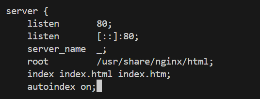

# RPM. Сборка RPM-пакета и создание репозитория

## Задача:
- создать свой RPM (можно взять свое приложение, либо собрать к примеру Apache с определенными опциями);
- cоздать свой репозиторий и разместить там ранее собранный RPM;
- реализовать это все либо в Vagrant, либо развернуть у себя через Nginx и дать ссылку на репозиторий.

### Ход выполнения работы:
1. Создание RPM
   
1.1 Для данного задания нам понадобятся следующие установленные пакеты:
```
 yum install -y wget rpmdevtools rpm-build createrepo \
 yum-utils cmake gcc git nano
```
1.2 Возьмем пакет Nginx и соберем его с дополнительным модулем ngx_broli  
1.3 Загрузим SRPM пакет Nginx для дальнейшей работы над ним:
```
mkdir rpm && cd rpm
yumdownloader --source nginx
```
1.4 При установке такого пакета в домашней директории создается дерево каталогов для сборки, далее поставим все зависимости для сборки пакета Nginx:
```
rpm -Uvh nginx*.src.rpm
yum-builddep nginx
```
1.5 Также нужно скачать исходный код модуля ngx_brotli — он потребуется при сборке:
```
cd /root
git clone --recurse-submodules -j8 \
https://github.com/google/ngx_brotli
cd ngx_brotli/deps/brotli
mkdir out && cd out
```
1.6 Собираем модуль ngx_brotli:
```
cmake -DCMAKE_BUILD_TYPE=Release -DBUILD_SHARED_LIBS=OFF -DCMAKE_C_FLAGS="-Ofast -m64 -march=native -mtune=native -flto -funroll-loops -ffunction-sections -fdata-sections -Wl,--gc-sections" -DCMAKE_CXX_FLAGS="-Ofast -m64 -march=native -mtune=native -flto -funroll-loops -ffunction-sections -fdata-sections -Wl,--gc-sections" -DCMAKE_INSTALL_PREFIX=./installed ..
cmake --build . --config Release -j 2 --target brotlienc
cd ../../../..
```
1.7 Нужно поправить сам spec файл, чтобы Nginx собирался с необходимыми нам опциями: находим секцию с параметрами configure (до условий if) и добавляем указание на модуль (не забудьте указать завершающий обратный слэш):
--add-module=/root/ngx_brotli \

<details>
<summary>Результат изменения файла</summary>


</details>

1.8 Теперь можно приступить к сборке RPM пакета:
```
cd ~/rpmbuild/SPECS/
rpmbuild -ba nginx.spec -D 'debug_package %{nil}'
```
1.9 Убедимся, что пакеты создались:
```
ll /root/rpmbuild/RPMS/x86_64/
```
<details>
<summary>Результат выполнения команды</summary>

```
[root@localhost SPECS]# ll /root/rpmbuild/RPMS/x86_64/
total 1992
-rw-r--r--. 1 root root   36267 Feb  8 13:34 nginx-1.20.1-20.el9.alma.1.x86_64.rpm
-rw-r--r--. 1 root root 1027994 Feb  8 13:34 nginx-core-1.20.1-20.el9.alma.1.x86_64.rpm
-rw-r--r--. 1 root root  759722 Feb  8 13:34 nginx-mod-devel-1.20.1-20.el9.alma.1.x86_64.rpm
-rw-r--r--. 1 root root   19378 Feb  8 13:34 nginx-mod-http-image-filter-1.20.1-20.el9.alma.1.x86_64.rpm
-rw-r--r--. 1 root root   31012 Feb  8 13:34 nginx-mod-http-perl-1.20.1-20.el9.alma.1.x86_64.rpm
-rw-r--r--. 1 root root   18165 Feb  8 13:34 nginx-mod-http-xslt-filter-1.20.1-20.el9.alma.1.x86_64.rpm
-rw-r--r--. 1 root root   53796 Feb  8 13:34 nginx-mod-mail-1.20.1-20.el9.alma.1.x86_64.rpm
-rw-r--r--. 1 root root   80282 Feb  8 13:34 nginx-mod-stream-1.20.1-20.el9.alma.1.x86_64.rpm
```
</details>

1.10 Копируем пакеты в общий каталог:
```
cp ~/rpmbuild/RPMS/noarch/* ~/rpmbuild/RPMS/x86_64/
cd ~/rpmbuild/RPMS/x86_64
```
1.11 Теперь можно установить наш пакет и убедиться, что nginx работает:
```
yum localinstall *.rpm
```
<details>
<summary>Результат выполнения команды</summary>

```
[root@localhost x86_64]# yum localinstall *.rpm
Last metadata expiration check: 0:58:45 ago on Sat 08 Feb 2025 12:44:10 PM UTC.
Dependencies resolved.
================================================================================================================================================================================= Package                                             Architecture                   Version                                           Repository                            Size 
=================================================================================================================================================================================Installing:
 nginx                                               x86_64                         2:1.20.1-20.el9.alma.1                            @commandline                          35 k 
 nginx-all-modules                                   noarch                         2:1.20.1-20.el9.alma.1                            @commandline                         7.2 k 
 nginx-core                                          x86_64                         2:1.20.1-20.el9.alma.1                            @commandline                         1.0 M 
 nginx-filesystem                                    noarch                         2:1.20.1-20.el9.alma.1                            @commandline                         8.2 k 
 nginx-mod-devel                                     x86_64                         2:1.20.1-20.el9.alma.1                            @commandline                         742 k 
 nginx-mod-http-image-filter                         x86_64                         2:1.20.1-20.el9.alma.1                            @commandline                          19 k 
 nginx-mod-http-perl                                 x86_64                         2:1.20.1-20.el9.alma.1                            @commandline                          30 k 
 nginx-mod-http-xslt-filter                          x86_64                         2:1.20.1-20.el9.alma.1                            @commandline                          18 k 
 nginx-mod-mail                                      x86_64                         2:1.20.1-20.el9.alma.1                            @commandline                          53 k 
 nginx-mod-stream                                    x86_64                         2:1.20.1-20.el9.alma.1                            @commandline                          78 k 
Installing dependencies:
 almalinux-logos-httpd                               noarch                         90.5.1-1.1.el9                                    appstream                             18 k 

Transaction Summary
=================================================================================================================================================================================Install  11 Packages

Total size: 2.0 M
Total download size: 18 k
Installed size: 9.5 M
Is this ok [y/N]: y
Downloading Packages:
almalinux-logos-httpd-90.5.1-1.1.el9.noarch.rpm                                                                                                  123 kB/s |  18 kB     00:00     
---------------------------------------------------------------------------------------------------------------------------------------------------------------------------------Total                                                                                                                                             24 kB/s |  18 kB     00:00     
Running transaction check
Transaction check succeeded.
Running transaction test
Transaction test succeeded.
Running transaction
  Preparing        :                                                                                                                                                         1/1 
  Running scriptlet: nginx-filesystem-2:1.20.1-20.el9.alma.1.noarch                                                                                                         1/11 
  Installing       : nginx-filesystem-2:1.20.1-20.el9.alma.1.noarch                                                                                                         1/11 
  Installing       : nginx-core-2:1.20.1-20.el9.alma.1.x86_64                                                                                                               2/11 
  Installing       : almalinux-logos-httpd-90.5.1-1.1.el9.noarch                                                                                                            3/11 
  Installing       : nginx-2:1.20.1-20.el9.alma.1.x86_64                                                                                                                    4/11 
  Running scriptlet: nginx-2:1.20.1-20.el9.alma.1.x86_64                                                                                                                    4/11 
  Installing       : nginx-mod-http-image-filter-2:1.20.1-20.el9.alma.1.x86_64                                                                                              5/11 
  Running scriptlet: nginx-mod-http-image-filter-2:1.20.1-20.el9.alma.1.x86_64                                                                                              5/11 
  Installing       : nginx-mod-http-perl-2:1.20.1-20.el9.alma.1.x86_64                                                                                                      6/11 
  Running scriptlet: nginx-mod-http-perl-2:1.20.1-20.el9.alma.1.x86_64                                                                                                      6/11 
  Installing       : nginx-mod-http-xslt-filter-2:1.20.1-20.el9.alma.1.x86_64                                                                                               7/11 
  Running scriptlet: nginx-mod-http-xslt-filter-2:1.20.1-20.el9.alma.1.x86_64                                                                                               7/11 
  Installing       : nginx-mod-mail-2:1.20.1-20.el9.alma.1.x86_64                                                                                                           8/11 
  Running scriptlet: nginx-mod-mail-2:1.20.1-20.el9.alma.1.x86_64                                                                                                           8/11 
  Installing       : nginx-mod-stream-2:1.20.1-20.el9.alma.1.x86_64                                                                                                         9/11 
  Running scriptlet: nginx-mod-stream-2:1.20.1-20.el9.alma.1.x86_64                                                                                                         9/11 
  Installing       : nginx-all-modules-2:1.20.1-20.el9.alma.1.noarch                                                                                                       10/11 
  Installing       : nginx-mod-devel-2:1.20.1-20.el9.alma.1.x86_64                                                                                                         11/11 
  Running scriptlet: nginx-mod-devel-2:1.20.1-20.el9.alma.1.x86_64                                                                                                         11/11 
  Verifying        : almalinux-logos-httpd-90.5.1-1.1.el9.noarch                                                                                                            1/11 
  Verifying        : nginx-2:1.20.1-20.el9.alma.1.x86_64                                                                                                                    2/11 
  Verifying        : nginx-all-modules-2:1.20.1-20.el9.alma.1.noarch                                                                                                        3/11 
  Verifying        : nginx-core-2:1.20.1-20.el9.alma.1.x86_64                                                                                                               4/11 
  Verifying        : nginx-filesystem-2:1.20.1-20.el9.alma.1.noarch                                                                                                         5/11 
  Verifying        : nginx-mod-devel-2:1.20.1-20.el9.alma.1.x86_64                                                                                                          6/11 
  Verifying        : nginx-mod-http-image-filter-2:1.20.1-20.el9.alma.1.x86_64                                                                                              7/11 
  Verifying        : nginx-mod-http-perl-2:1.20.1-20.el9.alma.1.x86_64                                                                                                      8/11 
  Verifying        : nginx-mod-http-xslt-filter-2:1.20.1-20.el9.alma.1.x86_64                                                                                               9/11 
  Verifying        : nginx-mod-mail-2:1.20.1-20.el9.alma.1.x86_64                                                                                                          10/11 
  Verifying        : nginx-mod-stream-2:1.20.1-20.el9.alma.1.x86_64                                                                                                        11/11 

Installed:
  almalinux-logos-httpd-90.5.1-1.1.el9.noarch                  nginx-2:1.20.1-20.el9.alma.1.x86_64                  nginx-all-modules-2:1.20.1-20.el9.alma.1.noarch
  nginx-core-2:1.20.1-20.el9.alma.1.x86_64                     nginx-filesystem-2:1.20.1-20.el9.alma.1.noarch       nginx-mod-devel-2:1.20.1-20.el9.alma.1.x86_64
  nginx-mod-http-image-filter-2:1.20.1-20.el9.alma.1.x86_64    nginx-mod-http-perl-2:1.20.1-20.el9.alma.1.x86_64    nginx-mod-http-xslt-filter-2:1.20.1-20.el9.alma.1.x86_64     
  nginx-mod-mail-2:1.20.1-20.el9.alma.1.x86_64                 nginx-mod-stream-2:1.20.1-20.el9.alma.1.x86_64

Complete!
```
</details>

1.12 Запускаем nginx, проверяем статус:
```
systemctl start nginx
systemctl status nginx
```
<details>
<summary>Результат выполнения команды</summary>

```
[root@localhost x86_64]# systemctl start nginx
[root@localhost x86_64]# systemctl status nginx
● nginx.service - The nginx HTTP and reverse proxy server
     Loaded: loaded (/usr/lib/systemd/system/nginx.service; disabled; preset: disabled)
     Active: active (running) since Sat 2025-02-08 13:43:11 UTC; 4s ago
    Process: 38609 ExecStartPre=/usr/bin/rm -f /run/nginx.pid (code=exited, status=0/SUCCESS)
    Process: 38610 ExecStartPre=/usr/sbin/nginx -t (code=exited, status=0/SUCCESS)
    Process: 38611 ExecStart=/usr/sbin/nginx (code=exited, status=0/SUCCESS)
   Main PID: 38612 (nginx)
      Tasks: 3 (limit: 11131)
     Memory: 4.9M
        CPU: 74ms
     CGroup: /system.slice/nginx.service
             ├─38612 "nginx: master process /usr/sbin/nginx"
             ├─38613 "nginx: worker process"
             └─38614 "nginx: worker process"

Feb 08 13:43:11 localhost.localdomain systemd[1]: Starting The nginx HTTP and reverse proxy server...
Feb 08 13:43:11 localhost.localdomain nginx[38610]: nginx: the configuration file /etc/nginx/nginx.conf syntax is ok
Feb 08 13:43:11 localhost.localdomain nginx[38610]: nginx: configuration file /etc/nginx/nginx.conf test is successful
Feb 08 13:43:11 localhost.localdomain systemd[1]: Started The nginx HTTP and reverse proxy server.
```
</details>

2. Создать свой репозиторий и разместить там ранее собранный RPM

2.1 Теперь приступим к созданию своего репозитория. Директория для статики у Nginx по умолчанию `/usr/share/nginx/html`. Создадим там каталог repo:
```
mkdir /usr/share/nginx/html/repo
```
2.2 Копируем туда наши собранные RPM-пакеты:
```
cp ~/rpmbuild/RPMS/x86_64/*.rpm /usr/share/nginx/html/repo/
```
2.3 Инициализируем репозиторий командой:
```
createrepo /usr/share/nginx/html/repo/
```
<details>
<summary>Результат выполнения команды</summary>

```
[root@localhost x86_64]# mkdir /usr/share/nginx/html/repo
[root@localhost x86_64]# cp ~/rpmbuild/RPMS/x86_64/*.rpm /usr/share/nginx/html/repo/
[root@localhost x86_64]# createrepo /usr/share/nginx/html/repo/
Directory walk started
Directory walk done - 10 packages
Temporary output repo path: /usr/share/nginx/html/repo/.repodata/
Preparing sqlite DBs
Pool started (with 5 workers)
Pool finished
```
</details>

2.4 Для прозрачности настроим в NGINX доступ к листингу каталога. В файле /etc/nginx/nginx.conf в блоке server добавим следующие директивы:
```
	index index.html index.htm;
	autoindex on;
 ```
 
<details>
<summary>Результат изменения файла</summary>



</details>

2.5 Проверяем синтаксис:
```
nginx -t
```
Результат:
```
nginx: the configuration file /etc/nginx/nginx.conf syntax is ok
nginx: configuration file /etc/nginx/nginx.conf test is successful
```
2.6 Перезапускаем NGINX
```
[root@packages ~]# nginx -s reload
```
2.7 Проверяем доступность репозитория в браузере или с помощью curl:
```
lynx http://localhost/repo/
curl -a http://localhost/repo/
```
<details>
<summary>Результат выполнения команды</summary>

<body>
<h1>Index of /repo/</h1><hr><pre><a href="../">../</a>
<a href="repodata/">repodata/</a>                                          08-Feb-2025 13:49                   -
<a href="nginx-1.20.1-20.el9.alma.1.x86_64.rpm">nginx-1.20.1-20.el9.alma.1.x86_64.rpm</a>              08-Feb-2025 13:48               36267
<a href="nginx-all-modules-1.20.1-20.el9.alma.1.noarch.rpm">nginx-all-modules-1.20.1-20.el9.alma.1.noarch.rpm</a>  08-Feb-2025 13:48                7357
<a href="nginx-core-1.20.1-20.el9.alma.1.x86_64.rpm">nginx-core-1.20.1-20.el9.alma.1.x86_64.rpm</a>         08-Feb-2025 13:48             1027994       
<a href="nginx-filesystem-1.20.1-20.el9.alma.1.noarch.rpm">nginx-filesystem-1.20.1-20.el9.alma.1.noarch.rpm</a>   08-Feb-2025 13:48                8440
<a href="nginx-mod-devel-1.20.1-20.el9.alma.1.x86_64.rpm">nginx-mod-devel-1.20.1-20.el9.alma.1.x86_64.rpm</a>    08-Feb-2025 13:48              759722
<a href="nginx-mod-http-image-filter-1.20.1-20.el9.alma.1.x86_64.rpm">nginx-mod-http-image-filter-1.20.1-20.el9.alma...&gt;</a> 08-Feb-2025 13:48               19378
<a href="nginx-mod-http-perl-1.20.1-20.el9.alma.1.x86_64.rpm">nginx-mod-http-perl-1.20.1-20.el9.alma.1.x86_64..&gt;</a> 08-Feb-2025 13:48               31012
<a href="nginx-mod-http-xslt-filter-1.20.1-20.el9.alma.1.x86_64.rpm">nginx-mod-http-xslt-filter-1.20.1-20.el9.alma.1..&gt;</a> 08-Feb-2025 13:48               18165
<a href="nginx-mod-mail-1.20.1-20.el9.alma.1.x86_64.rpm">nginx-mod-mail-1.20.1-20.el9.alma.1.x86_64.rpm</a>     08-Feb-2025 13:48               53796
<a href="nginx-mod-stream-1.20.1-20.el9.alma.1.x86_64.rpm">nginx-mod-stream-1.20.1-20.el9.alma.1.x86_64.rpm</a>   08-Feb-2025 13:48               80282
</pre><hr></body>
</html>

</details>

2.8 Добавим репозиторий в `/etc/yum.repos.d`:
```
cat >> /etc/yum.repos.d/otus.repo << EOF
[otus]
name=otus-linux
baseurl=http://localhost/repo
gpgcheck=0
enabled=1
EOF
```
2.9 Убедимся, что репозиторий подключился и посмотрим, что в нем есть:
```
yum repolist enabled | grep otus
```
<details>
<summary>Результат выполнения команды</summary>

```
[root@localhost x86_64]# yum repolist enabled | grep otus
otus                             otus-linux
```
</details>

2.10 Добавим пакет в наш репозиторий:
```
cd /usr/share/nginx/html/repo/
wget https://repo.percona.com/yum/percona-release-latest.noarch.rpm
```
<details>
<summary>Результат выполнения команды</summary>

```
[root@localhost x86_64]# cd /usr/share/nginx/html/repo/
[root@localhost repo]# wget https://repo.percona.com/yum/percona-release-latest.noarch.rpm
--2025-02-08 14:07:27--  https://repo.percona.com/yum/percona-release-latest.noarch.rpm
Resolving repo.percona.com (repo.percona.com)... 49.12.125.205, 2a01:4f8:242:5792::2
Connecting to repo.percona.com (repo.percona.com)|49.12.125.205|:443... connected.
HTTP request sent, awaiting response... 200 OK
Length: 27900 (27K) [application/x-redhat-package-manager]
Saving to: ‘percona-release-latest.noarch.rpm’

percona-release-latest.noarch.rpm            100%[===========================================================================================>]  27.25K  --.-KB/s    in 0.001s   

2025-02-08 14:07:28 (39.9 MB/s) - ‘percona-release-latest.noarch.rpm’ saved [27900/27900]
```
</details>

2.11 Обновим список пакетов в репозитории:
```
createrepo /usr/share/nginx/html/repo/
yum makecache
yum list | grep otus
percona-release.noarch 	1.0-27 		otus
```
<details>
<summary>Результат выполнения команды</summary>

```
[root@localhost repo]# createrepo /usr/share/nginx/html/repo/
Directory walk started
Directory walk done - 11 packages
Temporary output repo path: /usr/share/nginx/html/repo/.repodata/
Preparing sqlite DBs
Pool started (with 5 workers)
Pool finished
[root@localhost repo]# yum makecache
AlmaLinux 9 - AppStream                                                                                                                          3.5 kB/s | 4.2 kB     00:01    
AlmaLinux 9 - BaseOS                                                                                                                             6.5 kB/s | 3.8 kB     00:00    
AlmaLinux 9 - Extras                                                                                                                             4.7 kB/s | 3.3 kB     00:00    
otus-linux                                                                                                                                       558 kB/s | 7.2 kB     00:00    
Metadata cache created.
[root@localhost repo]# yum list | grep otus
percona-release.noarch                               1.0-29                              otus
```
</details>

2.12 Так как Nginx у нас уже стоит, установим репозиторий percona-release:

```yum install -y percona-release.noarch```

<details>
<summary>Результат выполнения команды</summary>

```
[root@localhost repo]# yum install -y percona-release.noarch
Last metadata expiration check: 0:01:35 ago on Sat 08 Feb 2025 02:10:06 PM UTC.
Dependencies resolved.
================================================================================================================================================================================= Package                                          Architecture                            Version                                    Repository                             Size 
=================================================================================================================================================================================Installing:
 percona-release                                  noarch                                  1.0-29                                     otus                                   27 k 

Transaction Summary
=================================================================================================================================================================================Install  1 Package

Total download size: 27 k
Installed size: 48 k
Downloading Packages:
percona-release-latest.noarch.rpm                                                                                                                8.5 MB/s |  27 kB     00:00     
---------------------------------------------------------------------------------------------------------------------------------------------------------------------------------Total                                                                                                                                            2.7 MB/s |  27 kB     00:00     
Running transaction check
Transaction check succeeded.
Running transaction test
Transaction test succeeded.
Running transaction
  Preparing        :                                                                                                                                                         1/1 
  Installing       : percona-release-1.0-29.noarch                                                                                                                           1/1 
  Running scriptlet: percona-release-1.0-29.noarch                                                                                                                           1/1 
* Enabling the Percona Release repository
<*> All done!
* Enabling the Percona Telemetry repository
<*> All done!
* Enabling the PMM2 Client repository
<*> All done!
The percona-release package now contains a percona-release script that can enable additional repositories for our newer products.

Note: currently there are no repositories that contain Percona products or distributions enabled. We recommend you to enable Percona Distribution repositories instead of individual product repositories, because with the Distribution you will get not only the database itself but also a set of other componets that will help you work with your database.  

For example, to enable the Percona Distribution for MySQL 8.0 repository use:

  percona-release setup pdps8.0

Note: To avoid conflicts with older product versions, the percona-release setup command may disable our original repository for some products.

For more information, please visit:
  https://docs.percona.com/percona-software-repositories/percona-release.html


  Verifying        : percona-release-1.0-29.noarch                                                                                                                           1/1 

Installed:
  percona-release-1.0-29.noarch

Complete!
```
</details>

Все прошло успешно. В случае, если вам потребуется обновить репозиторий (а это
делается при каждом добавлении файлов) снова, то выполните команду
```
createrepo /usr/share/nginx/html/repo/
```
