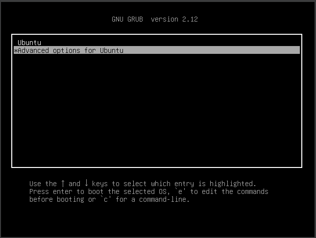
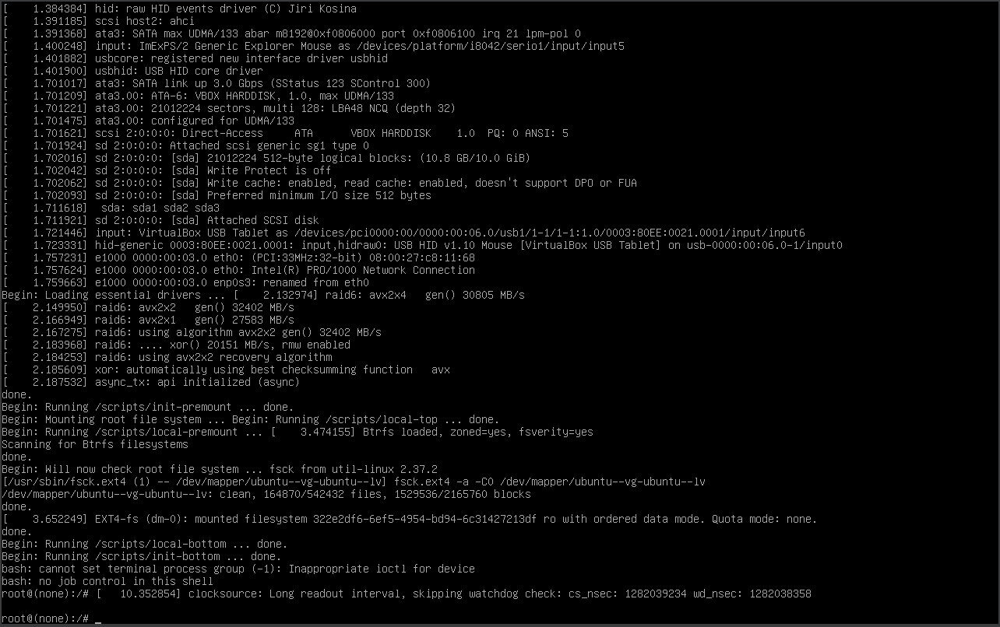
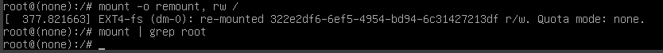
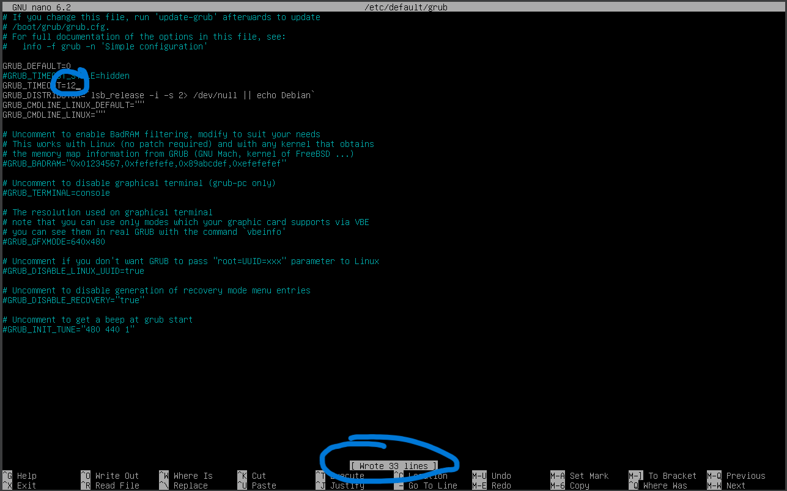
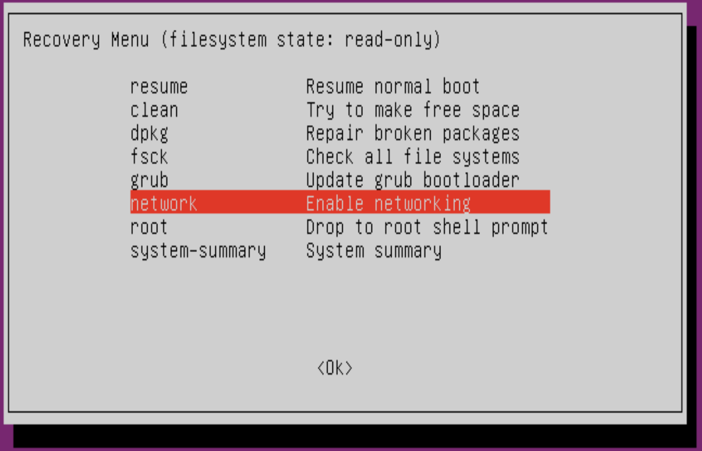
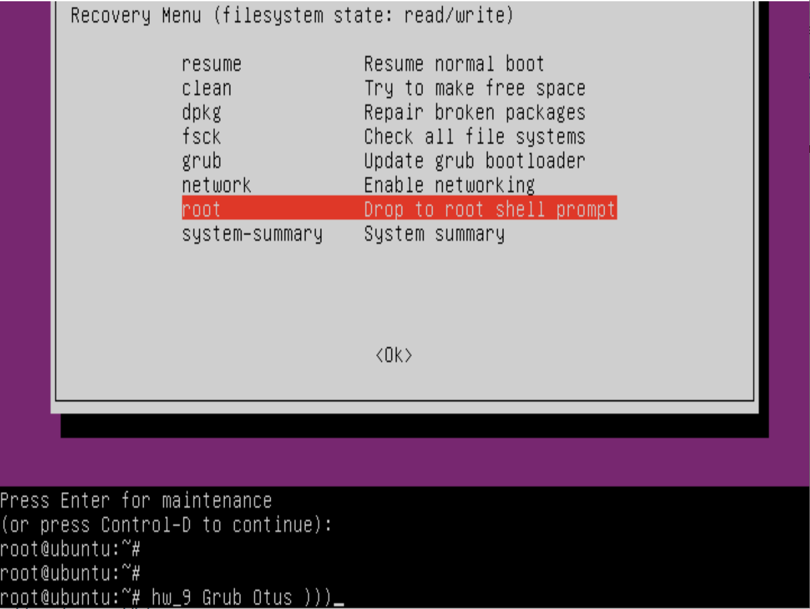
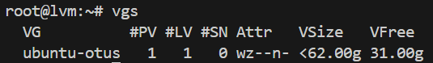

# GRUB2. Загрузка системы

## Задача:
Включить отображение меню Grub.
Попасть в систему без пароля несколькими способами.
Установить систему с LVM, после чего переименовать VG.

### Ход выполнения работы:
1. Включить отображение меню Grub  

1.1 По умолчанию меню загрузчика Grub скрыто и нет задержки при загрузке. Для отображения меню нужно отредактировать конфигурационный файл.
```
nano /etc/default/grub
```
1.2 Комментируем строку, скрывающую меню и ставим задержку для выбора пункта меню в 10 секунд.
```
#GRUB_TIMEOUT_STYLE=hidden
GRUB_TIMEOUT=10
```
Обновляем конфигурацию загрузчика и перезагружаемся для проверки.
```
update-grub
reboot
```
1.3 При загрузке в окне виртуальной машины мы должны увидеть меню загрузчика.
 
 

2. Попасть в систему без пароля несколькими способами
Для получения доступа необходимо при выборе ядра для загрузки нажать e. Попадаем в окно, где мы можем изменить параметры загрузки.  

2.1 Способ 1. `init=/bin/bash`
В конце строки, начинающейся с linux, добавляем init=/bin/bash и нажимаем сtrl-x для загрузки в систему
В целом на этом все, Мы попали в систему. 
 <details>
 <summary>Результат</summary>

 
 </details>

Рутовая файловая система при этом монтируется в режиме Read-Only. Если вы хотите перемонтировать ее в режим Read-Write, можно воспользоваться командой:
`mount -o remount,rw /`
После чего можно убедиться, записав данные в любой файл или прочитав вывод
команды:
`mount | grep root`
 <details>
 <summary>Результат</summary>

 
Данные успешно записались: 

Команда `mount | grep root` дала нулевой вывод (((
 </details>

2.2 Способ 2. `Recovery mode`
В меню загрузчика на первом уровне выбрать второй пункт (Advanced options…), далее загрузить пункт меню с указанием recovery mode в названии. 
Получим меню режима восстановления.
 
В этом меню сначала включаем поддержку сети (network) для того, чтобы файловая система перемонтировалась в режим read/write (либо это можно сделать вручную).
Далее выбираем пункт root и попадаем в консоль с пользователем root. Если вы ранее устанавливали пароль для пользователя root (по умолчанию его нет), то необходимо его ввести. 
В этой консоли можно производить любые манипуляции с системой.
 <details>
 <summary>Результат</summary>

 
 </details>

3. Установить систему с LVM, после чего переименовать VG
Мы установили систему Ubuntu 24.04 со стандартной разбивкой диска с использованием  LVM.
Первым делом посмотрим текущее состояние системы (список Volume Group):
```
root@lvm:~# vgs
  VG        #PV #LV #SN Attr   VSize   VFree 
  ubuntu-vg   1   1   0 wz--n- <62.00g 31.00g
```
Нас интересует вторая строка с именем Volume Group. Приступим к переименованию:
```
root@lvm:~# vgrename ubuntu-vg ubuntu-otus
  Volume group "ubuntu-vg" successfully renamed to "ubuntu-otus"
```
Далее правим /boot/grub/grub.cfg. Везде заменяем старое название VG на новое (в файле дефис меняется на два дефиса ubuntu--vg ubuntu--otus).
```
nano /boot/grub/grub.cfg
```
После чего можем перезагружаться и, если все сделано правильно, успешно грузимся с новым именем Volume Group и проверяем:
 
 <details>
 <summary>Результат</summary>

```
root@lvm:~# vgs
  VG          #PV #LV #SN Attr   VSize   VFree 
  ubuntu-otus   1   1   0 wz--n- <62.00g 31.00g
```
 
 </details>
